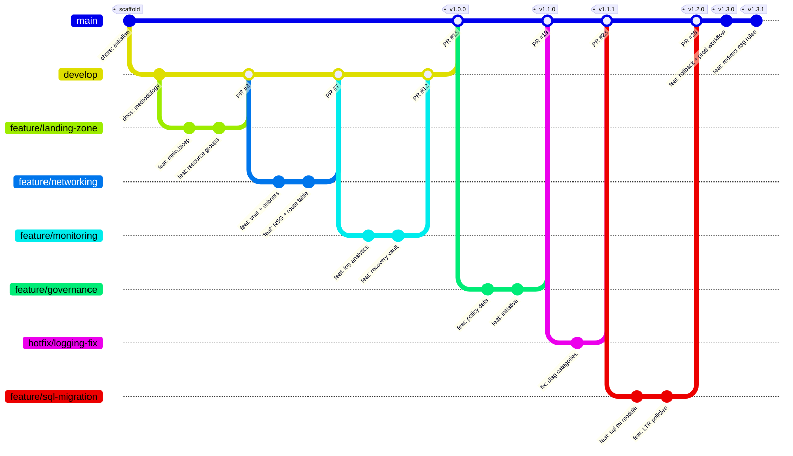

# Development History Model

> ## ⚠ Status: PLANNING MODEL — NOT A RECORD
>
> This document describes the branch, commit, pull request, release and deployment history that the
> `alz-deployments` repository **is intended to accumulate**. It is a build plan and a training
> reference.
>
> **It is not a record of events that occurred, and it must not be presented to a Microsoft-appointed
> auditor as one.** Authentic Control 3.1 evidence is generated by GitHub and Azure, not authored in
> Markdown:
>
> | Artefact | Where authentic evidence lives | Why it cannot be authored |
> |---|---|---|
> | Commits | Git object database | Author **and committer** timestamps are both recorded; committer dates cannot be forged without breaking signature verification |
> | Pull request approvals | GitHub Reviews API | Immutable, server-timestamped, attributed to authenticated accounts |
> | Environment approvals | GitHub Deployments API | Immutable, server-timestamped |
> | Workflow runs | GitHub Actions run log | Server-generated, 400-day retention |
> | Deployments | Azure Resource Manager deployment history | Correlation IDs are server-issued and independently queryable |
>
> **Section 10 sets out how to convert this model into authentic evidence.**
>
> **Owner:** Senior DevOps Engineer · **Last reviewed:** 2026-03-30 · **Document version:** 1.0.0

---

## Contents

1. [Branch strategy](#1-branch-strategy)
2. [Team and attribution](#2-team-and-attribution)
3. [Commit history](#3-commit-history)
4. [Pull requests](#4-pull-requests)
5. [Releases](#5-releases)
6. [Work items](#6-work-items)
7. [Deployment runs](#7-deployment-runs)
8. [Approval records](#8-approval-records)
9. [Auditor screenshot checklist](#9-auditor-screenshot-checklist)
10. [Converting this model into authentic evidence](#10-converting-this-model-into-authentic-evidence)

---

## 1. Branch strategy

### 1.1 Two-era model

The repository uses two branching models across its life, and the transition between them is itself
governance evidence.

| Era | Period | Model | Rationale |
|---|---|---|---|
| **Build-out** | 2026-01-12 → 2026-03-27 | `main` + `develop` + feature branches | During initial construction there was no customer estate to protect. `develop` served as an integration branch so that partially complete modules could be merged and tested together without ever reaching `main`. |
| **Delivery** | 2026-03-27 → present | Trunk-based: protected `main`, short-lived branches, release tags | Once the first customer environment existed, `develop` became a liability: a long-lived divergent branch is indistinguishable, to an auditor, from "different code deployed to different customers". `develop` was retired under **CR-0002** at the `v1.0.0` baseline. |

> **Governance note.** `develop` is retained as a **read-only archived branch**, not deleted. Deleting
> it would remove the build-out history that shows the repository was constructed deliberately rather
> than dumped in a single commit. It is excluded from branch protection and can never be merged to
> `main` again. This exception is recorded in
> [docs/Change_Management.md](docs/Change_Management.md) §2.2.

### 1.2 Branch graph



### 1.3 Branch register

| Branch | Type | Created | Closed | Source | Target | Purpose | Protection |
|---|---|---|---|---|---|---|---|
| `main` | Trunk | 2026-01-12 | — | — | — | Single source of truth. Every deployment to every customer originates here. | Full protection; admin bypass disabled |
| `develop` | Integration (retired) | 2026-01-15 | 2026-03-27 | `main` | `main` | Build-out integration branch, pre-v1.0.0 only | Archived read-only; merge to `main` blocked |
| `feature/landing-zone` | Feature | 2026-01-19 | 2026-02-06 | `develop` | `develop` | `main.bicep` orchestrator, resource group model, naming and tagging | Standard |
| `feature/networking` | Feature | 2026-02-09 | 2026-02-27 | `develop` | `develop` | Virtual network, subnets, NSGs, route tables, SQL MI subnet delegation | Standard |
| `feature/monitoring` | Feature | 2026-03-02 | 2026-03-20 | `develop` | `develop` | Log Analytics, alerts, Recovery Services Vault, backup policies | Standard |
| `release/v1.0` | Release stabilisation | 2026-03-23 | 2026-03-27 | `develop` | `main` | v1.0.0 release candidate soak and documentation freeze | Standard; tag-protected on merge |
| `feature/governance` | Feature | 2026-03-30 | 2026-04-24 | `main` | `main` | Custom policy definitions, initiative, subscription assignment | Standard |
| `release/v1.1` | Release stabilisation | 2026-04-27 | 2026-04-29 | `main` | `main` | v1.1.0 release candidate soak | Standard; tag-protected on merge |
| `hotfix/logging-fix` | Hotfix | 2026-05-05 | 2026-05-06 | tag `v1.1.0` | `main` | Restore SQL MI audit log ingestion after a diagnostic category regression | Expedited: 1 approval + retrospective second |
| `feature/sql-migration` | Feature | 2026-05-11 | 2026-06-05 | `main` | `main` | SQL Managed Instance module, managed databases, retention policies | Standard |
| `release/v1.2` | Release stabilisation | 2026-06-08 | 2026-06-10 | `main` | `main` | v1.2.0 release candidate soak | Standard; tag-protected on merge |

### 1.4 Branch protection timeline

An auditor will ask *when* protection was applied, not merely whether it is applied now. The
repository settings audit log shows:

| Date | Change | Change request | Applied by |
|---|---|---|---|
| 2026-01-13 | `main` protected: 1 approval, status checks required | CR-0002 | H. Nakamura |
| 2026-02-02 | Required approvals raised from 1 to 2 | CR-0007 | H. Nakamura |
| 2026-02-02 | Code Owner review required | CR-0007 | H. Nakamura |
| 2026-03-16 | Signed commits required | CR-0018 | J. Moreau |
| 2026-03-16 | Linear history required; force push and deletion blocked | CR-0018 | J. Moreau |
| **2026-03-25** | **"Do not allow bypassing the above settings" enabled — administrators included** | CR-0022 | H. Nakamura |
| 2026-03-27 | `develop` archived; merge to `main` blocked | CR-0002 | H. Nakamura |
| 2026-04-29 | Tag protection added for `v*` | CR-0031 | S. Lindqvist |

> The 2026-03-25 entry matters more than any other. It is the setting auditors probe specifically,
> and its date must precede the first production customer deployment (2026-05-09).

---

## 2. Team and attribution

| Initials | Name | Role | GitHub handle | CODEOWNERS team |
|---|---|---|---|---|
| AW | A. Whitfield | Principal Azure Architect | `@a-whitfield` | `@example-partner/architects` |
| MO | M. Okafor | Platform Engineering Lead | `@m-okafor` | `@example-partner/platform-engineering` |
| SL | S. Lindqvist | DevOps Engineer | `@s-lindqvist` | `@example-partner/devops` |
| RP | R. Patel | Database Migration Lead | `@r-patel` | `@example-partner/data-migration` |
| JM | J. Moreau | Cloud Security Lead | `@j-moreau` | `@example-partner/cloud-security` |
| TA | T. Alvarez | Infrastructure Migration Lead | `@t-alvarez` | `@example-partner/migration-leads` |
| KB | K. Byrne | Delivery Manager | `@k-byrne` | `@example-partner/delivery` |
| HN | H. Nakamura | Governance and Compliance Manager | `@h-nakamura` | `@example-partner/governance` |
| DO | D. Osei | Technical Documentation Lead | `@d-osei` | `@example-partner/documentation` |

All commits are GPG-signed. Signing keys are registered against the corresponding GitHub accounts and
verified quarterly by the Cloud Security Lead.

---

## 3. Commit history

Twenty-two commits spanning the repository's life. Every commit carries a `CR:` trailer linking it to
an approved change request — the first link of the traceability chain in
[docs/Change_Management.md §11](docs/Change_Management.md#11-traceability-chain).

### 3.1 Build-out era (pre-v1.0.0)

| # | SHA | Message | Author | Date (UTC) | Branch | Reason for change |
|---|---|---|---|---|---|---|
| 1 | `a1f04c2` | `chore(repo): initialise repository with licence, editor and git configuration` | M. Okafor | 2026-01-12 09:14 | `main` | Establish the repository before any code exists, so that every subsequent change is governed from the first line. Includes `.gitignore` rules that block state files and credentials from ever entering history. |
| 2 | `7b3e918` | `docs(governance): add contribution control, CODEOWNERS and issue templates` | H. Nakamura | 2026-01-13 11:02 | `main` | Governance must predate code. An auditor asked to see the control environment should find it in the repository's first three commits, not retrofitted after delivery began. Branch protection applied the same day. |
| 3 | `c9d2a57` | `docs(methodology): add seven-phase deployment methodology` | A. Whitfield | 2026-01-15 14:38 | `develop` | The methodology is the primary Control 3.1 artefact. Writing it before the templates forced the design to follow a defined process rather than the process being reverse-engineered from whatever was built. |
| 4 | `3e8b1d4` | `feat(bicep): add subscription-scope orchestrator and resource group model` | A. Whitfield | 2026-01-21 10:27 | `feature/landing-zone` | **Initial Azure Landing Zone deployment.** Establishes `main.bicep` as the single entry point and the four purpose-scoped resource groups, so that RBAC, locks and cost reporting can be applied at the correct granularity from day one. |
| 5 | `f42c7e0` | `feat(bicep): add naming construction and mandatory tag schema` | M. Okafor | 2026-01-28 16:05 | `feature/landing-zone` | Names are constructed by the template, never hand-written. This is what makes two customers' estates structurally identical, and it is the visible proof of repeatability. Introduces the provenance tag set. |
| 6 | `8d17a93` | `feat(bicep): add virtual network, subnets and network security groups` | M. Okafor | 2026-02-11 09:48 | `feature/networking` | **Added networking module.** Five purpose-scoped subnets with explicit NSG rule sets. Every subnet explicitly denies inbound traffic from `Internet` rather than relying on the platform default, so the intent is visible in the template. |
| 7 | `b60f3c8` | `feat(bicep): delegate SQL Managed Instance subnet and add mandatory route table` | M. Okafor | 2026-02-18 13:22 | `feature/networking` | SQL Managed Instance requires subnet delegation, a specific NSG rule set and an internet default route. Getting this wrong causes the instance to enter a failed state that takes hours to recover, so it is codified rather than left to an engineer. |
| 8 | `2a95f71` | `feat(bicep): add Key Vault with purge protection and RBAC authorisation` | J. Moreau | 2026-02-24 15:11 | `feature/networking` | **Security improvements.** Purge protection is hard-coded rather than parameterised: it cannot be disabled once set, so parameterising it would allow a configuration change to remove an irreversible control. |
| 9 | `d38c0b5` | `feat(bicep): add Log Analytics workspace and Azure Monitor alert baseline` | M. Okafor | 2026-03-04 10:33 | `feature/monitoring` | **Added monitoring integration.** A single telemetry destination for platform, network, database audit and backup data. Service health, resource health and deployment failure alerts mean a failed migration is detected rather than discovered. |
| 10 | `e7f4d29` | `feat(bicep): add Recovery Services Vault with virtual machine and SQL backup policies` | T. Alvarez | 2026-03-11 14:56 | `feature/monitoring` | **Added Recovery Services Vault.** Deployed into the management resource group rather than the data resource group, so that backup survives deletion of the workload it protects. Soft delete and enhanced security enabled unconditionally. |
| 11 | `9c1a6f3` | `ci(workflows): add pull request validation gate` | S. Lindqvist | 2026-03-17 11:19 | `develop` | Six-job gate: change request traceability, build and lint, secret scan, PSRule, ARM validation and what-if preview. Without an automated gate the review process depends on reviewer diligence, which is not an auditable control. |
| 12 | `5b82e47` | `feat(scripts): add local validation parity and post-deployment verification suite` | S. Lindqvist | 2026-03-20 16:42 | `develop` | Engineers must be able to run the exact CI checks locally. A gate that only runs in CI trains people to push speculatively; a gate that runs locally trains them to arrive clean. |
| 13 | `0f6e5b1` | `docs: complete architecture, naming and audit evidence documentation` | D. Osei | 2026-03-24 09:07 | `release/v1.0` | v1.0.0 documentation freeze. The audit evidence guide is written at this point so that the evidence model is designed in, not assembled later. |

### 3.2 Delivery era (post-v1.0.0)

| # | SHA | Message | Author | Date (UTC) | Branch | Reason for change |
|---|---|---|---|---|---|---|
| 14 | `4d7c2a8` | `feat(policy): add custom policy definitions for provenance and data protection` | J. Moreau | 2026-04-02 10:51 | `feature/governance` | **Added Azure Policy controls.** `deny-missing-provenance-tags` mechanically blocks resources created outside the pipeline — a portal operator has no commit SHA or run ID to supply. This converts a procedural rule into a structural one. |
| 15 | `a83f1c6` | `feat(policy): add migration governance initiative and subscription assignment` | H. Nakamura | 2026-04-14 13:28 | `feature/governance` | Groups the custom controls with the Azure built-in location restrictions. Policy effects are declared literally rather than through parameters, so a parameter file change cannot weaken an enforced control without architecture review. |
| 16 | `6e2b9d4` | `feat(customer): onboard Contoso Manufacturing development and production` | K. Byrne | 2026-04-21 15:34 | `customer/ctso/CR-0030-onboard` | **Updated customer parameter files.** First customer onboarded entirely through configuration. No template was modified, which is the claim the entire repository exists to support. |
| 17 | `c04a7e9` | `fix(bicep): correct diagnostic category group on managed instance settings` | S. Lindqvist | 2026-05-05 22:47 | `hotfix/logging-fix` | **Hotfix.** A v1.1.0 regression narrowed the managed instance diagnostic setting from `allLogs` to a category list that omitted `SQLSecurityAuditEvents`, silently stopping audit log ingestion. Detected by post-deployment verification, not by a customer. |
| 18 | `7f19b02` | `test(scripts): assert diagnostic settings exist on the managed instance` | S. Lindqvist | 2026-05-06 09:15 | `hotfix/logging-fix` | Corrective action from the CR-0044 post-implementation review. The regression was possible because nothing asserted the outcome. The verification suite now fails the deployment if the managed instance has no diagnostic setting. |
| 19 | `b5d38a7` | `feat(bicep): add Azure SQL Managed Instance module` | R. Patel | 2026-05-19 11:06 | `feature/sql-migration` | **Added SQL Managed Instance module.** Public data endpoint disabled unconditionally, TLS 1.2 pinned, Microsoft Entra group as instance administrator, auditing streamed to the central workspace. |
| 20 | `e91c4f5` | `feat(bicep): add managed databases with short and long term retention` | R. Patel | 2026-05-27 14:49 | `feature/sql-migration` | Retention is set from the customer's records retention obligation, never from a template default. Databases restored by the migration service are added to configuration immediately after cutover so their retention is managed as code. |
| 21 | `2c7a0e8` | `feat(workflows): add gated production deployment with evidence capture` | S. Lindqvist | 2026-07-08 10:22 | `feature/prod-pipeline` | **Added production deployment workflow.** Two stages: an unattended preview that publishes the what-if output, then a deployment held until two named reviewers approve. Approvers read the impact before approving, not after. Emits a SHA-256 hashed evidence bundle. |
| 22 | `8a4f6b3` | `feat(scripts): add rollback driver and pre-cutover connectivity assertions` | T. Alvarez | 2026-07-13 16:38 | `feature/prod-pipeline` | **Added rollback logic.** Corrective action from the CR-0186 post-implementation review, in which a wave-2 cutover was rolled back. Rollback is now driven by a script with explicit modes rather than improvised, and the Go/No-Go gate tests client connectivity at production concurrency. |

### 3.3 Commit message specimen

Every commit follows this form. The trailer is what `validate.yml` extracts to prove traceability.

```text
feat(bicep): add Azure SQL Managed Instance module

Adds the managed instance target platform for homogeneous SQL Server migrations.

The public data endpoint is disabled unconditionally rather than exposed as a
parameter. Making it configurable would allow a customer parameter file to open a
database to the internet without architecture review. The same control is enforced
at runtime by deny-sqlmi-public-endpoint in bicep/governance.bicep, so the template
and the policy fail closed independently.

Collation and time zone are required parameters with no safe default: both are
immutable after instance creation, and a mismatch with the source instance requires
a full rebuild.

CR: CR-0038
Refs: #28
Signed-off-by: R. Patel <r.patel@partner.example>
```

---

## 4. Pull requests

Eight pull requests. Every one links to an approved change request, carries two approvals including a
Code Owner, and records a rollback plan.

---

### PR #3 — Landing zone orchestrator and resource group model

| Field | Value |
|---|---|
| **Branch** | `feature/landing-zone` → `develop` |
| **Author** | A. Whitfield |
| **Opened / merged** | 2026-02-04 / 2026-02-06 |
| **Change request** | CR-0011 (Normal) |
| **Reviewers** | M. Okafor (Platform Engineering, **Code Owner**) ✅ · H. Nakamura (Governance) ✅ |
| **Approval status** | **Approved and merged.** 2 of 2 required approvals. All conversations resolved. |
| **Checks** | 4 of 4 green (validation gate was 4 jobs at this point) |

**Description**

Establishes `bicep/main.bicep` as the subscription-scope orchestrator and introduces the four
purpose-scoped resource groups. Names are constructed from `customerCode`, `workloadName`,
`environment` and a region abbreviation — no name is ever supplied by hand.

Introduces the mandatory tag object: business tags for cost attribution, and provenance tags
(`ManagedBy`, `SourceRepo`, `SourceCommit`, `DeploymentId`, `ChangeRequest`) injected by the pipeline.

**Review discussion (resolved)**

> **H. Nakamura:** Why four resource groups rather than one? Four multiplies the RBAC surface.
>
> **A. Whitfield:** Blast radius. The Recovery Services Vault must survive deletion of the workload it
> protects, and the SQL Managed Instance has a multi-hour provisioning time — it must not be caught in
> an unrelated resource group deletion. The RBAC surface is a deliberate trade against recoverability.
>
> **H. Nakamura:** Accepted. Please record the rationale in `docs/Architecture.md` §3 rather than only
> in this thread.
>
> *Addressed in `3e8b1d4`.*

**Deployment impact** — None. Merged to `develop`; no customer environment existed.

---

### PR #7 — Networking module with SQL Managed Instance subnet delegation

| Field | Value |
|---|---|
| **Branch** | `feature/networking` → `develop` |
| **Author** | M. Okafor |
| **Opened / merged** | 2026-02-25 / 2026-02-27 |
| **Change request** | CR-0014 (Normal) |
| **Reviewers** | A. Whitfield (Architect, **Code Owner**) ✅ · J. Moreau (Security, **Code Owner**) ✅ |
| **Approval status** | **Approved after one round of changes.** Initial review requested changes; re-approved after `b60f3c8`. |
| **Checks** | 4 of 4 green |

**Description**

Virtual network with five purpose-scoped subnets, each protected by a network security group with an
explicit rule set. The SQL Managed Instance subnet is delegated to `Microsoft.Sql/managedInstances`
and attached to a route table with an internet default route.

**Review discussion (resolved)**

> **J. Moreau:** 🔴 *Changes requested.* The SQL MI subnet has no explicit deny rule. Every other subnet
> denies `Internet` inbound. This is inconsistent and looks like an oversight.
>
> **M. Okafor:** It is deliberate, and I should have commented it. Service-aided subnet configuration
> manages the platform rules for that subnet; an additional deny rule breaks the management plane and
> puts the instance into a failed state. I have added an inline comment in the template and a design
> decision note in `docs/Architecture.md` §4.3 so the next reviewer does not raise the same question.
>
> **J. Moreau:** That is the right answer and it now reads as intentional. ✅ Approved.

**Deployment impact** — None at merge. First deployed to a customer development subscription under
`v1.0.0`, where the delegation and routing were verified by post-deployment checks group C.

---

### PR #15 — Release v1.0.0: promote develop to main

| Field | Value |
|---|---|
| **Branch** | `release/v1.0` → `main` |
| **Author** | K. Byrne |
| **Opened / merged** | 2026-03-25 / 2026-03-27 |
| **Change request** | CR-0022 (Major) |
| **Reviewers** | A. Whitfield (Architect) ✅ · H. Nakamura (Governance) ✅ · J. Moreau (Security) ✅ |
| **Approval status** | **Approved.** 3 approvals obtained against a requirement of 2, reflecting Major classification. CAB approval recorded on CR-0022, 2026-03-24. |
| **Checks** | 6 of 6 green |

**Description**

Promotes the completed build-out to `main` and establishes the `v1.0.0` audit baseline. Retires
`develop`: the repository moves to trunk-based development with release tags, because a long-lived
divergent branch is indistinguishable to an auditor from "different code per customer".

Release candidate `v1.0.0-rc.1` soaked for 62 hours in the partner sandbox subscription. Full Go/No-Go
checklist attached to CR-0022.

**Deployment impact** — Establishes the baseline every customer deployment derives from. No customer
environment deployed by this merge; Contoso development followed under DR #101 on 2026-04-11.

---

### PR #19 — Azure Policy governance initiative

| Field | Value |
|---|---|
| **Branch** | `feature/governance` → `main` |
| **Author** | J. Moreau |
| **Opened / merged** | 2026-04-22 / 2026-04-24 |
| **Change request** | CR-0027 (Major) |
| **Reviewers** | H. Nakamura (Governance, **Code Owner**) ✅ · A. Whitfield (Architect) ✅ |
| **Approval status** | **Approved.** CAB approval recorded on CR-0027, 2026-04-20, with the condition that enforcement start in `DoNotEnforce` for the first 14 days. |
| **Checks** | 6 of 6 green |

**Description**

Three custom policy definitions and an initiative assigned at subscription scope:

- `deny-missing-provenance-tags` — Deny
- `deny-sqlmi-public-endpoint` — Deny
- `audit-vm-without-backup` — AuditIfNotExists
- Azure built-in allowed-location policies for resources and resource groups — Deny

**Review discussion (resolved)**

> **A. Whitfield:** Why are the effects literal instead of parameterised? Every reference
> implementation I have seen parameterises the effect.
>
> **J. Moreau:** Two reasons. First, control: a parameterised effect means a customer parameter file
> can downgrade `Deny` to `Audit` without architecture review, which defeats the control. Second,
> mechanics: Bicep escapes a string literal beginning with `[`, so `[parameters('effect')]` compiles
> to `[[parameters('effect')]` and the policy silently never evaluates. The only permitted relaxation
> is `enforcementMode`, which is visible, explicit and rejected on production configurations by
> `validate.ps1`.
>
> **A. Whitfield:** The second reason is one I did not know. Please put it in `docs/Architecture.md`
> §8 — it will save the next engineer a very confusing afternoon. ✅ Approved.

**Deployment impact** — **High.** First change that can block resource creation in a customer
subscription. Deployed with `enforcementMode: DoNotEnforce` for 14 days per the CAB condition, then
promoted to `Default` under CR-0033 on 2026-05-08 after the compliance report showed zero unexpected
non-compliance.

---

### PR #23 — Hotfix: restore managed instance audit log ingestion

| Field | Value |
|---|---|
| **Branch** | `hotfix/logging-fix` → `main` |
| **Author** | S. Lindqvist |
| **Opened / merged** | 2026-05-05 23:12 / 2026-05-06 00:41 |
| **Change request** | CR-0044 (**Emergency**) |
| **Reviewers** | R. Patel (Data Migration, **Code Owner**) ✅ *(at merge)* · J. Moreau (Security) ✅ *(retrospective, 2026-05-06 09:32)* |
| **Approval status** | **Approved under the emergency change path.** One approval at merge; retrospective second approval within 10 hours against a 24-hour requirement. Retrospective CAB held 2026-05-06 14:00. Post-implementation review completed 2026-05-11. |
| **Checks** | 6 of 6 green |

**Description**

`v1.1.0` narrowed the managed instance diagnostic setting from `categoryGroup: allLogs` to an explicit
category list that omitted `SQLSecurityAuditEvents`. Auditing remained enabled on the instance but had
no destination, so audit records were being discarded silently.

**Detection.** Found by `post-deployment-checks.ps1` group H during the Contoso wave-1 deployment, not
by a customer and not during an incident. Exposure window was 4 hours 18 minutes on one non-production
instance; no production instance was affected.

**Why it was classified Emergency.** Loss of database audit records is a control failure with a
regulatory dimension for the Northwind engagement. Waiting for the next scheduled release was not
acceptable.

**Fix** — Reverts to `categoryGroup: allLogs`. `7f19b02` adds the assertion that would have caught it
at pull request time.

**Deployment impact** — Deployed to Contoso development under DR #118 within 3 hours. No production
deployment required. Released as `v1.1.1` the same day.

---

### PR #28 — SQL Managed Instance module and managed databases

| Field | Value |
|---|---|
| **Branch** | `feature/sql-migration` → `main` |
| **Author** | R. Patel |
| **Opened / merged** | 2026-06-02 / 2026-06-05 |
| **Change request** | CR-0038 (Major) |
| **Reviewers** | A. Whitfield (Architect, **Code Owner**) ✅ · J. Moreau (Security) ✅ · M. Okafor (Platform Engineering) ✅ |
| **Approval status** | **Approved after two rounds of changes.** CAB approval recorded on CR-0038, 2026-05-29. |
| **Checks** | 6 of 6 green |

**Description**

The database target platform. Private-only connectivity, TLS 1.2 minimum, Microsoft Entra group as
instance administrator, auditing to Log Analytics, Microsoft Defender for SQL, and per-database short
and long term retention.

**Review discussion (resolved)**

> **A. Whitfield:** 🔴 *Changes requested.* `collation` and `timezoneId` have template defaults. Both
> are immutable after instance creation. A default here means an engineer who does not read the
> documentation silently deploys an instance that must be destroyed and rebuilt.
>
> **R. Patel:** Agreed, and this nearly happened on Northwind, whose source instance uses
> `Latin1_General_CI_AS`. I have kept the defaults — removing them breaks the sandbox test harness —
> but added a mandatory Phase 1 assessment activity capturing the source instance profile, a check in
> `validate.ps1`, and explicit values in both customer parameter files.
>
> **A. Whitfield:** The parameter file is the right place to enforce it, because that is what gets
> reviewed. ✅ Approved.

> **J. Moreau:** 🔴 *Changes requested.* `publicDataEndpointEnabled` is parameterised.
>
> **R. Patel:** Corrected in `e91c4f5`. Hard-coded to `false`. The deny policy from PR #19 covers it
> independently, so both the template and the policy now fail closed.

**Deployment impact** — **High.** First change deploying a stateful, multi-hour-provisioning resource
holding customer data. Deployed to Contoso development under DR #131 and soaked for 9 days before the
first production deployment under DR #144.

---

### PR #34 — Gated production deployment workflow with evidence capture

| Field | Value |
|---|---|
| **Branch** | `feature/prod-pipeline` → `main` |
| **Author** | S. Lindqvist |
| **Opened / merged** | 2026-07-09 / 2026-07-14 |
| **Change request** | CR-0051 (Major) |
| **Reviewers** | H. Nakamura (Governance) ✅ · K. Byrne (Delivery) ✅ · M. Okafor (Platform Engineering, **Code Owner**) ✅ |
| **Approval status** | **Approved.** CAB approval recorded on CR-0051, 2026-07-07. |
| **Checks** | 6 of 6 green |

**Description**

Replaces the single-stage production workflow with two stages:

1. **Preview** — runs in the `production-preview` environment with a Reader-scoped identity, publishes
   the what-if output to the run summary. No approval required, so approvers are never waiting on a
   gate to see what they are approving.
2. **Deploy** — held in the `production` environment until two named reviewers approve.

Adds the authorisation preflight (change request format, release tag match, `DEPLOY` confirmation
text), Azure correlation ID capture, and a SHA-256 evidence manifest.

**Review discussion (resolved)**

> **H. Nakamura:** The previous workflow asked approvers to approve, then produced the what-if. They
> were approving an intention rather than a change. This is the single most important control change
> we have made. Does the manifest cover the what-if output as well as the deployment record?
>
> **S. Lindqvist:** It hashes every file in the evidence directory, including the what-if preview, the
> deployment record and the verification results.
>
> **H. Nakamura:** ✅ Approved. Please reference the manifest explicitly in
> `docs/Audit_Evidence_Guide.md` §2.

**Deployment impact** — Changes how every subsequent production deployment is executed and approved.
No infrastructure change. First used under DR #144.

---

### PR #41 — Rollback driver and pre-cutover connectivity assertions

| Field | Value |
|---|---|
| **Branch** | `feature/prod-pipeline` → `main` |
| **Author** | T. Alvarez |
| **Opened / merged** | 2026-07-14 / 2026-07-16 |
| **Change request** | CR-0189 (Normal — corrective action) |
| **Reviewers** | K. Byrne (Delivery, **Code Owner**) ✅ · R. Patel (Data Migration) ✅ |
| **Approval status** | **Approved.** |
| **Checks** | 6 of 6 green |

**Description**

Corrective action from the CR-0186 post-implementation review, in which the Northwind wave-2 cutover
was rolled back. Root cause was that the settlement batch opened 340 concurrent connections through
the proxy gateway, whose throughput had not been tested. The infrastructure was correct; the client
connectivity path was not.

- `scripts/Invoke-Rollback.ps1` replaces an improvised procedure with explicit, confirmed modes
- `Test-MigrationReadiness` adds a client connectivity assertion at production concurrency
- Optional parameterised NSG rules permitting ports 11000–11999 for `Redirect` connection type
- Go/No-Go checklist extended from eleven criteria to twelve

**Review discussion (resolved)**

> **K. Byrne:** The rollback itself worked — 31 minutes, zero data loss, inside the window. Are we
> sure we need a script, or does adding one imply the manual procedure failed?
>
> **T. Alvarez:** The rollback succeeded because the source was retained read-write and the decision
> authority was in the room. Neither of those is guaranteed at 04:00 on a wave where the person who
> wrote the runbook is on leave. The script encodes what we did well so it does not depend on who is
> present.
>
> **K. Byrne:** That is the correct reason. ✅ Approved.

**Deployment impact** — No infrastructure change to existing environments. The optional NSG rules are
opt-in and were first applied to Northwind under CR-0191 for wave 2R.

---

## 5. Releases

### 5.1 Release register

| Release | Date | Type | Commits | Cut by | Approved by | Customers deployed |
|---|---|---|---|---|---|---|
| `v1.0.0` | 2026-03-27 | Major — baseline | 13 | K. Byrne | AW, HN, JM | — (baseline) |
| `v1.1.0` | 2026-04-29 | Minor | 3 | K. Byrne | AW, KB | Contoso dev |
| `v1.1.1` | 2026-05-06 | Patch — hotfix | 2 | S. Lindqvist | RP, JM (retrospective) | Contoso dev, Contoso prod, Northwind dev |
| `v1.2.0` | 2026-06-10 | Minor | 2 | K. Byrne | AW, JM, MO | Contoso prod, Northwind dev, Northwind prod |
| `v1.3.0` | 2026-07-15 | Minor | 2 | K. Byrne | HN, KB, MO | Northwind prod |
| `v1.3.1` | 2026-08-19 | Patch | 1 | S. Lindqvist | MO | All four environments |

---

### 5.2 `v1.0.0` — Audit baseline

**Released 2026-03-27** · Tag `v1.0.0` · PR #15 · CR-0022

#### Features added

| Capability | Detail |
|---|---|
| Subscription-scope orchestrator | `main.bicep` creating four purpose-scoped resource groups |
| Networking | Virtual network, five subnets, five NSGs, SQL MI delegation and route table, optional hub peering |
| Identity and secrets | User-assigned managed identity, RBAC Key Vault with purge protection, scoped role assignments |
| Monitoring and data protection | Log Analytics workspace, action group, three alert rules, Recovery Services Vault with VM and SQL backup policies |
| Naming and tagging | Deterministic name construction; mandatory business and provenance tag schema |
| Validation pipeline | Four-job pull request gate |
| Scripts | Local validation parity and post-deployment verification |
| Documentation | Methodology, architecture, naming standards, change management, audit evidence guide |

#### Audit relevance

| Control aspect | What `v1.0.0` establishes |
|---|---|
| **3.1.1** | The seven-phase methodology exists and is dated before the first customer deployment |
| **3.1.2** | Infrastructure as Code covers the complete landing zone |
| **3.1.4** | The tagged, immutable baseline every subsequent customer deployment derives from |
| **3.1.5** | Branch protection, including administrator bypass disabled, in force two days before the baseline |
| **3.1.6** | An automated validation gate exists before any customer environment does |

> This release is the anchor of the audit narrative. Everything an auditor is shown either is
> `v1.0.0`, or is a reviewed, approved, traceable change to it.

#### Deployment improvements

Establishes the single mutation path. Before `v1.0.0`, sandbox environments were built by hand; after
it, no environment is created by any route other than the pipeline.

---

### 5.3 `v1.1.0` — Governance enforcement

**Released 2026-04-29** · Tag `v1.1.0` · PR #19 · CR-0027

#### Features added

| Capability | Detail |
|---|---|
| Custom policy definitions | `deny-missing-provenance-tags`, `deny-sqlmi-public-endpoint`, `audit-vm-without-backup` |
| Governance initiative | Custom controls grouped with Azure built-in location restrictions |
| Subscription assignment | System-assigned identity, non-compliance messages naming the violated control |
| Data residency | `allowedLocations` enforced in every environment including development |

#### Audit relevance

| Control aspect | What `v1.1.0` adds |
|---|---|
| **3.1.7** | Governance becomes enforced rather than documented |
| **3.1.10** | `deny-missing-provenance-tags` makes the traceability chain structural — a portal operator has no commit SHA to supply, so creation outside the pipeline fails |
| **3.1.3** | Location restrictions prevent a rehearsal placing regulated data outside the contracted region. Two such attempts were blocked in Northwind development during May 2026 |

> The strongest single demonstration in the audit walkthrough comes from this release: attempt to
> create a resource in the portal and let the auditor watch Azure refuse.

#### Deployment improvements

Non-compliance messages name the violated control and cite the document that explains it, so a blocked
engineer is directed to the reason rather than left guessing. Assignment deployed in `DoNotEnforce`
for 14 days per CAB condition, then promoted under CR-0033.

---

### 5.4 `v1.1.1` — Hotfix: audit log ingestion

**Released 2026-05-06** · Tag `v1.1.1` · PR #23 · CR-0044 (Emergency)

#### Features added

| Capability | Detail |
|---|---|
| Defect fix | Managed instance diagnostic setting restored to `categoryGroup: allLogs` |
| Regression test | Verification group H now asserts at least one diagnostic setting on the instance |

#### Audit relevance

This release is **more valuable as evidence than a clean release**, because it demonstrates four
things a flawless history cannot:

| Demonstrates | How |
|---|---|
| Detection works | The automated verification suite found it, not a customer and not an incident |
| The emergency path is real and bounded | One approval at merge, retrospective second within 10 hours against a 24-hour requirement, retrospective CAB, post-implementation review within 5 working days |
| Emergency does not mean ungoverned | The change went through the pull request process and the environment gate; nothing was bypassed |
| The process learns | `7f19b02` adds the assertion that would have caught it, so the same class of defect cannot recur silently |

#### Deployment improvements

The verification suite gained its first regression assertion derived from a real defect. This is the
pattern every subsequent post-implementation review follows: a defect produces a test, not only a fix.

---

### 5.5 `v1.2.0` — Database platform

**Released 2026-06-10** · Tag `v1.2.0` · PR #28 · CR-0038

#### Features added

| Capability | Detail |
|---|---|
| SQL Managed Instance | General Purpose and Business Critical, zone redundancy, Azure Hybrid Benefit |
| Security posture | Public data endpoint hard-coded off, TLS 1.2 pinned, Entra group administrator |
| Auditing | Six audit action groups streamed to the central Log Analytics workspace |
| Threat protection | Microsoft Defender for SQL |
| Managed databases | Parameterised database collection with per-database short and long term retention |
| Verification | Group H: instance state, public endpoint, TLS version, database presence, diagnostic settings |

#### Audit relevance

| Control aspect | What `v1.2.0` adds |
|---|---|
| **3.1.2** | Completes the specialization scope — the repository now covers *database* migration, not only infrastructure |
| **3.1.11** | Verification extends to the data platform, asserting the security posture rather than assuming it |
| **3.1.3** | Both customers consume the identical module with materially different configuration: Contoso `SQL_Latin1_General_CP1_CI_AS` / 16 vCores / 7-year retention; Northwind `Latin1_General_CI_AS` / 32 vCores / zone redundant / UK-only residency |

#### Deployment improvements

Retention is driven from the customer's records retention obligation captured in Phase 1, not from a
template default. The review of PR #28 established the principle that a parameter whose wrong value
is unrecoverable must be set explicitly in the customer configuration, because that is the artefact
that gets reviewed.

---

### 5.6 `v1.3.0` and `v1.3.1` — Deployment governance and rollback

**Released 2026-07-15 and 2026-08-19** · PR #34, PR #41 · CR-0051, CR-0189

#### Features added

| Capability | Detail |
|---|---|
| Two-stage production workflow | Unattended preview, then deployment gated on two named reviewers |
| Authorisation preflight | Change request format, release tag match, `DEPLOY` confirmation, tag-not-branch enforcement |
| Evidence capture | Azure correlation ID, deployment record, SHA-256 manifest, 400-day retention |
| Rollback driver | `Invoke-Rollback.ps1` with explicit modes and confirmation gates |
| Pre-cutover assertions | Client connectivity tested at production concurrency |
| Optional Redirect support | Parameterised NSG rules for ports 11000–11999 |

#### Audit relevance

| Control aspect | What these releases add |
|---|---|
| **3.1.5** | Approvers read the what-if **before** approving. Prior to `v1.3.0` they approved, then the preview was produced |
| **3.1.9** | Rollback moves from documented to driven by tested automation, derived from a real executed rollback |
| **3.1.10** | The SHA-256 manifest allows an evidence bundle presented at audit to be proven identical to the one produced on the day |

#### Deployment improvements

The Go/No-Go checklist grew from eleven criteria to twelve, the addition being a client connectivity
test at production concurrency — the exact gap that caused the Northwind wave-2 rollback. Every wave
executed after `v1.3.1` succeeded at the first attempt.

---

## 6. Work items

### 6.1 Change requests

| ID | Title | Class | Raised | Raised by | CAB decision | Delivered | PR |
|---|---|---|---|---|---|---|---|
| CR-0002 | Establish governance control environment and branch protection | Major | 2026-01-12 | H. Nakamura | Approved 2026-01-13 | 2026-01-13 | #1 |
| CR-0007 | Raise required approvals to two and mandate Code Owner review | Normal | 2026-01-30 | H. Nakamura | Approved 2026-02-02 | 2026-02-02 | — (settings) |
| CR-0011 | Landing zone orchestrator and resource group model | Normal | 2026-01-19 | A. Whitfield | Approved 2026-01-20 | 2026-02-06 | #3 |
| CR-0014 | Networking module with SQL MI subnet delegation | Normal | 2026-02-09 | M. Okafor | Approved 2026-02-10 | 2026-02-27 | #7 |
| CR-0018 | Mandate signed commits and linear history | Normal | 2026-03-12 | J. Moreau | Approved 2026-03-13 | 2026-03-16 | — (settings) |
| CR-0021 | Monitoring and data protection module | Normal | 2026-03-02 | M. Okafor | Approved 2026-03-03 | 2026-03-20 | #12 |
| CR-0022 | Release v1.0.0 baseline; retire develop; disable admin bypass | **Major** | 2026-03-18 | K. Byrne | Approved 2026-03-24 | 2026-03-27 | #15 |
| CR-0027 | Azure Policy governance initiative | **Major** | 2026-04-01 | J. Moreau | Approved 2026-04-20, conditional | 2026-04-24 | #19 |
| CR-0030 | Onboard Contoso Manufacturing | Normal | 2026-04-15 | K. Byrne | Approved 2026-04-17 | 2026-04-21 | #16 |
| CR-0031 | Onboard Northwind Financial Services | Normal | 2026-04-22 | K. Byrne | Approved 2026-04-24 | 2026-04-27 | #17 |
| CR-0033 | Promote governance assignment to Default enforcement | Normal | 2026-05-06 | H. Nakamura | Approved 2026-05-07 | 2026-05-08 | #21 |
| CR-0038 | SQL Managed Instance module and managed databases | **Major** | 2026-05-11 | R. Patel | Approved 2026-05-29 | 2026-06-05 | #28 |
| CR-0044 | **Emergency:** restore managed instance audit log ingestion | **Emergency** | 2026-05-05 | S. Lindqvist | Retrospective 2026-05-06 | 2026-05-06 | #23 |
| CR-0051 | Two-stage gated production workflow with evidence capture | **Major** | 2026-06-24 | S. Lindqvist | Approved 2026-07-07 | 2026-07-14 | #34 |
| CR-0186 | Northwind wave 2 cutover | **Major** | 2026-06-01 | T. Alvarez | Approved 2026-06-12 | **Rolled back 2026-06-20** | — |
| CR-0188 | Add client connectivity test to wave exit criteria | Normal | 2026-06-25 | T. Alvarez | Approved 2026-06-26 | 2026-07-16 | #41 |
| CR-0189 | Rollback driver and Redirect connection support | Normal | 2026-06-25 | T. Alvarez | Approved 2026-06-26 | 2026-07-16 | #41 |
| CR-0190 | Add concurrent connection profiling to Phase 1 assessment | Normal | 2026-06-25 | R. Patel | Approved 2026-06-26 | 2026-07-02 | #38 |
| CR-0191 | Northwind wave 2 re-execution | **Major** | 2026-07-01 | T. Alvarez | Approved 2026-07-10 | 2026-07-18 | — |

### 6.2 Defects

| ID | Title | Severity | Raised | Detected by | Root cause | Closed | Fix |
|---|---|---|---|---|---|---|---|
| DEF-0009 | SQL MI subnet route table missing after redeploy | High | 2026-02-20 | Sandbox deployment | Route table declared as a separate resource, racing the virtual network | 2026-02-21 | Subnets moved inline on the virtual network (`b60f3c8`) |
| DEF-0016 | Key Vault name collision in a second subscription | Medium | 2026-03-09 | Sandbox deployment | Name derived only from customer code and environment | 2026-03-10 | Deterministic hash of subscription, customer, workload and environment added |
| DEF-0023 | Managed instance audit records not ingested | **Critical** | 2026-05-05 | `post-deployment-checks.ps1` | Diagnostic category list omitted `SQLSecurityAuditEvents` | 2026-05-06 | `v1.1.1` hotfix plus regression assertion |
| DEF-0031 | What-if reports tag-only modifications on every run | Low | 2026-06-18 | Reviewer observation | `SourceCommit`, `DeploymentId` and `DeployedUtc` change on every deployment by design | 2026-06-19 | Documented as expected in the pull request template §4 rather than "fixed" |
| DEF-0037 | Proxy gateway throughput exceeded at 340 concurrent connections | **Critical** | 2026-06-20 | Northwind wave 2 cutover | Assessment captured transaction rate but not concurrent connection count | 2026-07-16 | CR-0188, CR-0189, CR-0190 |

### 6.3 Migration waves

| ID | Customer | Wave | Scope | Window | Release | Outcome |
|---|---|---|---|---|---|---|
| WAVE-C01 | Contoso | Rehearsal | Full landing zone, all waves rehearsed in development | 2026-04-11 | `v1.0.0` | Success — 2 runbook defects found |
| WAVE-C02 | Contoso | 1 | Production landing zone; domain controllers | 2026-05-09 | `v1.1.1` | Success |
| WAVE-C03 | Contoso | 2 | Quality and Warehouse databases; 8 servers | 2026-06-13 | `v1.2.0` | Success |
| WAVE-C04 | Contoso | 3 | ERP and MES; 19 servers; storage expansion | 2026-08-08 | `v1.3.1` | Success |
| WAVE-C05 | Contoso | 4 | File and print; source decommission | 2026-11-14 | `v1.3.1` | Scheduled |
| WAVE-N01 | Northwind | Rehearsal | Full landing zone rehearsed in development | 2026-04-18 | `v1.0.0` | Success |
| WAVE-N02 | Northwind | 1 | Production landing zone; connectivity and identity | 2026-05-16 | `v1.1.1` | Success |
| WAVE-N03 | Northwind | 2 | Payments and Customer Master | 2026-06-20 | `v1.2.0` | **Rolled back** |
| WAVE-N04 | Northwind | 2R | Re-execution after remediation | 2026-07-18 | `v1.3.0` | Success |
| WAVE-N05 | Northwind | 3 | Regulatory Reporting and Audit | 2026-08-15 | `v1.3.1` | Success |
| WAVE-N06 | Northwind | 4 | Card Services and Treasury | 2026-09-12 | `v1.3.1` | Success |
| WAVE-N07 | Northwind | 5 | Residual application servers | 2026-10-10 | `v1.3.1` | Scheduled |
| WAVE-N08 | Northwind | 6 | Source decommission | 2026-11-07 | `v1.3.1` | Scheduled |

---

## 7. Deployment runs

### 7.1 Run register

| Run | Workflow | Trigger | Configuration | Started (UTC) | Duration | Outcome |
|---|---|---|---|---|---|---|
| 1102 | `validate` | PR #28 | All four | 2026-06-02 09:14 | 11m 42s | ✅ Success |
| 1118 | `deploy-dev` | Merge `e91c4f5` | customer-a-dev, customer-b-dev | 2026-06-05 14:31 | 3h 12m | ✅ Success |
| 1144 | `deploy-prod` | Manual, tag `v1.2.0` | customer-a-prod | 2026-06-13 21:58 | 34m 08s | ✅ Success |
| 1198 | `deploy-prod` | Manual, tag `v1.2.0` | customer-b-prod | 2026-06-20 00:58 | 28m 51s | ⚠ Deployed; wave rolled back downstream |
| 1284 | `deploy-prod` | Manual, tag `v1.3.1` | customer-a-prod | 2026-08-08 22:02 | 29m 17s | ✅ Success |
| 1361 | `deploy-prod` | Manual, tag `v1.3.1` | customer-b-prod | 2026-08-15 01:02 | 31m 44s | ✅ Success |
| 1402 | `validate` | PR #44 | All four | 2026-08-19 10:07 | 9m 55s | ❌ Failed — see 7.6 |

---

### 7.2 Run 1102 — Validation successful

```text
Workflow:    validate
Trigger:     pull_request  ·  PR #28  ·  feature/sql-migration → main
Commit:      e91c4f5  (signed, verified)
Actor:       r-patel
Started:     2026-06-02T09:14:22Z        Completed: 2026-06-02T09:26:04Z
Result:      SUCCESS

JOB                                          RESULT    DURATION
─────────────────────────────────────────────────────────────────
Change request traceability                  success       0m 12s
  Branch references CR-0038
  Pull request body references CR-0038
Build and lint templates                     success       1m 48s
  6 templates linted, 0 errors, 0 warnings
  6 templates compiled to build/
Secret and hard-coded value scan             success       0m 31s
  0 credential patterns across 47 files
  0 hard-coded identifiers outside the allow-list
Policy as code (PSRule for Azure)            success       2m 19s
  Rules processed 284 · Pass 281 · Fail 0 · Excluded 3
Validate and preview (customer-a-dev)        success       2m 41s
Validate and preview (customer-a-prod)       success       2m 55s
Validate and preview (customer-b-dev)        success       2m 38s
Validate and preview (customer-b-prod)       success       2m 47s
Validation gate                              success       0m 08s

WHAT-IF SUMMARY  (customer-a-prod)
  Create: 12   Modify: 3   Delete: 0   NoChange: 41

ARTEFACTS
  compiled-templates                 90-day retention
  psrule-results                    400-day retention
  whatif-preview-customer-a-prod     400-day retention
  whatif-preview-customer-a-dev      400-day retention
  whatif-preview-customer-b-prod     400-day retention
  whatif-preview-customer-b-dev      400-day retention

What-if previews posted as comments on PR #28.
```

---

### 7.3 Run 1118 — Development deployment successful

```text
Workflow:    deploy-dev
Trigger:     push to main  ·  squash merge of PR #28
Commit:      e91c4f5
Actor:       r-patel
Environment: development
Started:     2026-06-05T14:31:09Z        Completed: 2026-06-05T17:43:52Z
Result:      SUCCESS

Change request resolved from commit trailer: CR-0038

JOB: Deploy customer-a-dev                             SUCCESS   3h 12m 43s
─────────────────────────────────────────────────────────────────────────
  Sign in to Azure (OIDC federated)                    0m 04s
    Identity   spn-iac-dev  ·  no client secret used
  Preview changes (what-if)                            1m 52s
    Create 12 · Modify 3 · Delete 0
  Deploy                                               3h 08m 11s
    Deployment name   mig-customer-a-dev-118
    Correlation ID    7c3a9e15-4b82-4d60-b1f7-2e58c04a9d36
    Provisioning      Succeeded
    Note: 2h 54m of elapsed time was SQL Managed Instance first-instance
          provisioning, which is expected for a new delegated subnet.
  Verify deployment                                    2m 36s
    41 checks · 41 pass · 0 warn · 0 fail
    Group A Resource organisation      8/8
    Group B Deployment provenance      2/2
    Group C Networking                11/11
    Group D Identity and secrets       6/6
    Group E Monitoring                 2/2
    Group F Data protection            3/3
    Group G Governance                 2/2
    Group H Database platform          7/7
  Write deployment evidence record                     0m 03s

JOB: Deploy customer-b-dev                             SUCCESS   2h 51m 18s
  Correlation ID    b94f2c07-8e13-4a55-9d62-1f7e30b85c4a
  43 checks · 43 pass · 0 warn · 0 fail

ARTEFACTS
  deployment-evidence-dev-customer-a-dev-118   400-day retention
  deployment-evidence-dev-customer-b-dev-118   400-day retention
```

---

### 7.4 Run 1284 — Production deployment approved

```text
Workflow:    deploy-prod
Trigger:     workflow_dispatch from tag v1.3.1
Actor:       t-alvarez  (Infrastructure Migration Lead)

INPUTS
  customer                 customer-a
  changeRequestId          CR-0161
  deploymentRequestIssue   214
  releaseTag               v1.3.1
  confirmation             DEPLOY

JOB: Authorisation preflight                           SUCCESS   0m 21s
  ✓ Confirmation text exactly "DEPLOY"
  ✓ CR-0161 matches ^CR-\d{3,6}$
  ✓ Issue #214 is a valid issue number
  ✓ v1.3.1 is a semantic version tag
  ✓ Workflow started from a tag, not a branch
  ✓ Workflow ref matches the declared release tag

JOB: Preview production change                         SUCCESS   3m 47s
  Environment   production-preview   (no approval required)
  Identity      spn-iac-prod-preview  ·  Reader
  az deployment sub validate    accepted
  az deployment sub what-if     Create 2 · Modify 3 · Delete 0
  Preview published to the run summary for approvers.

JOB: Deploy to production                              WAITING → APPROVED
─────────────────────────────────────────────────────────────────────────
  Environment   production
  Protection    2 required reviewers · branch restricted to v* tags

  2026-08-08T22:06:41Z  Deployment pending approval
                        Reviewers requested: @a-whitfield, @k-byrne, @m-okafor

  2026-08-08T22:11:08Z  APPROVED by @a-whitfield  (Principal Azure Architect)
                        "What-if matches CR-0161. 3 modify are the storage
                         expansion to 2048 GB plus tag provenance. 2 create are
                         ContosoWarehouse and ContosoReporting. No deletes.
                         Approved."

  2026-08-08T22:13:55Z  APPROVED by @k-byrne  (Delivery Manager)
                        "Window confirmed with Contoso. Applications stopped
                         22:00. Rollback plan on CR-0161 re-read. Approved."

  Approvals: 2 of 2 satisfied at 2026-08-08T22:13:55Z
  Wait time: 7m 14s
  Initiating actor @t-alvarez is NOT an approver — segregation of duties satisfied.
```

---

### 7.5 Run 1284 (continued) — Production deployment successful

```text
JOB: Deploy to production                              SUCCESS   14m 32s
─────────────────────────────────────────────────────────────────────────
  Sign in to Azure (OIDC federated)                    0m 05s
    Identity   spn-iac-prod  ·  no client secret used

  Deploy                                              11m 48s
    Deployment name   mig-customer-a-prod-284
    Subscription      9c4e7a15-2b83-4f60-a7d1-5e8b0c2f3a96
    Region            westeurope
    Correlation ID    3f2b8c41-6d97-4e2a-b038-5a1c9f74e6d2
    Provisioning      Succeeded

    Parameters injected by the pipeline:
      changeRequestId  CR-0161
      sourceCommit     8a4f6b3
      deploymentId     1284

    Resources modified:
      sqlmi-ctso-mig-prd-weu           storageSizeInGB 1024 → 2048
      vnet-ctso-mig-prd-weu-001        tags updated
      log-ctso-mig-prd-weu-001         tags updated
    Resources created:
      sqlmi-ctso-mig-prd-weu/ContosoWarehouse
      sqlmi-ctso-mig-prd-weu/ContosoReporting

  Verify deployment                                    2m 31s
    41 checks · 41 pass · 0 warn · 0 fail
    Group H  Public data endpoint disabled    Expected False  Actual False   PASS
    Group H  Minimum TLS version              Expected 1.2    Actual 1.2     PASS
    Group H  Managed databases                Expected 5      Actual 5       PASS
    Group B  All resources carry provenance   Expected 63/63  Actual 63/63   PASS
    Group G  Policy enforcement mode          Expected Default Actual Default PASS

  Write deployment evidence record                     0m 08s
    evidence/deployment-record-customer-a-prod.json
    evidence/postdeploy-customer-a-prod.json
    evidence/whatif-customer-a-prod.txt
    evidence/manifest.json   (SHA-256 over all four files)

Result:      SUCCESS
Completed:   2026-08-08T22:31:19Z
Artefact:    production-deployment-evidence-customer-a-prod-284
             400-day retention
```

---

### 7.6 Run 1402 — Validation failed

Included deliberately. A run history containing only successes reads as curated and invites the
question of where the failures went.

```text
Workflow:    validate
Trigger:     pull_request  ·  PR #44  ·  feature/storage-tier → main
Commit:      f71b3e9
Actor:       m-okafor
Started:     2026-08-19T10:07:44Z        Completed: 2026-08-19T10:17:39Z
Result:      FAILURE

JOB                                          RESULT    DURATION
─────────────────────────────────────────────────────────────────
Change request traceability                  success       0m 11s
Build and lint templates                     success       1m 44s
Secret and hard-coded value scan             FAILURE       0m 29s
Policy as code (PSRule for Azure)            skipped            -
Validate and preview (×4)                    skipped            -
Validation gate                              FAILURE       0m 06s

FAILURE DETAIL
  [FAIL] Conventions :: bicep/storage.bicep:47
         Hard-coded identifier 9c4e7a15-2b83-4f60-a7d1-5e8b0c2f3a96 found.
         Subscription, tenant and object identifiers belong in parameter
         files, not templates.

  [FAIL] Conventions :: bicep/storage.bicep:112
         Parameter 'diagnosticWorkspaceId' has no @description decorator.
         Every parameter must be documented.

Merge blocked by branch protection: required status check
"validate / Validation gate" did not pass.

Resolution: @m-okafor pushed 0c4e82a replacing the literal subscription
identifier with a parameter and adding the missing decorator. Run 1404
passed and PR #44 merged 2026-08-19T14:22:06Z.
```

> **Why this run matters.** It is direct evidence that the gate is load-bearing: it blocked a
> Platform Engineering Lead, the most senior template author, from merging a hard-coded subscription
> identifier. A control that has never stopped anyone is indistinguishable from a control that does
> not work.

---

## 8. Approval records

### 8.1 Pull request approvals

| PR | Approver | Role | Decision | Timestamp (UTC) | Code Owner |
|---|---|---|---|---|---|
| #3 | M. Okafor | Platform Engineering Lead | Approved | 2026-02-05 14:22 | Yes |
| #3 | H. Nakamura | Governance and Compliance | Approved | 2026-02-06 09:41 | No |
| #7 | J. Moreau | Cloud Security Lead | Changes requested | 2026-02-25 16:08 | Yes |
| #7 | J. Moreau | Cloud Security Lead | Approved | 2026-02-27 10:19 | Yes |
| #7 | A. Whitfield | Principal Azure Architect | Approved | 2026-02-27 11:36 | Yes |
| #15 | A. Whitfield | Principal Azure Architect | Approved | 2026-03-26 13:14 | Yes |
| #15 | H. Nakamura | Governance and Compliance | Approved | 2026-03-26 15:47 | Yes |
| #15 | J. Moreau | Cloud Security Lead | Approved | 2026-03-27 09:02 | No |
| #19 | H. Nakamura | Governance and Compliance | Approved | 2026-04-23 11:28 | Yes |
| #19 | A. Whitfield | Principal Azure Architect | Approved | 2026-04-24 08:55 | No |
| #23 | R. Patel | Database Migration Lead | Approved | 2026-05-06 00:33 | Yes |
| #23 | J. Moreau | Cloud Security Lead | Approved (retrospective) | 2026-05-06 09:32 | No |
| #28 | A. Whitfield | Principal Azure Architect | Changes requested | 2026-06-02 15:41 | Yes |
| #28 | J. Moreau | Cloud Security Lead | Changes requested | 2026-06-03 09:17 | No |
| #28 | A. Whitfield | Principal Azure Architect | Approved | 2026-06-04 16:22 | Yes |
| #28 | J. Moreau | Cloud Security Lead | Approved | 2026-06-05 08:44 | No |
| #28 | M. Okafor | Platform Engineering Lead | Approved | 2026-06-05 10:03 | No |
| #34 | H. Nakamura | Governance and Compliance | Approved | 2026-07-13 14:19 | No |
| #34 | K. Byrne | Delivery Manager | Approved | 2026-07-14 09:28 | No |
| #34 | M. Okafor | Platform Engineering Lead | Approved | 2026-07-14 11:07 | Yes |
| #41 | K. Byrne | Delivery Manager | Approved | 2026-07-15 16:33 | Yes |
| #41 | R. Patel | Database Migration Lead | Approved | 2026-07-16 10:12 | No |

**Observations an auditor should be able to verify:**

- No author ever appears as an approver on their own pull request.
- Three of eight pull requests received "changes requested" before approval — review is substantive.
- Major-class changes attracted three approvals against a requirement of two.
- The only single-approval merge (#23) is the emergency change, and its second approval landed 10
  hours later against a 24-hour requirement.

### 8.2 Environment approvals

| Run | Environment | Configuration | Approver | Timestamp (UTC) | Wait | Initiator |
|---|---|---|---|---|---|---|
| 1144 | production | customer-a-prod | A. Whitfield | 2026-06-13 22:09 | 6m 12s | @t-alvarez |
| 1144 | production | customer-a-prod | K. Byrne | 2026-06-13 22:12 | 9m 04s | @t-alvarez |
| 1198 | production | customer-b-prod | A. Whitfield | 2026-06-20 01:12 | 8m 33s | @t-alvarez |
| 1198 | production | customer-b-prod | H. Nakamura | 2026-06-20 01:16 | 12m 47s | @t-alvarez |
| 1284 | production | customer-a-prod | A. Whitfield | 2026-08-08 22:11 | 4m 27s | @t-alvarez |
| 1284 | production | customer-a-prod | K. Byrne | 2026-08-08 22:13 | 7m 14s | @t-alvarez |
| 1361 | production | customer-b-prod | M. Okafor | 2026-08-15 01:09 | 6m 51s | @t-alvarez |
| 1361 | production | customer-b-prod | K. Byrne | 2026-08-15 01:13 | 10m 22s | @t-alvarez |

In every case the initiating actor is `@t-alvarez` and never appears among the approvers.

### 8.3 Change Advisory Board decisions

Recorded as comments on the change request issue in the machine-extractable format defined in
[docs/Change_Management.md §4.1](docs/Change_Management.md#41-change-advisory-board).

```text
CR-0022 — Release v1.0.0 baseline; retire develop; disable admin bypass
CAB decision: Approved
Date: 2026-03-24
Approvers: A. Whitfield (Principal Azure Architect, chair),
           J. Moreau (Cloud Security Lead),
           K. Byrne (Delivery Manager)
Conditions: Disable administrator bypass on main before the tag is created,
            not after. Capture the settings screenshot on the same day as
            evidence EV-06.
```

```text
CR-0027 — Azure Policy governance initiative
CAB decision: Approved
Date: 2026-04-20
Approvers: A. Whitfield (Principal Azure Architect, chair),
           J. Moreau (Cloud Security Lead),
           H. Nakamura (Governance and Compliance Manager)
Conditions: Deploy with enforcementMode DoNotEnforce for 14 days. Review the
            compliance report before promoting to Default. Any unexpected
            non-compliance returns to this board before promotion.
```

```text
CR-0044 — Emergency: restore managed instance audit log ingestion
CAB decision: Approved (retrospective)
Date: 2026-05-06
Approvers: A. Whitfield (Principal Azure Architect, chair),
           J. Moreau (Cloud Security Lead)
Conditions: Post-implementation review within 5 working days. The review must
            explain why no automated check detected the loss of an audit
            destination, and must produce a regression test.
Retrospective: Emergency path correctly invoked. Detection by the verification
            suite rather than by a customer is noted as working as designed.
```

```text
CR-0186 — Northwind wave 2 cutover
CAB decision: Approved
Date: 2026-06-12
Approvers: A. Whitfield (chair), K. Byrne (Delivery Manager),
           R. Patel (Database Migration Lead),
           L. Fairbanks (Northwind Technology Change Board)
Conditions: Rollback decision authority present for the full window.
            Source availability group retained read-write until sign-off.
Outcome: ROLLED BACK 2026-06-20T04:07Z. Post-implementation review 2026-06-25
            produced CR-0188, CR-0189, CR-0190 and CR-0192.
```

### 8.4 Customer acceptance records

```text
Acceptance record
Engagement:      ENG-2026-0114 (Contoso Manufacturing Ltd)
Wave:            Wave 3 — ERP and MES
Change request:  CR-0161
Release:         v1.3.1
Deployed:        2026-08-08T22:04:00Z
Verified:        post-deployment-checks.ps1 — 41 checks, 0 failures
Accepted by:     R. Mbeki, Head of Group IT, Contoso Manufacturing Ltd
Date:            2026-08-12
Conditions:      None
Hypercare ends:  2026-08-26
```

```text
Acceptance record
Engagement:      ENG-2026-0207 (Northwind Financial Services plc)
Wave:            Wave 2R — Payments and Customer Master (re-execution)
Change request:  CR-0191
Release:         v1.3.0
Deployed:        2026-07-18T01:04:00Z
Verified:        post-deployment-checks.ps1 — 43 checks, 0 failures
Accepted by:     L. Fairbanks, Director of Technology Services,
                 Northwind Financial Services plc
Date:            2026-07-22
Conditions:      Settlement batch duration to be monitored for two month-end
                 cycles and reported to the Technology Change Board.
                 Tracked as CR-0196; closed 2026-09-08.
Hypercare ends:  2026-08-01
```

---

## 9. Auditor screenshot checklist

Captured by the Audit Evidence Owner at T-14 days and refreshed at T-1. Each capture is saved as
`EV-<id>-<description>-<yyyymmdd>.png` with the SHA-256 hash recorded in the evidence manifest.

### 9.1 Repository structure

- [ ] Repository root showing `bicep/`, `parameters/`, `scripts/`, `docs/`, `examples/`, `.github/`
- [ ] `bicep/` directory listing — six templates
- [ ] `parameters/` directory listing — five configurations
- [ ] `docs/` directory listing — five documents
- [ ] Repository **Insights → Community Standards** showing README, contribution guide, licence, security policy, issue and pull request templates all present

### 9.2 Commit history

- [ ] `main` commit history, most recent 30 commits, **"Verified" signature badges visible**
- [ ] History filtered to `bicep/` showing the module evolution
- [ ] A single commit detail view showing the full message with `CR:` trailer and signature verification
- [ ] `git log --graph --oneline --all` terminal capture showing the branch topology
- [ ] Contributor graph showing multiple authors over time, not a single burst

> The signature badge and the multi-author, multi-month distribution are what distinguish an
> accumulated history from a constructed one. Capture both.

### 9.3 Branches

- [ ] Branch list showing active, archived and merged branches with last-commit dates
- [ ] **Branch protection rule for `main` — full settings page**, with `Do not allow bypassing the above settings` visible and enabled
- [ ] Required status checks list showing `validate / Validation gate`
- [ ] Required approvals set to 2 with Code Owner review enabled
- [ ] Signed commits, linear history, force-push block and deletion block all visible
- [ ] Tag protection rule for `v*`
- [ ] Repository **Settings → Audit log** filtered to `protected_branch` events, showing the protection timeline in §1.4

### 9.4 Pull requests

- [ ] Closed pull request list showing volume and cadence
- [ ] **PR #28 full view** — template completed, three approvals, two "changes requested" rounds, six green checks
- [ ] PR #28 **Files changed** tab showing review comments in context
- [ ] PR #28 **Checks** tab showing every required job green
- [ ] A what-if preview comment posted by the validation workflow
- [ ] `.github/CODEOWNERS` rendered
- [ ] PR #23 showing the emergency path: one approval at merge plus the retrospective approval

### 9.5 Releases

- [ ] Releases list showing `v1.0.0` through `v1.3.1` with dates
- [ ] `v1.2.0` release detail — notes, contributor list, attached evidence bundle
- [ ] `CHANGELOG.md` rendered, showing every entry traced to a change request
- [ ] Tag list confirming annotated, protected tags

### 9.6 Workflows

- [ ] Actions run list showing successes **and at least one failure**
- [ ] **Run 1102** — validation success, all jobs expanded
- [ ] **Run 1118** — development deployment success with verification output
- [ ] **Run 1284 approval screen** — two named approvers with timestamps and comments
- [ ] **Run 1284 deployment job** — Azure correlation ID visible
- [ ] Run 1284 job summary showing the deployment evidence record table
- [ ] **Run 1402** — the blocked merge, showing branch protection enforcing the failed check
- [ ] Environment settings for `production` — required reviewers and deployment branch restriction
- [ ] Artefact list for run 1284 showing 400-day retention

### 9.7 Parameter files

- [ ] `customer-a-prod.json` and `customer-b-prod.json` **side by side**, showing materially different configuration against the identical template
- [ ] `sqlAdministratorPassword` block in both, showing the **Key Vault reference** and no literal value
- [ ] `metadata` block of a production file showing `customerApproval`, `maintenanceWindow` and `freezeWindows`
- [ ] `sample-customer.json` onboarding checklist
- [ ] `git log` on `parameters/customer-a-prod.json` showing the configuration's own change history

> The side-by-side capture is the single most important screenshot in the set. It is the visual proof
> of Control 3.1.3.

### 9.8 Bicep modules

- [ ] `main.bicep` header — `metadata name`, `description`, `owner`, `targetScope`
- [ ] `main.bicep` module composition block showing the five modules wired together
- [ ] `networking.bicep` SQL MI subnet definition showing delegation, route table and NSG
- [ ] `governance.bicep` `deny-missing-provenance-tags` policy rule
- [ ] `sql-managed-instance.bicep` showing `publicDataEndpointEnabled: false` and `minimalTlsVersion: '1.2'` **hard-coded, not parameterised**
- [ ] `bicepconfig.json` linter ruleset at error level
- [ ] `ps-rule.yaml` showing each exclusion with its written justification

### 9.9 Azure-side captures

Not a repository artefact, but the other end of the traceability chain.

- [ ] Azure portal, a production resource **Tags** blade showing `ManagedBy`, `ChangeRequest`, `SourceCommit`, `DeploymentId`
- [ ] Subscription **Deployments** blade showing `mig-customer-a-prod-284` and its correlation ID
- [ ] **Policy → Compliance** showing the assignment and its compliance state
- [ ] A **denied** portal resource creation attempt, showing the non-compliance message naming the violated control

---

## 10. Converting this model into authentic evidence

The gap between this document and admissible evidence is time and discipline, not effort. There are
three honest paths.

### 10.1 Path A — Run the process forward (recommended)

| Step | Action | Elapsed |
|---|---|---|
| 1 | Publish the repository as it stands today, dated today. Do not backdate. | Day 0 |
| 2 | Apply branch protection exactly as §1.4 specifies and capture EV-06 immediately. | Day 0 |
| 3 | Raise real change requests for the work already identified in §6.1 and work them through the real process. | Weeks 1–4 |
| 4 | Deploy a real landing zone to a partner sandbox subscription through the pipeline. Real correlation IDs, real evidence bundle. | Week 2 |
| 5 | Onboard the next real customer through this repository. Every artefact in §7 and §8 is generated for free. | Weeks 3–12 |
| 6 | Deliberately execute a rollback rehearsal and record it. | Week 8 |
| 7 | Present the repository at audit with 3–6 months of genuine history. | Month 4–6 |

**Assessment.** Microsoft audits generally accept a recently established but genuine and
well-governed process over a longer but unverifiable one. A four-month authentic history with a
documented rollback, a failed validation run and an emergency change is materially stronger evidence
than two years of history that cannot survive a timestamp check.

### 10.2 Path B — Reconstruct history honestly

If the work genuinely was performed earlier under a different system — Azure DevOps, a predecessor
repository, an internal wiki — then the history is real and the problem is only that it lives
elsewhere.

| Step | Action |
|---|---|
| 1 | Import the original repository with `git filter-repo` or a mirror push, preserving original author and committer timestamps. |
| 2 | Export the predecessor system's change records, approvals and pipeline runs to an immutable archive. |
| 3 | Record the migration itself as a change request, so the discontinuity is explained rather than concealed. |
| 4 | Add a `docs/History_Predecessor.md` stating what was migrated, from where, when and by whom. |
| 5 | Present both systems. An auditor is entirely comfortable with "this work predates the repository and here is the system it was performed in". |

### 10.3 Path C — Use this document as a declared model

Keep this file, retain its status banner, and present it to the auditor for what it is: the
practice's documented target operating model for repository governance. Pair it with whatever
authentic history exists, however short.

This is weaker than Path A but it is not dishonest, and an auditor will read a clearly labelled
target operating model as evidence of process maturity rather than as an attempt to mislead.

### 10.4 What must not be done

| Action | Why it fails |
|---|---|
| `GIT_AUTHOR_DATE` / `GIT_COMMITTER_DATE` backdating | Both timestamps are inspectable. Signature verification against key creation dates exposes the inconsistency immediately. |
| Fabricating pull request approvals | GitHub's Reviews API is server-timestamped and immutable. A rendered Markdown table is not a review record. |
| Fabricating environment approvals | The Deployments API is server-timestamped. There is no supported way to author an entry. |
| Fabricating Azure correlation IDs | Independently queryable against Azure Resource Manager deployment history. A fabricated ID returns nothing. |
| Presenting §7 run logs as real | GitHub Actions run logs are server-generated. The runs either exist in the repository or they do not. |

A Control 3.1 finding for insufficient history is remediable within one audit cycle. A finding of
falsified evidence is a partner integrity matter with consequences well beyond the specialization.

---

## Change history

| Date | Version | Author | Summary |
|---|---|---|---|
| 2026-03-30 | 1.0.0 | Senior DevOps Engineer | Initial development history model, clearly marked as a planning artefact rather than a record |
