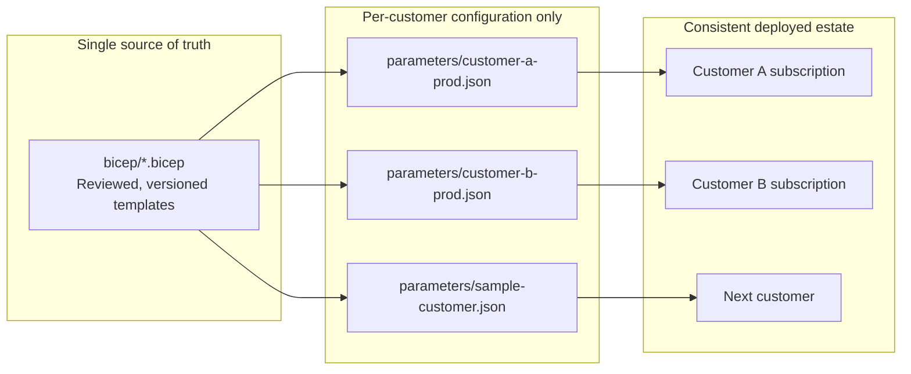
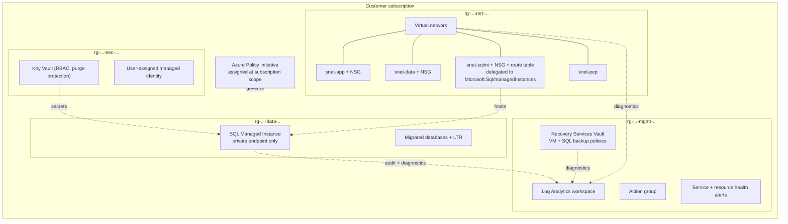
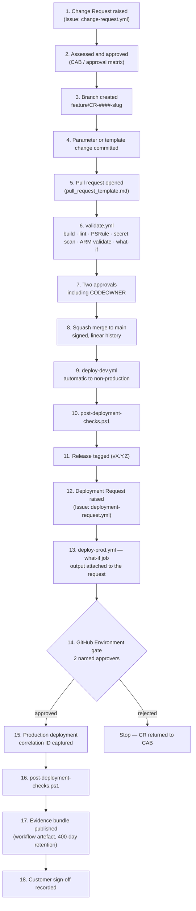
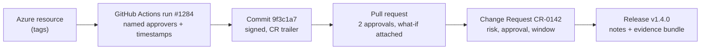

# Azure Migration Deployment Factory (`alz-deployments`)

**Repeatable, governed, audit-traceable Azure landing zone and database migration deployments.**

| | |
|---|---|
| **Microsoft Advanced Specialization** | Infrastructure and Database Migration to Microsoft Azure |
| **Primary control evidenced** | **3.1 — Repeatable Deployment** |
| **Deployment technology** | Bicep (Infrastructure as Code) + GitHub Actions (CI/CD) |
| **Authentication model** | Secretless — GitHub OIDC federated to Microsoft Entra workload identity |
| **Repository owner** | Cloud Platform Engineering |
| **Document owner** | Principal Azure Architect |
| **Current release** | `v1.3.1` |
| **Last reviewed** | 2026-09-28 |

---

## 1. What this repository is

This repository is **the deployment capability itself**, not a record of a single project.

Every customer infrastructure and database migration delivered by this practice is deployed from
**this repository, using these templates, through these pipelines**. A new customer is onboarded by
adding a **parameter file only** — no template is copied, forked, or hand-modified per engagement.

That single property is what makes the deployment *repeatable*, and it is the core of the evidence
presented for Control 3.1.



---

## 2. What gets deployed

A single subscription-scoped deployment (`bicep/main.bicep`) provisions a complete, governed
migration landing zone:

| Layer | Resources | Module |
|---|---|---|
| **Resource organisation** | 4 purpose-scoped resource groups (network, management, security, data) | `main.bicep` |
| **Networking** | Virtual network, application / data / SQL MI / private-endpoint / Bastion subnets, NSGs with explicit rule sets, SQL MI route table, optional hub peering | `networking.bicep` |
| **Identity & secrets** | User-assigned managed identity, RBAC-enabled Key Vault with purge protection, scoped role assignments for platform and customer groups | `identity.bicep` |
| **Monitoring & data protection** | Log Analytics workspace, action group, service-health and resource-health alerts, saved migration audit queries, Recovery Services Vault with VM and SQL backup policies and soft delete | `monitoring.bicep` |
| **Governance** | 3 custom policy definitions, 1 policy initiative (including allowed-location built-ins), subscription-scope assignment with non-compliance messaging | `governance.bicep` |
| **Database target** | Azure SQL Managed Instance, private-only, TLS 1.2 minimum, Entra admin group, auditing to Log Analytics, Defender for SQL, per-database long-term retention | `sql-managed-instance.bicep` |



---

## 3. Repository map

```text
alz-deployments/
├── README.md                          This file — orientation for engineers and auditors
├── CHANGELOG.md                       Release history (Keep a Changelog format)
├── CONTRIBUTING.md                    Mandatory contribution and review process
├── SECURITY.md                        Secret handling and vulnerability disclosure
├── LICENSE                            Terms under which customers reuse the IaC
├── ps-rule.yaml                       PSRule for Azure policy-as-code test configuration
├── .editorconfig / .gitignore         Formatting and exclusion rules
│
├── bicep/                             Infrastructure as Code — the single source of truth
│   ├── main.bicep                     Subscription-scope orchestrator
│   ├── networking.bicep               VNet, subnets, NSGs, route table, peering
│   ├── identity.bicep                 Managed identity, Key Vault, RBAC
│   ├── monitoring.bicep               Log Analytics, alerts, Recovery Services Vault
│   ├── governance.bicep               Policy definitions, initiative, assignment
│   └── sql-managed-instance.bicep     SQL Managed Instance and databases
│
├── parameters/                        Per-customer configuration — the ONLY thing that varies
│   ├── customer-a-dev.json
│   ├── customer-a-prod.json
│   ├── customer-b-dev.json
│   ├── customer-b-prod.json
│   └── sample-customer.json           Annotated template for new engagements
│
├── .github/
│   ├── CODEOWNERS                     Mandatory subject-matter review per path
│   ├── pull_request_template.md       Change-control metadata on every PR
│   ├── ISSUE_TEMPLATE/
│   │   ├── change-request.yml         Formal change request (CR) record
│   │   ├── deployment-request.yml     Scheduled deployment authorisation record
│   │   └── config.yml
│   └── workflows/
│       ├── validate.yml               PR gate: build, lint, scan, validate, what-if
│       ├── deploy-dev.yml             Non-production deployment
│       └── deploy-prod.yml            Production deployment with approval gates
│
├── scripts/
│   ├── validate.ps1                   Local parity of the CI validation gate
│   ├── deploy.ps1                     Controlled deployment driver with evidence capture
│   └── post-deployment-checks.ps1     Objective post-deployment verification suite
│
├── docs/
│   ├── Deployment_Methodology.md      THE repeatable process — primary 3.1 evidence
│   ├── Architecture.md                Target-state landing zone design and decisions
│   ├── Naming_Standards.md            Naming convention and mandatory tag schema
│   ├── Change_Management.md           Branching, approval, release, rollback, sign-off
│   └── Audit_Evidence_Guide.md        Auditor entry point and evidence mapping
│
└── examples/
    ├── migration-project-01.md        Contoso Manufacturing — SQL Server to SQL MI
    └── migration-project-02.md        Northwind Financial — datacentre exit + DB migration
```

---

## 4. Deployment flow

Every change to every customer environment follows exactly this path. There is no other route to
production.



---

## 5. Quick start

### 5.1 Prerequisites

| Requirement | Minimum version | Notes |
|---|---|---|
| Azure CLI | 2.61.0 | `az bicep version` must report 0.28.0 or later |
| PowerShell | 7.4 | Required by all scripts in `scripts/`; the scripts drive the Azure CLI, so no Az PowerShell module is needed |
| PSRule for Azure | 1.38.0 | `Install-Module PSRule.Rules.Azure -Scope CurrentUser` |
| Azure RBAC | Contributor + User Access Administrator on the target subscription | Required for policy assignment and role assignment |
| Entra | A security group for the SQL MI administrator | Object ID supplied in the parameter file |
| Key Vault | A bootstrap Key Vault holding `sqlmi-admin-password` | Referenced by parameter files; never stored in Git. The deploying identity needs `Key Vault Secrets User` on it |

### 5.2 Validate locally (never deploy without this)

```powershell
./scripts/validate.ps1 -ParameterFile ./parameters/sample-customer.json -SubscriptionId <subscription-guid>
```

### 5.3 Preview the change (what-if)

```powershell
./scripts/deploy.ps1 `
    -ParameterFile ./parameters/customer-a-dev.json `
    -SubscriptionId <subscription-guid> `
    -ChangeRequestId CR-0142 `
    -WhatIfOnly
```

### 5.4 Deploy

```powershell
./scripts/deploy.ps1 `
    -ParameterFile ./parameters/customer-a-dev.json `
    -SubscriptionId <subscription-guid> `
    -ChangeRequestId CR-0142
```

### 5.5 Verify

```powershell
./scripts/post-deployment-checks.ps1 `
    -ParameterFile ./parameters/customer-a-dev.json `
    -SubscriptionId <subscription-guid> `
    -OutputPath ./evidence-postdeploy.json
```

> Manual deployment from a workstation is permitted **only** against `dev` subscriptions and only for
> pre-merge investigation. All `test` and `prod` deployments must run through GitHub Actions so that
> the approval, correlation ID, and evidence records are produced. See
> [docs/Change_Management.md](docs/Change_Management.md).

---

## 6. Onboarding a new customer

The entire onboarding process is a configuration exercise. Templates are never modified.

1. Raise a change request issue using the **Customer / Change Request** form.
2. Copy `parameters/sample-customer.json` to `parameters/<customer-code>-<env>.json`.
3. Populate customer identity, IP address plan, sizing, retention, and Entra object IDs.
4. Point `sqlAdminPassword` at the customer's bootstrap Key Vault secret reference.
5. Run `./scripts/validate.ps1` locally until clean.
6. Open a pull request using the **Infrastructure change** template.
7. After merge, deploy to `dev`, verify, tag a release, then request production deployment.

Estimated elapsed effort for a standard landing zone: configuration ~2 hours, validation and review
per the SLAs in [CONTRIBUTING.md](CONTRIBUTING.md).

---

## 7. Audit traceability

Every deployed resource carries provenance tags written by the pipeline, so any live Azure resource
can be traced back to the reviewed change that created it:

| Tag | Example value | Purpose |
|---|---|---|
| `ManagedBy` | `IaC` | Declares the resource is pipeline-managed; enforced by policy |
| `SourceRepo` | `contoso-partner/alz-deployments` | Which repository produced it |
| `SourceCommit` | `9f3c1a7` | Which reviewed commit produced it |
| `DeploymentId` | `1284` | Which GitHub Actions run produced it |
| `ChangeRequest` | `CR-0142` | Which approved change authorised it |
| `DeployedUtc` | `2026-03-11T21:04:00Z` | When it was produced |



Auditors should start at **[docs/Audit_Evidence_Guide.md](docs/Audit_Evidence_Guide.md)**.

---

## 8. Governance summary

| Control | Implementation |
|---|---|
| Branch protection | `main` requires 2 approvals, CODEOWNER review, 5 status checks, signed commits, linear history; admin bypass disabled |
| Peer review | [.github/CODEOWNERS](.github/CODEOWNERS) enforces subject-matter review per path |
| Change control | Change requests raised via issue form; CAB approval recorded on the issue |
| Automated quality gate | [validate.yml](.github/workflows/validate.yml) — build, lint, PSRule, secret scan, ARM validation, what-if |
| Deployment approval | GitHub Environments `development`, `production`; production requires 2 named reviewers |
| Secret management | No secrets in Git; OIDC federated identity; Key Vault references in parameter files |
| Policy enforcement | Custom initiative assigned at subscription scope by `governance.bicep` |
| Verification | `post-deployment-checks.ps1` runs after every deployment and fails the run on non-compliance |
| Evidence retention | Workflow artefacts retained 400 days; evidence bundles archived for 24 months |

---

## 9. Documentation index

| Document | Audience | Purpose |
|---|---|---|
| [docs/Deployment_Methodology.md](docs/Deployment_Methodology.md) | Delivery teams, auditors | The seven-phase repeatable deployment process, entry/exit criteria, and artefacts |
| [docs/Architecture.md](docs/Architecture.md) | Architects, engineers, customers | Target-state landing zone and database migration architecture with design decisions |
| [docs/Naming_Standards.md](docs/Naming_Standards.md) | Engineers | Resource naming convention and mandatory tagging schema |
| [docs/Change_Management.md](docs/Change_Management.md) | All, auditors | Branching, approval, release, rollback, and customer sign-off processes |
| [docs/Audit_Evidence_Guide.md](docs/Audit_Evidence_Guide.md) | Microsoft auditor | Control 3.1 evidence mapping and live walkthrough script |
| [examples/migration-project-01.md](examples/migration-project-01.md) | All | Contoso Manufacturing — SQL Server 2014 to SQL Managed Instance |
| [examples/migration-project-02.md](examples/migration-project-02.md) | All | Northwind Financial — datacentre exit with regulated database migration |

---

## 10. Support and contacts

| Role | Responsibility | Contact |
|---|---|---|
| Principal Azure Architect | Architecture decisions, major change approval | `azure-architecture@partner.example` |
| Platform Engineering Lead | Templates, modules, pipelines | `platform-engineering@partner.example` |
| Database Migration Lead | SQL Managed Instance, database cutover | `data-migration@partner.example` |
| Cloud Security Lead | Policy, identity, secret governance | `cloud-security@partner.example` |
| Delivery Manager | Change control, release, customer sign-off | `delivery@partner.example` |
| Audit Evidence Owner | Specialization evidence and auditor liaison | `compliance@partner.example` |

Report suspected vulnerabilities per [SECURITY.md](SECURITY.md). Do not open a public issue.

---

## Change history

| Date | Version | Author | Summary |
|---|---|---|---|
| 2026-09-28 | 1.0.0 | Principal Azure Architect | Initial audit-ready baseline for Control 3.1 |
