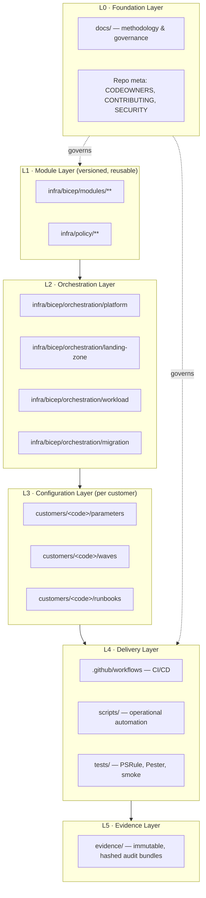
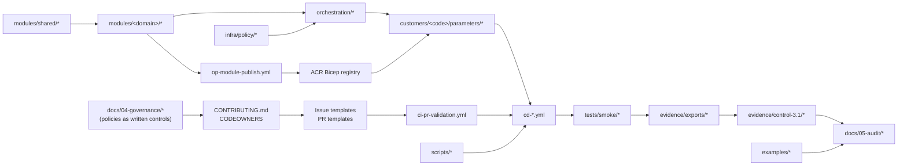
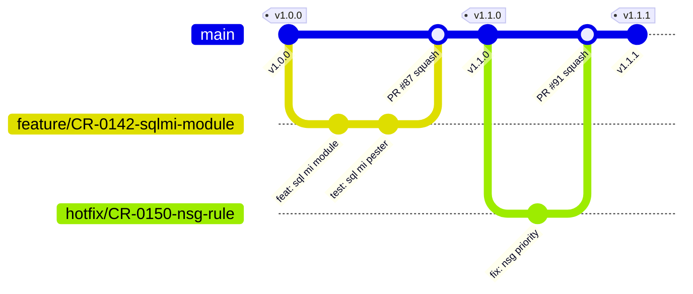
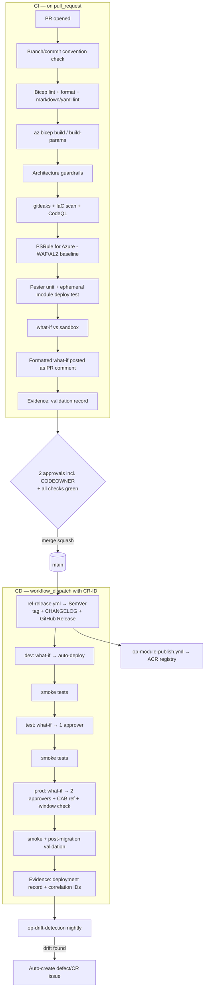
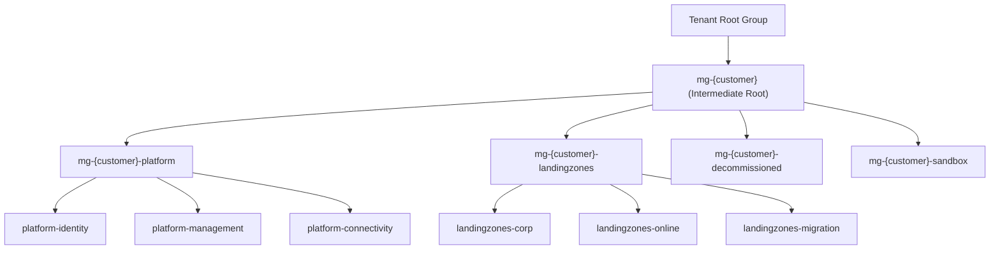
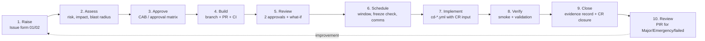

# Repository Design Specification
## `alz-deployments` — Azure Landing Zone & Migration Deployment Factory

**Document type:** Implementation handoff specification
**Target audience:** Implementation engineer, DevOps engineer, audit evidence owner
**Microsoft Advanced Specialization:** Infrastructure and Database Migration to Microsoft Azure
**Primary control addressed:** **3.1 — Repeatable Deployment**
**Secondary controls supported:** 1.x (Methodology), 2.x (Assessment & Planning), 4.x (Operations & Optimization)
**Status:** Design — no implementation files generated yet
**Version:** 1.0.0-design

> **Auditor caveat (read first).** Microsoft revises advanced specialization audit checklists periodically. Before the audit window opens, the Governance/Compliance owner **must** reconcile the sub-control identifiers used in Section 8 and Section D against the *current* published checklist PDF supplied by the Microsoft-appointed auditor, and update `evidence/control-3.1/CONTROL-MAP.md` accordingly. The evidence *artifacts* in this design are deliberately superset — they satisfy every historical phrasing of 3.1.

---

## Table of Contents

1. [Repository Architecture](#1-repository-architecture)
2. [Folder Structure](#2-folder-structure)
3. [File Inventory](#3-file-inventory)
4. [Logical Dependencies](#4-logical-dependencies)
5. [Recommended Branch Strategy](#5-recommended-branch-strategy)
6. [CI/CD Design](#6-cicd-design)
7. [Azure Landing Zone Design](#7-azure-landing-zone-design)
8. [Audit Evidence Mapping](#8-audit-evidence-mapping)
9. [Pull Request Governance Design](#9-pull-request-governance-design)
10. [Release Management Design](#10-release-management-design)
11. [Change Management Framework](#11-change-management-framework)
12. [Documentation Hierarchy](#12-documentation-hierarchy)
- [A) File Generation Order](#a-file-generation-order)
- [B) Recommended Commit Sequence](#b-recommended-commit-sequence)
- [C) Recommended Release Sequence](#c-recommended-release-sequence)
- [D) Microsoft Auditor Evidence Mapping — Control 3.1](#d-microsoft-auditor-evidence-mapping--control-31)

---

## 1. Repository Architecture

### 1.1 Design intent

The repository is a **deployment factory**, not a single deployment. It must prove to an auditor that the partner executes customer migrations using a *standardised, versioned, peer-reviewed, automated* process rather than bespoke manual effort per engagement.

Three properties drive every structural decision:

| Property | Structural consequence |
|---|---|
| **Repeatability** | Logic (Bicep modules) is separated absolutely from configuration (parameter files). A new customer is onboarded by adding *configuration only*. |
| **Reusability** | Modules are independently versioned and published to an Azure Container Registry Bicep registry. Customers pin module versions. |
| **Traceability** | Every production change traces: Issue (CR) → Branch → PR → Review → Merge Commit → Release Tag → Workflow Run ID → Azure Deployment Correlation ID → Evidence Bundle. |

### 1.2 Layered architecture



**Dependency rule (strictly enforced by CI):** a layer may depend only on layers *below* it. Modules must never reference a customer. Orchestrations must never hard-code a value that belongs in a parameter file. CI check `ci-architecture-guardrails` enforces this by static path analysis.

### 1.3 Deployment scope model

| Scope | Bicep `targetScope` | Orchestration entry point | Deployed by |
|---|---|---|---|
| Tenant | `tenant` | `orchestration/platform/mg-hierarchy.bicep` | `cd-platform.yml` |
| Management Group | `managementGroup` | `orchestration/platform/policy-assignments.bicep` | `cd-platform.yml` |
| Subscription | `subscription` | `orchestration/landing-zone/landing-zone.bicep` | `cd-landing-zone.yml` |
| Resource Group | `resourceGroup` | `orchestration/workload/*.bicep` | `cd-workload.yml` |
| Migration | `subscription` | `orchestration/migration/*.bicep` | `cd-migration-wave.yml` |

### 1.4 Module distribution model

```
Source (this repo) ──build/test/version──► ACR Bicep Registry (br:crlcbuiac.azurecr.io/bicep/modules/...)
                                                     │
                     ┌───────────────────────────────┼───────────────────────────────┐
                     ▼                               ▼                               ▼
          Customer A (pin v1.4.0)        Customer B (pin v1.4.0)        Customer C (pin v1.2.1)
```

This is the single strongest architectural demonstration of **customer reusability**: identical artefact, different configuration, explicit version pinning, documented upgrade path.

### 1.5 Naming & tagging standards (repo-wide)

- **Resource naming:** `<type-abbr>-<customer>-<workload>-<env>-<region-abbr>-<instance>` (e.g. `vnet-ctso-hub-prd-weu-001`), implemented centrally in `modules/shared/naming.bicep`.
- **Mandatory tags:** `Customer`, `Environment`, `Workload`, `CostCenter`, `Owner`, `DataClassification`, `ManagedBy=IaC`, `SourceRepo`, `SourceCommit`, `DeploymentId`, `ChangeRequest`.
- `SourceCommit` + `DeploymentId` + `ChangeRequest` tags are **audit-critical**: they let an auditor stand in the Azure Portal on a live resource and trace it back to a reviewed pull request. Enforced by Azure Policy `require-iac-provenance-tags`.

---

## 2. Folder Structure

```text
alz-deployments/
│
├── .github/
│   ├── CODEOWNERS
│   ├── dependabot.yml
│   ├── pull_request_template.md
│   ├── PULL_REQUEST_TEMPLATE/
│   │   ├── infrastructure_change.md
│   │   ├── module_change.md
│   │   ├── customer_onboarding.md
│   │   └── documentation_change.md
│   ├── ISSUE_TEMPLATE/
│   │   ├── config.yml
│   │   ├── 01-change-request.yml
│   │   ├── 02-emergency-change.yml
│   │   ├── 03-defect-report.yml
│   │   ├── 04-customer-onboarding.yml
│   │   ├── 05-migration-wave.yml
│   │   ├── 06-security-finding.yml
│   │   ├── 07-module-request.yml
│   │   └── 08-documentation-update.yml
│   ├── actions/
│   │   ├── azure-oidc-login/action.yml
│   │   ├── evidence-writer/action.yml
│   │   └── whatif-formatter/action.yml
│   └── workflows/
│       ├── _reusable-validate.yml
│       ├── _reusable-whatif.yml
│       ├── _reusable-deploy.yml
│       ├── _reusable-evidence.yml
│       ├── ci-pr-validation.yml
│       ├── ci-architecture-guardrails.yml
│       ├── ci-security-scan.yml
│       ├── ci-module-unit-test.yml
│       ├── cd-platform.yml
│       ├── cd-landing-zone.yml
│       ├── cd-workload.yml
│       ├── cd-migration-wave.yml
│       ├── op-drift-detection.yml
│       ├── op-evidence-export.yml
│       ├── op-module-publish.yml
│       └── rel-release.yml
│
├── docs/
│   ├── README.md
│   ├── 00-overview/
│   │   ├── 01-purpose-and-scope.md
│   │   ├── 02-repository-architecture.md
│   │   ├── 03-roles-and-raci.md
│   │   └── 04-glossary.md
│   ├── 01-methodology/
│   │   ├── 01-deployment-methodology.md
│   │   ├── 02-migration-methodology.md
│   │   ├── 03-database-migration-playbook.md
│   │   ├── 04-assessment-to-deployment-handoff.md
│   │   ├── 05-wave-planning.md
│   │   ├── 06-cutover-and-rollback.md
│   │   └── 07-post-migration-validation.md
│   ├── 02-architecture/
│   │   ├── 01-landing-zone-architecture.md
│   │   ├── 02-management-group-design.md
│   │   ├── 03-network-topology.md
│   │   ├── 04-identity-and-access.md
│   │   ├── 05-security-baseline.md
│   │   ├── 06-data-platform-architecture.md
│   │   ├── 07-monitoring-and-observability.md
│   │   ├── 08-bcdr-architecture.md
│   │   └── 09-naming-and-tagging.md
│   ├── 03-operations/
│   │   ├── 01-prerequisites.md
│   │   ├── 02-bootstrap-guide.md
│   │   ├── 03-cicd-operations.md
│   │   ├── 04-customer-onboarding-guide.md
│   │   ├── 05-module-authoring-guide.md
│   │   ├── 06-testing-strategy.md
│   │   ├── 07-drift-management.md
│   │   └── 08-troubleshooting.md
│   ├── 04-governance/
│   │   ├── 01-branch-strategy.md
│   │   ├── 02-pull-request-governance.md
│   │   ├── 03-change-management.md
│   │   ├── 04-release-management.md
│   │   ├── 05-versioning-policy.md
│   │   ├── 06-policy-governance.md
│   │   ├── 07-secrets-and-identity-governance.md
│   │   └── 08-definition-of-done.md
│   ├── 05-audit/
│   │   ├── 01-audit-evidence-guide.md
│   │   ├── 02-control-3.1-repeatable-deployment.md
│   │   ├── 03-evidence-collection-procedure.md
│   │   ├── 04-evidence-index.md
│   │   └── 05-auditor-walkthrough-script.md
│   ├── 06-customer/
│   │   ├── 01-customer-reuse-guide.md
│   │   ├── 02-customer-handover-pack.md
│   │   ├── 03-customer-runbook-template.md
│   │   └── 04-knowledge-transfer-plan.md
│   └── diagrams/
│       ├── src/            # .drawio and .mmd sources
│       └── export/         # .svg / .png rendered outputs
│
├── infra/
│   ├── bicepconfig.json
│   ├── bicep/
│   │   ├── modules/
│   │   │   ├── shared/            # naming, tags, rbac, diagnostics, private-endpoint, lock
│   │   │   ├── management-group/
│   │   │   ├── subscription/
│   │   │   ├── networking/        # hub-vnet, spoke-vnet, peering, firewall, bastion,
│   │   │   │                      # vpn-gateway, expressroute, private-dns-zones, nsg, route-table
│   │   │   ├── identity/          # managed-identity, entra-ds, rbac-assignment
│   │   │   ├── management/        # log-analytics, automation-account, dcr, action-group, alerts
│   │   │   ├── security/          # key-vault, defender-plans, sentinel, ddos
│   │   │   ├── compute/           # vm-linux, vm-windows, vmss, availability-set, avd-hostpool
│   │   │   ├── data/              # sql-managed-instance, sql-database, sql-server,
│   │   │   │                      # postgresql-flexible, mysql-flexible, cosmos-db,
│   │   │   │                      # data-migration-service, sql-elastic-pool
│   │   │   ├── storage/           # storage-account, recovery-services-vault, backup-vault,
│   │   │   │                      # backup-policy, netapp-files
│   │   │   ├── migration/         # azure-migrate-project, asr-replication-policy,
│   │   │   │                      # asr-recovery-plan, migration-staging
│   │   │   └── integration/       # app-service-plan, app-service, function-app, apim
│   │   └── orchestration/
│   │       ├── platform/
│   │       ├── landing-zone/
│   │       ├── workload/
│   │       └── migration/
│   └── policy/
│       ├── definitions/
│       ├── initiatives/
│       ├── assignments/
│       └── exemptions/
│
├── customers/
│   ├── _template/
│   │   ├── customer.yaml
│   │   ├── parameters/
│   │   ├── waves/
│   │   ├── runbooks/
│   │   └── README.md
│   ├── contoso/
│   │   ├── customer.yaml
│   │   ├── parameters/
│   │   │   ├── platform/{dev,prod}/*.bicepparam
│   │   │   ├── landing-zone/{dev,test,prod}/*.bicepparam
│   │   │   ├── workload/{dev,test,prod}/*.bicepparam
│   │   │   └── migration/*.bicepparam
│   │   ├── waves/
│   │   ├── runbooks/
│   │   └── evidence/
│   └── fabrikam/   (same shape)
│
├── examples/
│   ├── README.md
│   ├── 01-greenfield-alz-hub-spoke/
│   ├── 02-vm-lift-and-shift-migration/
│   ├── 03-sql-server-to-sql-managed-instance/
│   ├── 04-oracle-to-postgresql-flexible/
│   └── 05-file-server-to-azure-files/
│
├── scripts/
│   ├── powershell/
│   ├── bash/
│   └── python/
│
├── tests/
│   ├── psrule/
│   ├── pester/
│   ├── smoke/
│   └── data/
│
├── evidence/
│   ├── README.md
│   ├── templates/
│   ├── control-3.1/
│   └── exports/            # generated, hash-manifested, never hand-edited
│
├── .config/
│   ├── ps-rule.yaml
│   ├── .gitleaks.toml
│   ├── .markdownlint.jsonc
│   └── .yamllint.yml
│
├── .editorconfig
├── .gitattributes
├── .gitignore
├── CHANGELOG.md
├── CODE_OF_CONDUCT.md
├── CONTRIBUTING.md
├── LICENSE
├── README.md
├── SECURITY.md
├── SUPPORT.md
└── VERSION
```

---

## 3. File Inventory

**Owner role key:**
`PA` Principal Azure Architect · `PE` Platform Engineering Lead · `DO` DevOps Engineer · `ML` Infrastructure Migration Lead · `DBA` Database Migration Lead · `SEC` Cloud Security Lead · `GOV` Governance & Compliance Manager · `DOC` Technical Documentation Lead · `DEL` Delivery Manager · `QA` Audit Evidence Owner

**Audit relevance key:** `A1` Direct 3.1 primary evidence · `A2` Supporting 3.1 evidence · `A3` Cross-control / contextual evidence · `—` Operational only

### 3.1 Repository root & meta files

| File name | Purpose | Owner | Key sections | Audit relevance | Dependencies |
|---|---|---|---|---|---|
| `README.md` | Repository front door; states that this repo *is* the partner's repeatable deployment capability; 10-minute orientation for auditor and engineer | PA | Purpose · Specialization statement · Architecture diagram · Quick start · Repo map · Versioning · Where audit evidence lives · Support | **A1** | `docs/**`, `diagrams/export/repo-architecture.svg` |
| `CONTRIBUTING.md` | Mandatory contribution process; the written control that makes review non-optional | GOV | Branch naming · Commit convention · Required local checks · PR process · Review SLAs · Definition of Done · Escalation | **A1** | `docs/04-governance/*` |
| `CODE_OF_CONDUCT.md` | Behavioural baseline | GOV | Standards · Enforcement · Contacts | A3 | — |
| `SECURITY.md` | Vulnerability disclosure & secret-handling policy | SEC | Reporting channel · SLA · Supported versions · Secret management rules · No-secrets-in-repo rule | A2 | `.config/.gitleaks.toml` |
| `SUPPORT.md` | Support channels, customer escalation path | DEL | Channels · Severity matrix · Response targets | A3 | — |
| `CHANGELOG.md` | Human-readable, Keep-a-Changelog-format history of every release | DEL | Unreleased · Per-version Added/Changed/Deprecated/Removed/Fixed/Security | **A1** | `rel-release.yml`, git tags |
| `VERSION` | Single source of truth for repository release version (SemVer) | DEL | Plain version string | A2 | `rel-release.yml` |
| `LICENSE` | Legal terms for customer reuse of IaC | GOV | License text | A2 | — |
| `.gitignore` | Prevent state/secret/artefact leakage into VCS | DO | Azure CLI · Terraform-style state · `*.env` · build output · local evidence | A2 | — |
| `.gitattributes` | Enforce LF, mark generated files, binary diagram handling | DO | EOL rules · `linguist-generated` · binary patterns | — | — |
| `.editorconfig` | Deterministic formatting across contributors | DO | Indent · charset · trim · final newline | A2 | — |
| `REPOSITORY-DESIGN.md` | This document — design of record, retained for auditor context | PA | All 12 design sections | A2 | — |

### 3.2 `.github/` — governance & automation configuration

| File name | Purpose | Owner | Key sections | Audit relevance | Dependencies |
|---|---|---|---|---|---|
| `.github/CODEOWNERS` | Enforces mandatory subject-matter review per path; the mechanical heart of PR governance | GOV | Global default · `/infra/bicep/modules/` → PE+PA · `/infra/policy/` → SEC+GOV · `/customers/` → DEL+ML · `/.github/workflows/` → DO · `/docs/05-audit/` → QA+GOV | **A1** | GitHub teams; branch protection |
| `.github/dependabot.yml` | Automated dependency and Action version currency | DO | `github-actions` ecosystem · schedule · reviewers · labels | A2 | `workflows/**` |
| `.github/pull_request_template.md` | Default PR template; guarantees every change carries change-control metadata | GOV | Linked CR · Change type/class · Risk & blast radius · What-if attached · Testing evidence · Rollback plan · Security review · Docs updated · Reviewer checklist · Evidence links | **A1** | Issue templates, `docs/04-governance/02` |
| `PULL_REQUEST_TEMPLATE/infrastructure_change.md` | Variant for customer-impacting infra changes | ML | Above + affected customers/subscriptions · maintenance window · customer approval reference · post-deploy validation | **A1** | `cd-*.yml` |
| `PULL_REQUEST_TEMPLATE/module_change.md` | Variant for shared module changes | PE | SemVer impact (major/minor/patch) · breaking-change statement · consumer impact analysis · test matrix · registry publish plan · deprecation notice | **A1** | `op-module-publish.yml`, `docs/04-governance/05` |
| `PULL_REQUEST_TEMPLATE/customer_onboarding.md` | Variant for adding a new customer configuration | DEL | Customer code · subscriptions · regions · tenant/identity prereqs · parameter completeness checklist · naming/tag conformance | **A1** | `customers/_template/**` |
| `PULL_REQUEST_TEMPLATE/documentation_change.md` | Lightweight variant for docs-only changes | DOC | Pages changed · diagram regenerated? · index updated? · link check | A2 | `docs/**` |
| `ISSUE_TEMPLATE/config.yml` | Disables blank issues; routes to correct form; links to docs | GOV | `blank_issues_enabled: false` · contact links | **A1** | all issue forms |
| `ISSUE_TEMPLATE/01-change-request.yml` | The formal RFC/CR record — origin of every production change | DEL | CR ID · Customer · Change class (Standard/Normal/Major) · Business justification · Scope · Risk & impact · Backout plan · Test plan · Requested window · CAB approval fields | **A1** | `docs/04-governance/03` |
| `ISSUE_TEMPLATE/02-emergency-change.yml` | Break-glass change path with retrospective approval | DEL | Incident ref · Justification · Approver (named) · Actions taken · Retrospective CAB date · PIR link | **A1** | `docs/04-governance/03` |
| `ISSUE_TEMPLATE/03-defect-report.yml` | Defect intake with environment and reproduction data | PE | Environment · Module+version · Expected/actual · Deployment run ID · Correlation ID · Severity | A2 | — |
| `ISSUE_TEMPLATE/04-customer-onboarding.yml` | New engagement intake driving repeatable onboarding | DEL | Customer · Tenant · Subscription plan · Regions · Compliance requirements · Migration scope · Target dates | **A1** | `docs/03-operations/04` |
| `ISSUE_TEMPLATE/05-migration-wave.yml` | Per-wave planning and tracking record | ML | Wave ID · In-scope servers/databases · Dependencies · Replication start · Test failover date · Cutover window · Rollback trigger criteria · Sign-off | **A1** | `customers/*/waves/*` |
| `ISSUE_TEMPLATE/06-security-finding.yml` | Security/policy non-compliance intake | SEC | Finding source · Severity · Affected scope · Remediation owner · Due date | A2 | `infra/policy/**` |
| `ISSUE_TEMPLATE/07-module-request.yml` | Demand signal for new reusable module | PE | Use case · Customers benefiting · Required parameters · AVM equivalent check · Target release | A2 | `docs/03-operations/05` |
| `ISSUE_TEMPLATE/08-documentation-update.yml` | Doc gap intake | DOC | Page · Gap · Proposed change | A3 | — |
| `actions/azure-oidc-login/action.yml` | Composite action: federated (secretless) Azure auth | DO | Inputs (client-id, tenant-id, subscription-id) · `azure/login@v2` · scope assertion · audit log line | **A1** | GitHub OIDC ↔ Entra federated credentials |
| `actions/evidence-writer/action.yml` | Composite action: writes standardised evidence records from any job | QA | Inputs (control, stage, artefacts) · JSON schema emit · SHA-256 manifest · artifact upload | **A1** | `evidence/templates/*` |
| `actions/whatif-formatter/action.yml` | Converts `az deployment what-if` output into a readable PR comment + evidence artefact | DO | Parse · Summarise create/modify/delete · Render markdown · Fail-on-delete guard | **A1** | `_reusable-whatif.yml` |

### 3.3 `.github/workflows/` — CI/CD

| File name | Purpose | Owner | Key sections | Audit relevance | Dependencies |
|---|---|---|---|---|---|
| `_reusable-validate.yml` | Reusable: lint + build + policy-as-code + unit test for any Bicep path | DO | Inputs (path, ruleset) · Bicep lint · `az bicep build` · PSRule for Azure · Pester · artefact upload | **A1** | `.config/ps-rule.yaml`, `tests/**` |
| `_reusable-whatif.yml` | Reusable: preview-only deployment simulation against target scope | DO | Inputs (scope, sub, params) · OIDC login · `what-if` · formatter · PR comment · evidence emit | **A1** | `actions/azure-oidc-login`, `actions/whatif-formatter` |
| `_reusable-deploy.yml` | Reusable: the single, only code path that mutates Azure | DO | Inputs (env, scope, template, params, cr-id) · environment gate · OIDC · deployment stack create/update · output capture · tagging provenance · evidence emit · failure rollback hook | **A1** | GitHub Environments, `actions/evidence-writer` |
| `_reusable-evidence.yml` | Reusable: collect, hash, and publish an evidence bundle | QA | Gather logs/what-if/approvals/run metadata · SHA-256 manifest · retention · upload | **A1** | `evidence/**` |
| `ci-pr-validation.yml` | Mandatory PR status check; blocks merge on any failure | DO | Triggers (`pull_request`) · path filters · matrix over changed modules · calls `_reusable-validate` + `_reusable-whatif` (sandbox) · required check name | **A1** | reusable workflows |
| `ci-architecture-guardrails.yml` | Enforces the layer dependency rule and repo conventions mechanically | PE | Module→customer reference ban · hard-coded subscription/GUID scan · required-tag scan · naming-module usage check · parameter-file schema check | **A1** | `scripts/powershell/Test-RepoConventions.ps1` |
| `ci-security-scan.yml` | Secret, IaC, and supply-chain scanning | SEC | gitleaks · Microsoft Security DevOps / Checkov · CodeQL (Actions) · SARIF upload to code scanning · fail thresholds | **A1** | `.config/.gitleaks.toml` |
| `ci-module-unit-test.yml` | Per-module compile + deployment test into ephemeral sandbox RG, then teardown | PE | Matrix over modules · deploy to sandbox · assert outputs · Pester assertions · destroy · results artifact | **A1** | `tests/pester/**` |
| `cd-platform.yml` | Deploys management groups, policy, platform subscriptions | PA | `workflow_dispatch` + tag trigger · inputs (customer, env, cr-id) · what-if → approval → deploy · tenant/MG scope · evidence | **A1** | `_reusable-*`, `orchestration/platform/*` |
| `cd-landing-zone.yml` | Deploys connectivity, identity, management landing zones per customer/env | PE | Same gated pattern at subscription scope · env-sequenced promotion | **A1** | `orchestration/landing-zone/*` |
| `cd-workload.yml` | Deploys application/data workload resources into landing zones | ML | RG scope · dependency on landing zone outputs · smoke tests post-deploy | **A1** | `orchestration/workload/*`, `tests/smoke/**` |
| `cd-migration-wave.yml` | Executes a migration wave: staging infra, replication config, test failover, cutover gate | ML / DBA | Wave input · pre-flight checks · infra deploy · replication · **manual cutover approval gate** · post-migration validation · rollback job · evidence | **A1** | `orchestration/migration/*`, `customers/*/waves/*` |
| `op-drift-detection.yml` | Scheduled nightly what-if across all deployed scopes; opens issue on drift | PE | Cron · matrix over customers/envs · what-if · diff classification · auto-create issue · evidence emit | **A1** | `_reusable-whatif.yml` |
| `op-evidence-export.yml` | Scheduled/manual export of the full audit evidence bundle | QA | Cron (monthly) + dispatch · pull PR/review/run metadata via API · render index · hash manifest · commit to `evidence/exports/` via PR | **A1** | `scripts/python/export_evidence.py` |
| `op-module-publish.yml` | Publishes versioned modules to the ACR Bicep registry on module tag | PE | Tag trigger `modules/**/v*` · build · `az bicep publish` with `--documentationUri` · immutability check · registry inventory update | **A1** | ACR, `docs/04-governance/05` |
| `rel-release.yml` | Cuts a repository release: version bump, changelog, tag, release notes, evidence snapshot | DEL | Trigger on `main` release commit · SemVer derive from Conventional Commits · update `CHANGELOG.md`/`VERSION` · create annotated tag + GitHub Release · attach evidence bundle | **A1** | `CHANGELOG.md`, `VERSION` |

### 3.4 `infra/bicep/modules/` — reusable module layer

> Every module folder contains the **same five files**. This uniformity is itself audit evidence of a repeatable engineering standard. `<module>` below is a placeholder (e.g. `networking/hub-vnet`).

| File name | Purpose | Owner | Key sections | Audit relevance | Dependencies |
|---|---|---|---|---|---|
| `modules/<module>/main.bicep` | The reusable, customer-agnostic resource definition | PE | `metadata name/description/owner/version` · `targetScope` · decorated params with `@description`/`@allowed`/`@minLength` · variables · resources · `output` block | **A1** | `modules/shared/*` |
| `modules/<module>/README.md` | Module contract: what it does, every parameter, every output, usage example | PE | Description · Parameters table · Outputs table · Usage snippet · Version history · Known limitations · AVM alignment note | **A1** | `main.bicep` |
| `modules/<module>/main.test.bicep` | Deployable test harness proving the module works in isolation | PE | Minimum-viable invocation · maximum/complex invocation · assertion outputs | **A1** | `main.bicep` |
| `modules/<module>/version.json` | Module SemVer, changelog pointer, deprecation status | PE | `version` · `status` (preview/GA/deprecated) · `supersededBy` · `lastReviewed` | **A1** | `op-module-publish.yml` |
| `modules/<module>/CHANGELOG.md` | Per-module change history independent of repo release | PE | Per-version entries with breaking-change markers | **A1** | `version.json` |

**Module catalogue (all follow the 5-file pattern):**

| Group | Modules | Owner | Audit relevance |
|---|---|---|---|
| `shared/` | `naming`, `tags`, `rbac-assignment`, `diagnostic-settings`, `private-endpoint`, `resource-lock`, `budget` | PE | **A1** (naming/tagging standardisation) |
| `management-group/` | `mg-hierarchy`, `mg-subscription-association` | PA | **A1** |
| `subscription/` | `subscription-vending`, `subscription-placement` | PA | **A1** |
| `networking/` | `hub-vnet`, `spoke-vnet`, `vnet-peering`, `azure-firewall`, `firewall-policy`, `bastion`, `vpn-gateway`, `expressroute-gateway`, `private-dns-zones`, `nsg`, `route-table`, `application-gateway`, `virtual-wan` | PE | **A1** |
| `identity/` | `user-assigned-identity`, `entra-domain-services`, `rbac-custom-role` | SEC | A2 |
| `management/` | `log-analytics-workspace`, `automation-account`, `data-collection-rule`, `action-group`, `alert-rules`, `dashboard` | PE | A2 |
| `security/` | `key-vault`, `defender-for-cloud-plans`, `sentinel`, `ddos-protection-plan` | SEC | **A1** |
| `compute/` | `vm-windows`, `vm-linux`, `vmss`, `availability-set`, `proximity-placement-group`, `shared-image-gallery` | ML | **A1** |
| `data/` | `sql-server`, `sql-database`, `sql-elastic-pool`, `sql-managed-instance`, `postgresql-flexible`, `mysql-flexible`, `cosmos-db`, `data-migration-service`, `sql-vm` | DBA | **A1** (specialization core) |
| `storage/` | `storage-account`, `file-share`, `recovery-services-vault`, `backup-vault`, `backup-policy-vm`, `backup-policy-sql`, `netapp-files` | ML | **A1** |
| `migration/` | `azure-migrate-project`, `asr-replication-policy`, `asr-recovery-plan`, `migration-staging-storage`, `database-migration-runtime` | ML / DBA | **A1** (specialization core) |
| `integration/` | `app-service-plan`, `app-service`, `function-app`, `api-management` | PE | A3 |

### 3.5 `infra/bicep/orchestration/` — solution layer

| File name | Purpose | Owner | Key sections | Audit relevance | Dependencies |
|---|---|---|---|---|---|
| `orchestration/platform/mg-hierarchy.bicep` | Deploys the full CAF management group tree (tenant scope) | PA | `targetScope='tenant'` · MG tree params · module calls · outputs (MG IDs) | **A1** | `modules/management-group/*` |
| `orchestration/platform/policy-assignments.bicep` | Assigns built-in + custom initiatives across the MG tree | GOV | `targetScope='managementGroup'` · assignment loop · enforcement mode · identity · remediation | **A1** | `infra/policy/**` |
| `orchestration/platform/subscription-vending.bicep` | Standardised subscription creation/placement/baseline | PA | Vending params · placement · budget · baseline RBAC · tags | **A1** | `modules/subscription/*` |
| `orchestration/platform/main.bicep` | Composite platform entry point (hierarchy + policy + vending) | PA | Ordered module composition · conditional deployment flags · outputs | **A1** | all platform orchestrations |
| `orchestration/landing-zone/connectivity.bicep` | Hub network, firewall, gateways, DNS, Bastion | PE | Hub vnet · firewall policy · gateway subnets · private DNS zone set · diagnostics | **A1** | `modules/networking/*` |
| `orchestration/landing-zone/identity.bicep` | Identity landing zone (DC subnet/VMs or Entra DS, RBAC baseline) | SEC | Identity vnet · DC deployment · RBAC · diagnostics | A2 | `modules/identity/*`, `modules/compute/*` |
| `orchestration/landing-zone/management.bicep` | LAW, automation, DCRs, alerts, dashboards | PE | Workspace · solutions · DCR association · alert baseline | A2 | `modules/management/*` |
| `orchestration/landing-zone/corp-spoke.bicep` | A routed, policy-governed spoke landing zone | PE | Spoke vnet · peering · UDR to firewall · NSGs · private endpoint subnet | **A1** | `modules/networking/*` |
| `orchestration/landing-zone/main.bicep` | Composite landing zone entry point | PE | Conditional composition · cross-module wiring via outputs | **A1** | above |
| `orchestration/workload/iaas-workload.bicep` | Standard migrated-VM workload pattern | ML | Compute · disks · backup · monitoring · NSG · load balancer | **A1** | `modules/compute/*`, `modules/storage/*` |
| `orchestration/workload/data-platform.bicep` | Standard migrated-database pattern (SQL MI / Flexible Server) | DBA | DB service · private endpoint · firewall · backup/LTR · auditing · diagnostics · Defender for SQL | **A1** | `modules/data/*` |
| `orchestration/workload/main.bicep` | Composite workload entry point | ML | Composition · dependency wiring | **A1** | above |
| `orchestration/migration/migration-landing-zone.bicep` | Target-state infrastructure for a migration wave | ML | Staging storage · target subnets · Azure Migrate project · replication targets | **A1** | `modules/migration/*` |
| `orchestration/migration/asr-configuration.bicep` | Site Recovery vault, policies, recovery plans | ML | Vault · replication policy · recovery plan mapping · network mapping | **A1** | `modules/migration/*` |
| `orchestration/migration/database-migration.bicep` | DMS instance, projects, target DB provisioning | DBA | DMS SKU · vnet integration · target DBs · assessment output ingestion | **A1** | `modules/data/*` |
| `orchestration/migration/main.bicep` | Composite migration wave entry point | ML | Wave-parameterised composition | **A1** | above |
| `infra/bicepconfig.json` | Linter ruleset + module registry aliases; makes quality non-negotiable | PE | `analyzers.core.rules` (error level) · `moduleAliases.br` → ACR · experimental features | **A1** | ACR registry |

### 3.6 `infra/policy/` — governance as code

| File name | Purpose | Owner | Key sections | Audit relevance | Dependencies |
|---|---|---|---|---|---|
| `policy/definitions/<name>.json` | Custom policy definitions (e.g. `deny-public-ip-on-vm`, `require-iac-provenance-tags`, `deny-sql-public-endpoint`, `require-private-endpoint-for-paas`, `allowed-regions`, `require-diagnostic-settings`) | SEC | `mode` · `parameters` · `policyRule.if/then` · `metadata.category/version` | **A1** | — |
| `policy/initiatives/<name>.json` | Grouped initiatives: `alz-baseline`, `migration-baseline`, `data-protection-baseline`, `iso27001-overlay` | GOV | `policyDefinitions[]` · groups · parameter passthrough | **A1** | definitions |
| `policy/assignments/<scope>-<initiative>.bicepparam` | Scope-bound assignment configuration per customer/environment | GOV | Scope · enforcement mode · parameters · exclusions · identity · remediation flag | **A1** | `orchestration/platform/policy-assignments.bicep` |
| `policy/exemptions/<name>.json` | Documented, time-bounded exemptions with justification | GOV | Scope · category · expiry · justification · approver · linked CR | **A1** | assignments |
| `policy/README.md` | Policy governance model, lifecycle, exemption process | GOV | Catalogue table · naming · promotion (Audit→Deny) · exemption workflow · review cadence | **A1** | `docs/04-governance/06` |

### 3.7 `customers/` — configuration layer (reusability proof)

| File name | Purpose | Owner | Key sections | Audit relevance | Dependencies |
|---|---|---|---|---|---|
| `customers/_template/README.md` | Step-by-step instructions to clone the template for a new customer | DEL | Copy procedure · required substitutions · validation command · onboarding checklist | **A1** | `docs/03-operations/04` |
| `customers/_template/customer.yaml` | Canonical customer descriptor consumed by workflows | DEL | `code` · `name` · `tenantId` · `subscriptions{}` · `regions[]` · `environments[]` · `complianceFrameworks[]` · `contacts{}` · `maintenanceWindows` | **A1** | `cd-*.yml` |
| `customers/_template/parameters/**/*.bicepparam` | Placeholder parameter files for every orchestration/environment combination | PE | `using` pointer · typed parameter assignments · no secrets (Key Vault refs only) | **A1** | `orchestration/**` |
| `customers/_template/waves/wave-template.yaml` | Migration wave definition schema | ML | Wave ID · scope inventory · dependencies · schedule · validation criteria · rollback triggers · sign-off | **A1** | `cd-migration-wave.yml` |
| `customers/_template/runbooks/*.md` | Templated cutover, rollback, validation and handover runbooks | ML / DBA | Pre-checks · timed steps · decision gates · rollback · sign-off table | **A1** | `docs/01-methodology/06` |
| `customers/<code>/customer.yaml` | Real (sanitised) customer descriptor | DEL | as above | **A1** | — |
| `customers/<code>/parameters/platform/<env>/*.bicepparam` | Platform configuration for that customer/env | PA | Parameter assignments only | **A1** | `orchestration/platform/main.bicep` |
| `customers/<code>/parameters/landing-zone/<env>/*.bicepparam` | Landing zone configuration | PE | Address spaces · firewall SKU · DNS · peering · workspace retention | **A1** | `orchestration/landing-zone/main.bicep` |
| `customers/<code>/parameters/workload/<env>/*.bicepparam` | Workload configuration | ML | VM sizes · disk tiers · DB SKUs · backup policy refs | **A1** | `orchestration/workload/main.bicep` |
| `customers/<code>/parameters/migration/wave-<n>.bicepparam` | Per-wave migration configuration | ML | Source inventory refs · target subnets · replication policy · staging storage | **A1** | `orchestration/migration/main.bicep` |
| `customers/<code>/waves/wave-<n>.yaml` | Executable wave plan | ML | as template | **A1** | — |
| `customers/<code>/runbooks/*.md` | Executed runbooks with completion records | ML | as template + actual timestamps/sign-offs | **A1** | — |
| `customers/<code>/evidence/README.md` | Pointer to that engagement's evidence set (sanitisation status noted) | QA | Engagement summary · evidence index · sanitisation log · customer consent ref | **A1** | `evidence/**` |
| `customers/README.md` | Explains the configuration-only onboarding model | DEL | Model · directory contract · adding a customer · sanitisation policy | **A1** | `_template/**` |

### 3.8 `examples/` — reference migration projects

| File name | Purpose | Owner | Key sections | Audit relevance | Dependencies |
|---|---|---|---|---|---|
| `examples/README.md` | Index and intent of reference implementations | PA | Catalogue · how to run · relationship to customer configs | **A1** | all examples |
| `examples/01-greenfield-alz-hub-spoke/README.md` | End-to-end greenfield ALZ walkthrough | PA | Scenario · architecture diagram · prerequisites · deploy commands · validation · teardown · cost note | **A1** | `orchestration/platform`, `landing-zone` |
| `examples/01-.../parameters/*.bicepparam` | Runnable example parameters (fictional org) | PA | Parameter assignments | **A1** | above |
| `examples/01-.../deploy.ps1` | One-command reproducible deployment script | DO | Param block · prereq check · what-if · confirm · deploy · output summary | **A1** | `_reusable-deploy.yml` parity |
| `examples/02-vm-lift-and-shift-migration/**` | Azure Migrate + ASR VM migration reference | ML | Assessment inputs · replication setup · test failover · cutover · post-validation · rollback | **A1** | `orchestration/migration` |
| `examples/03-sql-server-to-sql-managed-instance/**` | SQL Server → SQL MI reference (DMA/DMS, link feature) | DBA | Assessment (DMA) · target sizing · DMS project · cutover · validation queries · rollback | **A1** | `modules/data/sql-managed-instance` |
| `examples/04-oracle-to-postgresql-flexible/**` | Heterogeneous DB migration reference | DBA | Schema conversion · data migration · validation · performance baseline · cutover | **A1** | `modules/data/postgresql-flexible` |
| `examples/05-file-server-to-azure-files/**` | File server → Azure Files/File Sync reference | ML | Assessment · sync topology · ACL preservation · cutover · DFS-N update | A2 | `modules/storage/*` |

> **Auditor value:** examples prove the methodology is *executable by a third party* — the core test of "repeatable". Each example must be runnable end-to-end in a partner sandbox subscription and must be re-verified before each audit (`docs/05-audit/03`).

### 3.9 `scripts/`

| File name | Purpose | Owner | Key sections | Audit relevance | Dependencies |
|---|---|---|---|---|---|
| `scripts/powershell/Initialize-Bootstrap.ps1` | One-time platform bootstrap: Entra app + federated credentials, ACR, evidence storage, RBAC | DO | Params · idempotency guards · OIDC federation setup · role assignments · output summary | **A1** | `docs/03-operations/02` |
| `scripts/powershell/New-CustomerScaffold.ps1` | Generates a customer folder from `_template` with validated substitutions | DEL | Params · template copy · token replacement · schema validation · next-steps output | **A1** | `customers/_template/**` |
| `scripts/powershell/Test-RepoConventions.ps1` | Local + CI enforcement of layer rules, naming, tagging, parameter schema | PE | Rule set · path analysis · findings object · exit codes | **A1** | `ci-architecture-guardrails.yml` |
| `scripts/powershell/Invoke-PreDeploymentCheck.ps1` | Pre-flight: quota, RBAC, policy compliance, name availability, dependency readiness | PE | Check list · pass/warn/fail · report artefact | **A1** | `cd-*.yml` |
| `scripts/powershell/Invoke-PostMigrationValidation.ps1` | Post-cutover technical validation suite | ML | Connectivity · service health · backup registered · monitoring active · DB integrity · results artefact | **A1** | `docs/01-methodology/07` |
| `scripts/powershell/Export-DeploymentEvidence.ps1` | Captures deployment operations, correlation IDs, what-if, approvals for one run | QA | Params (run id) · ARM deployment ops query · JSON emit · hash | **A1** | `evidence/templates/*` |
| `scripts/powershell/Invoke-Rollback.ps1` | Controlled rollback driver (redeploy prior tag / ASR failback / DB restore) | ML | Rollback modes · confirmation gate · execution · evidence emit | **A1** | `docs/01-methodology/06` |
| `scripts/bash/deploy.sh` | POSIX parity of the deploy path for Linux/macOS engineers | DO | Arg parsing · az login check · what-if · deploy | A2 | — |
| `scripts/bash/validate.sh` | POSIX parity of local validation | DO | bicep build · PSRule via container · lint | A2 | — |
| `scripts/python/export_evidence.py` | Aggregates GitHub API data (PRs, reviews, runs, approvals) into the evidence index | QA | API pagination · review/approval extraction · environment approval extraction · markdown+JSON render · SHA-256 manifest | **A1** | `op-evidence-export.yml` |
| `scripts/python/generate_module_catalog.py` | Builds the module inventory table from `version.json` files | PE | Scan · parse · render `docs/03-operations/05` appendix | A2 | `modules/**/version.json` |
| `scripts/README.md` | Script catalogue, parameters, safety notes | DO | Table of scripts · usage · idempotency statement | A2 | — |

### 3.10 `tests/`

| File name | Purpose | Owner | Key sections | Audit relevance | Dependencies |
|---|---|---|---|---|---|
| `.config/ps-rule.yaml` | PSRule for Azure configuration: which WAF/ALZ rules apply, baselines, exclusions | SEC | `include.module` · `binding` · `rule.exclude` (justified) · baseline selection · output | **A1** | `ci-pr-validation.yml` |
| `tests/psrule/.ps-rule/custom.Rule.ps1` | Partner-specific rules (tagging, naming, provenance, region allow-list) | GOV | Rule definitions · severity · recommendation text | **A1** | `ps-rule.yaml` |
| `tests/psrule/baselines/*.yaml` | Named baselines per environment tier (dev tolerant, prod strict) | SEC | Rule inclusion per baseline | **A1** | — |
| `tests/pester/Modules.Tests.ps1` | Structural tests: every module has 5 required files, metadata, outputs, README parameter parity | PE | Describe/Context/It blocks · discovery over module tree | **A1** | `modules/**` |
| `tests/pester/Parameters.Tests.ps1` | Every `.bicepparam` compiles, references an existing template, contains no literal secrets | PE | Discovery over `customers/**` · `az bicep build-params` · regex secret scan | **A1** | `customers/**` |
| `tests/pester/Policy.Tests.ps1` | Policy JSON schema validity, naming, metadata completeness | GOV | Schema assertions · category/version presence | A2 | `infra/policy/**` |
| `tests/pester/Documentation.Tests.ps1` | Docs completeness: required pages exist, links resolve, diagrams referenced | DOC | Link check · required-file assertions | A2 | `docs/**` |
| `tests/smoke/Test-LandingZone.ps1` | Post-deploy assertions for a landing zone (peering up, firewall healthy, DNS resolving, diagnostics on) | PE | Assertion list · retry/backoff · results object | **A1** | `cd-landing-zone.yml` |
| `tests/smoke/Test-DataPlatform.ps1` | Post-deploy assertions for migrated databases (connectivity via private endpoint, backup configured, auditing on, TDE) | DBA | Assertion list · results object | **A1** | `cd-workload.yml` |
| `tests/smoke/Test-MigrationReadiness.ps1` | Pre-cutover gate assertions (replication healthy, RPO within target, test failover passed) | ML | Assertion list · hard gate exit codes | **A1** | `cd-migration-wave.yml` |
| `tests/data/*.json` | Fixture inventories used by tests and examples | PE | Fictional server/DB inventories | — | — |
| `tests/README.md` | Testing strategy summary and how to run locally | PE | Layers of testing · commands · CI mapping | **A1** | `docs/03-operations/06` |

### 3.11 `evidence/`

| File name | Purpose | Owner | Key sections | Audit relevance | Dependencies |
|---|---|---|---|---|---|
| `evidence/README.md` | Explains the evidence model, immutability rules, and sanitisation policy | QA | Purpose · structure · generation (never hand-authored) · hashing · retention (min. 24 months) · redaction rules · customer consent | **A1** | `docs/05-audit/*` |
| `evidence/templates/deployment-record.md` | Canonical per-deployment evidence record | QA | CR ID · PR # · reviewers · approval timestamps · commit SHA · release tag · workflow run URL · what-if summary · deployment correlation ID · validation results · sign-off | **A1** | `actions/evidence-writer` |
| `evidence/templates/change-record.md` | Canonical change-control record | DEL | CR metadata · class · CAB decision · implementation window · outcome · PIR | **A1** | issue forms |
| `evidence/templates/release-record.md` | Canonical release record | DEL | Version · scope · included PRs · approvals · rollout plan · rollback plan · verification | **A1** | `rel-release.yml` |
| `evidence/templates/migration-wave-record.md` | Canonical wave completion record | ML | Wave scope · timings · test failover result · cutover decision · validation · customer sign-off | **A1** | `cd-migration-wave.yml` |
| `evidence/templates/evidence-manifest.schema.json` | JSON schema for machine-generated manifests | QA | Fields · types · required · hash algorithm | **A1** | `export_evidence.py` |
| `evidence/control-3.1/CONTROL-MAP.md` | Line-by-line mapping of 3.1 sub-requirements → artefacts → repo paths → demo steps | QA / GOV | Requirement table · artefact links · demonstration script · gaps & mitigations | **A1** | everything |
| `evidence/control-3.1/deployment-evidence-index.md` | Index of all captured deployment evidence records | QA | Table: date, customer, env, CR, PR, run, record link | **A1** | `exports/**` |
| `evidence/control-3.1/customer-references.md` | Sanitised list of customer engagements deployed with this repo | DEL | Customer code · industry · scope · dates · artefacts · consent status | **A1** | `customers/**` |
| `evidence/exports/<yyyy-mm>/manifest.json` | Hashed manifest of that export batch | QA | Files · SHA-256 · generated-at · generator version · run URL | **A1** | `op-evidence-export.yml` |
| `evidence/exports/<yyyy-mm>/*.json|*.md` | Machine-exported PR, review, approval, and run records | QA | Raw+rendered records | **A1** | GitHub API |

### 3.12 `docs/` — documentation set

| File name | Purpose | Owner | Key sections | Audit relevance | Dependencies |
|---|---|---|---|---|---|
| `docs/README.md` | Documentation index and reading paths (engineer / customer / auditor) | DOC | Tier map · three reading paths · doc conventions · review cadence | **A1** | all docs |
| `00-overview/01-purpose-and-scope.md` | What this repo is, what it is not, specialization linkage | PA | Purpose · scope/out-of-scope · specialization mapping · assumptions | **A1** | — |
| `00-overview/02-repository-architecture.md` | Narrative of Section 1 of this design | PA | Layers · dependency rule · scope model · distribution model | **A1** | `diagrams/export/repo-architecture.svg` |
| `00-overview/03-roles-and-raci.md` | Named roles, responsibilities, RACI per activity | DEL | Role definitions · RACI matrix · approval authority matrix | **A1** | `CODEOWNERS` |
| `00-overview/04-glossary.md` | Terminology (ALZ, MG, wave, cutover, CR, CAB, RPO/RTO) | DOC | A–Z terms | A3 | — |
| `01-methodology/01-deployment-methodology.md` | **The repeatable deployment methodology** — the single most important audit document | PA | Principles · 7 phases (Assess → Design → Configure → Validate → Approve → Deploy → Verify) · inputs/outputs per phase · entry/exit criteria · roles · artefacts produced · tooling · repeatability controls · process flow diagram | **A1** | everything |
| `01-methodology/02-migration-methodology.md` | Infrastructure migration methodology (CAF-aligned) | ML | Assess · Mobilise · Migrate (wave model) · Optimise · Secure/Manage · tooling · decision trees | **A1** | `examples/02` |
| `01-methodology/03-database-migration-playbook.md` | Database migration methodology (homogeneous & heterogeneous) | DBA | Discovery (DMA/Azure Migrate) · target selection matrix · sizing · schema conversion · data movement options (DMS, log shipping, link, native backup/restore, replication) · validation · cutover · rollback · performance baseline | **A1** | `examples/03`, `04` |
| `01-methodology/04-assessment-to-deployment-handoff.md` | How assessment outputs become parameter files deterministically | ML | Input artefacts · mapping rules · sizing translation table · handoff checklist | **A1** | `customers/**` |
| `01-methodology/05-wave-planning.md` | Wave composition, dependency mapping, sequencing rules | ML | Dependency discovery · grouping rules · wave sizing · calendar · risk tiers | **A1** | `customers/*/waves/*` |
| `01-methodology/06-cutover-and-rollback.md` | Cutover governance and mandatory rollback design | ML / DBA | Go/No-Go criteria · cutover runbook structure · communication plan · rollback triggers · rollback procedures per workload type · abort authority | **A1** | `Invoke-Rollback.ps1` |
| `01-methodology/07-post-migration-validation.md` | Definition of "migration complete" | ML | Technical validation · business validation · performance baseline comparison · backup/DR verification · monitoring verification · handover · hypercare | **A1** | `tests/smoke/**` |
| `02-architecture/01-landing-zone-architecture.md` | Reference ALZ architecture and design decisions | PA | Design areas (8 CAF areas) · decisions & rationale · diagrams · customisation points | **A1** | `diagrams/export/alz-*.svg` |
| `02-architecture/02-management-group-design.md` | MG hierarchy, placement rules, policy inheritance | PA | Hierarchy diagram · MG purpose table · subscription placement rules | **A1** | `orchestration/platform` |
| `02-architecture/03-network-topology.md` | Hub-spoke / vWAN topology, addressing, routing, DNS, hybrid connectivity | PE | Topology options & selection criteria · IP address plan · routing · DNS design · firewall rule model · hybrid (S2S/ER) | **A1** | `modules/networking/*` |
| `02-architecture/04-identity-and-access.md` | Identity model, RBAC, PIM, break-glass, workload identity | SEC | Entra design · RBAC matrix · PIM · break-glass · federated CI/CD identities · least privilege | **A1** | `actions/azure-oidc-login` |
| `02-architecture/05-security-baseline.md` | Security controls applied to every deployment | SEC | Defender plans · encryption · network isolation · private endpoints · key management · logging · MCSB alignment | **A1** | `infra/policy/**` |
| `02-architecture/06-data-platform-architecture.md` | Target-state database architecture patterns | DBA | Service selection matrix · HA/DR tiers · private connectivity · backup/LTR · auditing · performance tiers | **A1** | `modules/data/*` |
| `02-architecture/07-monitoring-and-observability.md` | Monitoring design and alert baseline | PE | LAW topology · DCR strategy · alert catalogue · dashboards · retention | A2 | `modules/management/*` |
| `02-architecture/08-bcdr-architecture.md` | Backup and DR design incl. RPO/RTO targets | ML | Backup policies · vault design · DR tiers · ASR design · test schedule | **A1** | `modules/storage/*` |
| `02-architecture/09-naming-and-tagging.md` | Naming convention and mandatory tag schema | PE | Abbreviation tables · patterns · tag schema · enforcement (policy + module) | **A1** | `modules/shared/naming.bicep` |
| `03-operations/01-prerequisites.md` | Tooling, permissions, and tenant prerequisites | DO | Tool versions · required roles · tenant settings · network prerequisites | A2 | — |
| `03-operations/02-bootstrap-guide.md` | Bootstrapping the CI/CD control plane for a new tenant | DO | Step-by-step · OIDC federation · ACR · environments · secrets/variables · verification | **A1** | `Initialize-Bootstrap.ps1` |
| `03-operations/03-cicd-operations.md` | How to run, monitor, and troubleshoot pipelines | DO | Workflow catalogue · inputs · approval flow · reading what-if · re-run policy · failure playbooks | **A1** | `workflows/**` |
| `03-operations/04-customer-onboarding-guide.md` | The repeatable onboarding procedure (configuration-only) | DEL | Intake · scaffold · parameterise · validate · pilot deploy · promote · handover · checklist | **A1** | `New-CustomerScaffold.ps1` |
| `03-operations/05-module-authoring-guide.md` | Standards for creating/changing modules | PE | Required files · metadata · parameter decorators · outputs · testing · versioning · AVM-first policy · review checklist · module catalogue appendix | **A1** | `modules/**` |
| `03-operations/06-testing-strategy.md` | Test pyramid and gates | PE | Static → unit → integration → policy → smoke → drift · gate mapping to workflows · coverage expectations | **A1** | `tests/**` |
| `03-operations/07-drift-management.md` | Detecting and remediating drift; "IaC is the source of truth" | PE | Detection schedule · classification · remediation paths · emergency-change linkage · metrics | **A1** | `op-drift-detection.yml` |
| `03-operations/08-troubleshooting.md` | Known failure modes and resolutions | DO | Symptom → cause → fix table · escalation | A3 | — |
| `04-governance/01-branch-strategy.md` | Branching model and protection rules | GOV | Model · branch types · naming · protection settings · merge strategy · tags · diagram | **A1** | Section 5 |
| `04-governance/02-pull-request-governance.md` | PR lifecycle, review requirements, approval authority | GOV | Lifecycle · required checks · CODEOWNERS matrix · review SLA · approval authority by risk · merge rules · exceptions | **A1** | Section 9 |
| `04-governance/03-change-management.md` | Change control framework | DEL | Change classes · lifecycle · CAB · approval matrix · emergency path · freeze windows · PIR · metrics | **A1** | Section 11 |
| `04-governance/04-release-management.md` | Release process and calendar | DEL | Release types · cadence · RC process · go/no-go · release notes · rollback · deprecation | **A1** | Section 10 |
| `04-governance/05-versioning-policy.md` | SemVer rules for repo, modules, and customer pinning | PE | SemVer definitions · breaking-change criteria · module tags · pinning & upgrade policy · support window | **A1** | `version.json` |
| `04-governance/06-policy-governance.md` | Policy lifecycle and exemption governance | GOV | Definition lifecycle · Audit→Deny promotion · exemption approval · review cadence · compliance reporting | **A1** | `infra/policy/**` |
| `04-governance/07-secrets-and-identity-governance.md` | Secretless CI/CD, Key Vault usage, rotation | SEC | No-secrets rule · OIDC federation · Key Vault references · rotation schedule · scanning | **A1** | `ci-security-scan.yml` |
| `04-governance/08-definition-of-done.md` | Objective completion criteria for any change | GOV | Code · tests · docs · evidence · approvals · deployment · validation checklist | **A1** | `CONTRIBUTING.md` |
| `05-audit/01-audit-evidence-guide.md` | **Auditor-facing master guide** | QA | Specialization context · control list · where each evidence type lives · how evidence is generated · immutability & hashing · retention · sanitisation · contact | **A1** | `evidence/**` |
| `05-audit/02-control-3.1-repeatable-deployment.md` | Deep-dive narrative + proof for Control 3.1 | QA / GOV | Control statement · partner interpretation · capability narrative · sub-requirement → evidence table · 3 customer examples · demonstration steps · continuous-improvement note | **A1** | Section D |
| `05-audit/03-evidence-collection-procedure.md` | How evidence is produced, verified, and refreshed pre-audit | QA | Automated collection · manual attestations · verification (hash) · pre-audit refresh checklist (T-30/T-14/T-7/T-1) · roles | **A1** | `op-evidence-export.yml` |
| `05-audit/04-evidence-index.md` | Master index of every evidence artefact with links | QA | Table: evidence ID · control · type · location · owner · last refreshed | **A1** | `evidence/**` |
| `05-audit/05-auditor-walkthrough-script.md` | Timed live-demo script for the audit call | QA | 45-min agenda · click-path per proof point · fallback screenshots · Q&A prep · roles present | **A1** | everything |
| `06-customer/01-customer-reuse-guide.md` | How a customer independently reuses the IaC after handover | DEL | Licensing · prerequisites · fork/consume model · module pinning · running deployments · support boundaries | **A1** | `LICENSE` |
| `06-customer/02-customer-handover-pack.md` | Contents and process of formal handover | DEL | Pack contents checklist · acceptance criteria · sign-off form · KT sessions · warranty/hypercare | **A1** | `docs/01-methodology/07` |
| `06-customer/03-customer-runbook-template.md` | Operational runbook template delivered to customers | ML | Environment summary · routine ops · deploy change · rollback · escalation · contacts | **A1** | `customers/*/runbooks` |
| `06-customer/04-knowledge-transfer-plan.md` | Structured KT curriculum | DEL | Sessions · audiences · materials · competency checks · recordings | A2 | — |
| `diagrams/src/*.drawio` / `*.mmd` | Editable diagram sources (version-controlled) | PA | — | **A1** | — |
| `diagrams/export/*.svg` / `*.png` | Rendered diagrams referenced by docs | DOC | — | **A1** | `src/*` |
| `diagrams/README.md` | Diagram standards, naming, regeneration procedure | DOC | Tooling · naming (`NN-topic.drawio`) · export command · colour/icon standard (Azure official icons) · review rule | A2 | — |

**Required diagram set:**

| Diagram | Purpose | Owner | Referenced by |
|---|---|---|---|
| `01-repo-architecture` | Layered repository architecture | PA | `README.md`, `00-overview/02` |
| `02-alz-management-groups` | MG hierarchy + policy inheritance | PA | `02-architecture/02` |
| `03-alz-network-hub-spoke` | Hub-spoke topology with firewall, gateways, DNS | PE | `02-architecture/03` |
| `04-alz-network-vwan` | Virtual WAN alternative topology | PE | `02-architecture/03` |
| `05-cicd-pipeline-flow` | PR → validate → what-if → approve → deploy → evidence | DO | `06`, `03-operations/03` |
| `06-branching-and-release-flow` | Branch, tag, release, hotfix flow | GOV | `04-governance/01` |
| `07-change-management-flow` | CR → CAB → PR → deploy → PIR | DEL | `04-governance/03` |
| `08-migration-wave-process` | Assess → replicate → test failover → cutover → validate | ML | `01-methodology/02` |
| `09-database-migration-decision-tree` | Source/target selection and method choice | DBA | `01-methodology/03` |
| `10-audit-traceability-chain` | Issue→PR→Commit→Tag→Run→Azure resource | QA | `05-audit/02` |
| `11-identity-and-cicd-trust` | OIDC federation and RBAC scoping | SEC | `02-architecture/04` |
| `12-bcdr-architecture` | Backup/DR topology | ML | `02-architecture/08` |

---

## 4. Logical Dependencies

### 4.1 Build/consume dependency graph



### 4.2 Hard dependency rules (CI-enforced)

| Rule | Enforced by | Failure mode |
|---|---|---|
| A module may not reference `customers/**` | `ci-architecture-guardrails.yml` | PR blocked |
| A module may not contain a literal subscription ID, tenant ID, or customer name | `ci-architecture-guardrails.yml` + `gitleaks` | PR blocked |
| An orchestration may not declare a resource directly (must call a module) — exceptions whitelisted | `ci-architecture-guardrails.yml` | PR blocked |
| Every `.bicepparam` must `using` an existing template and compile | `tests/pester/Parameters.Tests.ps1` | PR blocked |
| Every module must have all 5 required files and README/param parity | `tests/pester/Modules.Tests.ps1` | PR blocked |
| Production deploy requires a green `ci-pr-validation` on the merge commit | Branch protection + `cd-*.yml` guard | Deploy blocked |
| Production deploy requires a linked CR issue ID as workflow input | `cd-*.yml` input validation | Deploy blocked |
| Deployment must write an evidence record | `_reusable-deploy.yml` post-step (`if: always()`) | Job fails; run flagged |

### 4.3 Azure runtime dependency order

```
1. Entra federated identities + RBAC (bootstrap script)
2. Management group hierarchy (tenant scope)
3. Policy definitions + initiatives (MG scope)
4. Platform subscriptions (vending)
5. Management landing zone (Log Analytics) ──┐
6. Connectivity landing zone (hub, firewall) ─┼─► must precede spokes
7. Identity landing zone                      ─┘
8. Policy assignments (enforcement mode)
9. Corp/Online spoke landing zones
10. Migration landing zone + staging
11. Workload/database resources
12. Replication & migration wave execution
13. Post-migration validation, backup, monitoring, optimisation
```

External dependencies that must exist before step 1: Entra tenant, EA/MCA billing scope, network connectivity (ER/VPN) design sign-off, customer-supplied IP address plan, DNS delegation decisions.

---

## 5. Recommended Branch Strategy

### 5.1 Model: **Trunk-based with protected `main` + release tags + hotfix branches**

Rationale for audit: a single protected trunk produces one linear, gap-free, reviewed history. Long-lived environment branches (GitFlow-style `develop`/`release` per env) create divergent histories that auditors read as "different code deployed to different customers" — the opposite of repeatable.

**Environment promotion is achieved by *parameters and release tags*, not by branches.**



### 5.2 Branch types

| Type | Pattern | Source | Target | Max lifetime | Approvals |
|---|---|---|---|---|---|
| Trunk | `main` | — | — | permanent | protected |
| Feature | `feature/CR-<id>-<slug>` | `main` | `main` | 5 working days | 2 (incl. CODEOWNER) |
| Fix | `fix/CR-<id>-<slug>` | `main` | `main` | 3 working days | 2 |
| Hotfix | `hotfix/CR-<id>-<slug>` | `main` or release tag | `main` | 24 hours | 1 + retrospective CAB |
| Docs | `docs/<slug>` | `main` | `main` | 5 days | 1 (DOC) |
| Customer config | `customer/<code>/CR-<id>-<slug>` | `main` | `main` | 5 days | 2 (DEL + PE) |
| Release prep (optional) | `release/v<x.y.z>` | `main` | `main` | 3 days | 2 |

Every branch name **must** contain a CR/issue ID (enforced by `ci-pr-validation.yml` branch-name check) — this is the first link in the audit traceability chain.

### 5.3 `main` branch protection settings (exact configuration to apply)

| Setting | Value | Audit rationale |
|---|---|---|
| Require a pull request before merging | ✅ | No unreviewed change reaches production |
| Required approvals | **2** | Segregation of duties |
| Dismiss stale approvals on new commits | ✅ | Approval applies to the deployed artefact |
| Require review from Code Owners | ✅ | Subject-matter competence |
| Require approval of the most recent reviewable push | ✅ | Prevents post-approval tampering |
| Require conversation resolution | ✅ | Findings demonstrably closed |
| Require status checks to pass | ✅ (`validate`, `guardrails`, `security-scan`, `unit-test`, `what-if`) | Automated quality gate |
| Require branches to be up to date | ✅ | Tested against final state |
| Require signed commits | ✅ | Non-repudiation of authorship |
| Require linear history | ✅ | Readable, unambiguous audit trail |
| Require deployments to succeed (sandbox) | ✅ | Proof of executability |
| Block force pushes | ✅ | History immutability |
| Restrict deletions | ✅ | History immutability |
| Do not allow bypassing the above (incl. admins) | ✅ | **Critical** — auditors specifically probe admin bypass |
| Merge method | Squash only, Conventional Commit title | Clean SemVer-derivable history |
| Auto-delete head branches | ✅ | Hygiene |
| Tag protection | `v*`, `modules/**/v*` — maintainers only | Release integrity |

### 5.4 Commit convention

Conventional Commits, with a mandatory trailer:

```
<type>(<scope>): <subject>

<body>

CR: CR-0142
Refs: #87
Signed-off-by: Name <email>
```

`type` ∈ `feat | fix | docs | refactor | test | chore | ci | perf | revert | build | security`
`scope` ∈ `modules/<group> | orchestration/<layer> | policy | customer/<code> | workflows | docs | evidence | scripts | tests`

Breaking changes: `!` after scope **and** a `BREAKING CHANGE:` footer → triggers MAJOR release.

---

## 6. CI/CD Design

### 6.1 Principles

1. **Single mutation path.** Azure is changed *only* by `_reusable-deploy.yml`. Interactive `az`/portal changes to managed scopes are policy-denied and drift-detected. This is the core of "repeatable".
2. **Secretless.** GitHub OIDC → Entra workload identity federation. Zero long-lived credentials in the repo or in GitHub secrets.
3. **Preview before change.** Every deployment is preceded by `what-if`, whose output is attached to the PR and to the evidence bundle.
4. **Gated promotion.** Identical template + release tag flows sandbox → dev → test → prod; only `.bicepparam` differs.
5. **Evidence is a build output.** Every run emits a hashed evidence record; failure to emit fails the run.

### 6.2 Pipeline topology



### 6.3 GitHub Environments (deployment gates)

| Environment | Protection rules | Deployers | Secrets/Vars | Audit output |
|---|---|---|---|---|
| `sandbox` | none | CI service identity | `AZURE_CLIENT_ID_SANDBOX` (var) | what-if + ephemeral deploy logs |
| `dev-<customer>` | none | Platform Engineering team | scoped client ID, subscription ID | deployment record |
| `test-<customer>` | 1 required reviewer (PE) | Platform Engineering team | scoped client ID | approval record + deployment record |
| `prod-<customer>` | **2 required reviewers** (PA/PE + DEL), wait timer 10 min, branch restricted to `main` + tag pattern | Release managers only | scoped client ID | **approval record with named approvers & timestamps** — primary 3.1 evidence |

Environment approval records are exported by `op-evidence-export.yml` via the GitHub Deployments API and stored immutably.

### 6.4 Identity & least privilege

| Identity | Federated subject | Azure scope | Role |
|---|---|---|---|
| `spn-iac-ci` | `repo:<org>/alz-deployments:pull_request` | Sandbox subscription | Contributor + Reader on target scopes (what-if only) |
| `spn-iac-platform` | `repo:<org>/alz-deployments:environment:prod-<customer>` | Tenant root / intermediate MG | Owner *(justified: policy + RBAC deployment)* — PIM-activated, time-bound |
| `spn-iac-lz-<customer>` | `repo:...:environment:<env>-<customer>` | Customer subscription | Contributor + User Access Administrator (scoped) |
| `spn-evidence-export` | `repo:...:environment:evidence` | Evidence storage account | Storage Blob Data Contributor |

Document the Owner-role justification explicitly in `docs/02-architecture/04-identity-and-access.md` — auditors ask.

### 6.5 Deployment mechanics

- **Azure Deployment Stacks** for landing zones and workloads (`az stack sub create --deny-settings-mode denyWriteAndDelete`) — gives automatic resource lifecycle management *and* a deny-assignment that mechanically blocks out-of-band portal changes. This is exceptionally strong 3.1 evidence.
- **Complete-mode discipline:** never use `--mode Complete` outside sandbox; rely on stacks for deletion semantics.
- **Provenance tagging:** `_reusable-deploy.yml` injects `SourceRepo`, `SourceCommit`, `DeploymentId`, `ChangeRequest`, `DeployedBy`, `DeployedAt` into every deployment's tag object.
- **Concurrency:** `concurrency: deploy-${{ customer }}-${{ env }}-${{ scope }}` with `cancel-in-progress: false` prevents overlapping mutations.
- **Failure handling:** on failure the workflow captures `az deployment operation list`, posts the error summary to the linked CR issue, and either halts (infra) or invokes `Invoke-Rollback.ps1` (migration cutover).
- **Retention:** workflow logs retained 400 days; evidence artefacts copied to immutable-blob storage with a 24-month legal hold.

### 6.6 Status check names (must match branch protection exactly)

`validate / bicep`, `validate / params`, `guardrails / conventions`, `security / gitleaks`, `security / iac-scan`, `security / codeql`, `test / pester`, `test / psrule`, `preview / what-if`.

---

## 7. Azure Landing Zone Design

### 7.1 Alignment

Cloud Adoption Framework **Azure Landing Zone conceptual architecture**, implemented with partner-authored Bicep modules that are **AVM-aligned** (Azure Verified Modules used where a GA module exists; partner modules only where AVM has no equivalent or customer requirements demand it). The AVM-first decision must be recorded per module in `version.json` → `avmAlignment`.

### 7.2 Management group hierarchy



`landingzones-migration` is specialization-specific: a transitional MG with a **relaxed-but-audited** policy set (e.g. legacy OS allowed with compensating controls, temporary public-endpoint exemptions with expiry) that workloads exit into `corp`/`online` after post-migration hardening. Exit criteria are defined in `docs/01-methodology/07`.

### 7.3 Design areas → implementation map

| CAF design area | Decision | Implemented by | Documented in |
|---|---|---|---|
| Billing & tenant | Single tenant, MCA/EA, per-customer intermediate MG | `orchestration/platform/mg-hierarchy.bicep` | `02-architecture/02` |
| Identity & access | Entra ID, PIM, custom roles, workload identity federation, break-glass ×2 | `orchestration/landing-zone/identity.bicep` | `02-architecture/04` |
| Resource organisation | MG tree + subscription vending + naming/tagging standard | `orchestration/platform/subscription-vending.bicep`, `modules/shared/naming` | `02-architecture/09` |
| Network topology | Hub-spoke (default) or Virtual WAN (multi-region/global); Azure Firewall Premium; forced tunnelling; private DNS zone set for all PaaS | `orchestration/landing-zone/connectivity.bicep` | `02-architecture/03` |
| Security | Defender for Cloud (all plans incl. Defender for SQL/Servers), MCSB initiative, Key Vault w/ RBAC + purge protection, private endpoints mandatory for PaaS, Sentinel | `orchestration/landing-zone/*`, `infra/policy/**` | `02-architecture/05` |
| Management | Central Log Analytics, DCRs, Azure Monitor baseline alerts, Update Manager, Backup Center | `orchestration/landing-zone/management.bicep` | `02-architecture/07` |
| Governance | Policy-as-code: `alz-baseline` + `migration-baseline` + `data-protection-baseline` initiatives; Audit→Deny promotion path; budgets per subscription | `infra/policy/**` | `04-governance/06` |
| Platform automation & DevOps | This repository; GitHub Actions; deployment stacks; drift detection | `.github/**` | `03-operations/03` |

### 7.4 Migration-specific landing zone components

| Component | Purpose | Module |
|---|---|---|
| Azure Migrate project + appliance connectivity | Discovery, dependency mapping, assessment | `modules/migration/azure-migrate-project` |
| Recovery Services Vault + replication policy | ASR replication of source VMs | `modules/migration/asr-replication-policy` |
| Recovery plan + network mapping | Orchestrated test failover and cutover | `modules/migration/asr-recovery-plan` |
| Staging storage (cache) | ASR cache / DMS backup staging, lifecycle-managed | `modules/migration/migration-staging-storage` |
| Azure Database Migration Service | Online/offline DB migration | `modules/data/data-migration-service` |
| Target data services (SQL MI, Flexible Servers) | Migration targets with private endpoints, LTR backup, auditing, Defender | `modules/data/*` |
| Migration spoke vnet + UDR | Isolated target network with firewall inspection | `modules/networking/spoke-vnet` |

### 7.5 Environment & region model

| Environment | Purpose | Policy enforcement | Deployed from |
|---|---|---|---|
| `sandbox` | Module unit tests, ephemeral | Audit only | CI (auto) |
| `dev` | Integration of orchestrations | Audit + selected Deny | `main` (auto) |
| `test` | Customer pre-production / pilot wave | Full Deny, prod-equivalent | release tag (1 approver) |
| `prod` | Customer production | Full Deny + resource locks + deny-assignments via stacks | release tag (2 approvers + CR) |

Regions: primary/secondary pair per customer, constrained by `allowed-regions` policy, parameterised in `customer.yaml`.

---

## 8. Audit Evidence Mapping

### 8.1 Evidence generation model

| Evidence class | Produced by | Human-editable? | Storage | Retention |
|---|---|---|---|---|
| Process definition | Docs authored by owners | Yes (via PR) | `docs/**` in git | Life of repo |
| Code artefact | Engineers (via PR) | Yes (via PR) | `infra/**`, `customers/**` in git | Life of repo |
| Review/approval record | GitHub API export | **No** | `evidence/exports/**` + immutable blob | 24 months min |
| Deployment record | `_reusable-deploy.yml` | **No** | `evidence/exports/**` + immutable blob | 24 months min |
| Validation record | CI test jobs | **No** | workflow artefacts + evidence export | 400 days / 24 months |
| Attestation | Named owner signature | Yes | `evidence/control-3.1/**` | Life of repo |

Every generated file is accompanied by a SHA-256 entry in `manifest.json`. `docs/05-audit/03` defines the verification command an auditor can run to confirm no tampering.

### 8.2 Evidence catalogue

| Evidence ID | Evidence | Repo location | Owner | Demonstrates |
|---|---|---|---|---|
| EV-01 | Documented deployment methodology | `docs/01-methodology/01-deployment-methodology.md` | PA | Defined, repeatable process exists |
| EV-02 | Migration methodology + DB playbook | `docs/01-methodology/02`, `03` | ML / DBA | Specialization-specific repeatability |
| EV-03 | IaC module library with versioning | `infra/bicep/modules/**` + `version.json` | PE | Standardised, reusable assets |
| EV-04 | Parameter-driven customer configurations | `customers/**` | DEL | Same code, multiple customers |
| EV-05 | Version control history | git log, tags, `CHANGELOG.md` | DEL | Change traceability over time |
| EV-06 | Branch protection configuration | Screenshot + `docs/04-governance/01` | GOV | Enforced review, no bypass |
| EV-07 | PR records with reviews & approvals | `evidence/exports/**` | QA | Peer review actually occurred |
| EV-08 | CI validation results | `evidence/exports/**`, workflow runs | DO | Automated quality gates |
| EV-09 | What-if previews attached to PRs | PR comments + `evidence/exports/**` | DO | Change impact reviewed pre-deploy |
| EV-10 | Environment approval records | `evidence/exports/**` | QA | Segregation of duties at deploy time |
| EV-11 | Deployment records w/ correlation IDs | `evidence/exports/**` | QA | Deployments executed via pipeline |
| EV-12 | Post-deployment validation results | `tests/smoke/**` outputs in evidence | PE | Deployments verified, not assumed |
| EV-13 | Change requests & CAB decisions | GitHub Issues + `evidence/templates/change-record.md` | DEL | Formal change control |
| EV-14 | Release records & notes | GitHub Releases + `CHANGELOG.md` | DEL | Controlled release management |
| EV-15 | Rollback procedures + a real rollback | `docs/01-methodology/06`, `Invoke-Rollback.ps1`, evidence record | ML | Recoverability is designed and proven |
| EV-16 | Policy-as-code + compliance reports | `infra/policy/**` + Defender/Policy exports | GOV | Governance enforced, not advisory |
| EV-17 | Drift detection runs & remediation | `op-drift-detection.yml` runs + issues | PE | IaC remains source of truth |
| EV-18 | Reference example projects | `examples/**` | PA | Third-party reproducibility |
| EV-19 | Customer handover packs | `docs/06-customer/**` + engagement artefacts | DEL | Customer reusability |
| EV-20 | Roles, RACI, approval authority | `docs/00-overview/03`, `CODEOWNERS` | GOV | Accountability & SoD |
| EV-21 | Security scanning results | Code scanning alerts + SARIF exports | SEC | Secure repeatable pipeline |
| EV-22 | Architecture diagrams | `docs/diagrams/export/**` | PA | Design is documented & consistent |
| EV-23 | Continuous improvement log | `docs/05-audit/02` §Continuous improvement + PIRs | GOV | Process maturity |
| EV-24 | Module registry inventory | ACR repository listing + `docs/03-operations/05` appendix | PE | Distributed reusable artefacts |

### 8.3 Minimum customer evidence set

Control 3.1 is assessed against **real engagements**. Prepare **three** sanitised customer folders, each with:

1. `customers/<code>/customer.yaml` + full parameter set
2. At least one migration wave plan and its executed runbook with sign-off
3. Linked CR issues, PRs (with 2 approvals), release tag, and deployment records
4. Post-migration validation output
5. Handover pack reference and customer consent/sanitisation note

At least one must be a **database migration** (SQL Server → SQL MI/Azure SQL, or heterogeneous) to satisfy the specialization scope.

---

## 9. Pull Request Governance Design

### 9.1 PR lifecycle

```mermaid
flowchart LR
    CR["Change Request issue<br/>(CR-####)"] --> BR["Branch feature/CR-####-slug"]
    BR --> DRAFT["Draft PR opened early"]
    DRAFT --> CI["Automated checks (9 required)"]
    CI --> RFR["Ready for review<br/>template fully completed"]
    RFR --> CO["CODEOWNERS auto-assigned"]
    CO --> REV["≥2 approvals<br/>all conversations resolved"]
    REV --> MQ["Merge queue<br/>(re-validates against main)"]
    MQ --> SQ["Squash merge<br/>Conventional Commit title + CR trailer"]
    SQ --> CLOSE["CR issue auto-linked/updated"]
    CLOSE --> REL["Included in next release"]
```



### 9.2 CODEOWNERS matrix

| Path | Required owners | Min approvals |
|---|---|---|
| `*` (default) | `@org/cloud-platform` | 2 |
| `/infra/bicep/modules/` | `@org/platform-engineering` `@org/architects` | 2 |
| `/infra/bicep/orchestration/` | `@org/architects` | 2 |
| `/infra/policy/` | `@org/security` `@org/governance` | 2 |
| `/customers/` | `@org/delivery` `@org/platform-engineering` | 2 |
| `/customers/*/waves/` | `@org/migration-leads` | 2 |
| `/.github/workflows/` | `@org/devops` | 2 |
| `/.github/CODEOWNERS` | `@org/governance` | 2 |
| `/docs/04-governance/` | `@org/governance` | 2 |
| `/docs/05-audit/` | `@org/governance` `@org/audit` | 2 |
| `/evidence/` | `@org/audit` | 2 |
| `/docs/` (other) | `@org/documentation` | 1 |

### 9.3 PR template — mandatory fields

The default template must force completion of:

1. **Linked Change Request** — `Closes CR-####` (CI validates the issue exists, is of type CR, and is in `Approved` state for production-affecting paths)
2. **Change classification** — Standard / Normal / Major / Emergency
3. **Affected scope** — customers, subscriptions, environments, modules (+ SemVer impact)
4. **Risk & blast radius** — Low/Medium/High + justification
5. **What-if output** — pasted or CI-comment link; explicit acknowledgement of any `Delete` operations
6. **Testing evidence** — checkboxes for lint/build/PSRule/Pester/module test/sandbox deploy
7. **Security review** — new public endpoints? new RBAC? new secrets? data classification impact?
8. **Rollback plan** — mandatory free text; "redeploy previous tag" is acceptable only if verified
9. **Documentation** — pages updated, diagrams regenerated
10. **Evidence** — links to artefacts that will be captured
11. **Reviewer checklist** — completed by reviewers, not the author

### 9.4 Review requirements by risk

| Risk | Reviewers | Additional gates |
|---|---|---|
| Low (docs, examples, sandbox params) | 1 CODEOWNER | — |
| Medium (module minor, non-prod params) | 2 incl. CODEOWNER | Sandbox deploy test green |
| High (module major/breaking, policy, prod params, networking, identity) | 2 incl. Architect **and** Security | CAB approval; what-if reviewed in-call |
| Emergency | 1 senior + retrospective 2nd within 24h | Retrospective CAB + PIR within 5 days |

### 9.5 Anti-patterns explicitly prohibited (documented in `CONTRIBUTING.md`)

- Self-approval or approving one's own team's change without a second independent reviewer
- Admin bypass of branch protection (disabled at org level; any usage is an auditable incident)
- Direct commits to `main`
- Force push or history rewrite on `main`
- Deploying from a fork or a non-`main` ref to `test`/`prod`
- Merging with unresolved conversations or failing checks
- Secrets committed in any form (blocked by `gitleaks` + push protection)

---

## 10. Release Management Design

### 10.1 Versioning

| Artefact | Scheme | Tag format | Source of truth |
|---|---|---|---|
| Repository | SemVer | `v1.4.0` | `VERSION`, `CHANGELOG.md` |
| Bicep module | SemVer, independent | `modules/<group>/<name>/v1.2.0` | `modules/<...>/version.json` |
| Policy initiative | Integer + date | `metadata.version` in JSON | initiative JSON |
| Customer configuration | Pinned module versions | recorded in `customer.yaml` | `customer.yaml` |

**MAJOR** = breaking parameter/behaviour change, resource replacement risk, or removal.
**MINOR** = new optional parameter, new module, additive capability.
**PATCH** = bug fix, documentation, non-behavioural refactor.

### 10.2 Release types & cadence

| Type | Cadence | Content | Approval |
|---|---|---|---|
| Scheduled minor | Every 2 weeks (Wed) | Features, new modules, doc updates | DEL + PA |
| Patch | As needed | Defect fixes | DEL |
| Major | Quarterly max | Breaking changes | CAB + PA + SEC; 30-day advance deprecation notice |
| Hotfix | Immediate | Sev1/Sev2 production fix | Emergency change authority |
| Customer release | Per engagement | Pinned version rollout to a customer | DEL + customer change board |

### 10.3 Release process

1. **Cut** — `rel-release.yml` derives the next SemVer from Conventional Commits since the last tag.
2. **Release candidate** — tag `v1.4.0-rc.1`; deploy to `test` for at least one full customer landing zone; run smoke suite.
3. **Go/No-Go** — checklist in `docs/04-governance/04`: all checks green, RC soak ≥ 48h, no open Sev1/Sev2, docs updated, rollback verified, CAB approved, customer window confirmed, evidence capture confirmed.
4. **Promote** — annotated tag `v1.4.0`; `CHANGELOG.md` and `VERSION` updated; GitHub Release created with auto-generated notes + evidence bundle attached.
5. **Publish modules** — `op-module-publish.yml` pushes changed modules to ACR; registry is immutable (re-push of an existing version fails).
6. **Roll out** — `cd-*.yml` deploys the tag per customer/environment with the applicable CR.
7. **Verify** — smoke + post-migration validation; evidence record closed.
8. **Communicate** — release notes distributed to customers; deprecation notices issued.

### 10.4 Freeze windows & deprecation

- **Freeze windows:** customer-declared blackout periods in `customer.yaml`; year-end; during active migration cutover windows for the affected customer. Only emergency changes permitted; each requires named executive approval recorded on the CR.
- **Deprecation policy:** module marked `deprecated` in `version.json` with `supersededBy`; minimum **two minor releases or 90 days** of support; `op-module-publish.yml` emits a warning; consumers tracked via `customer.yaml` pins; removal only in a MAJOR release.
- **Supported versions:** current MAJOR and previous MAJOR (`SECURITY.md`).

### 10.5 Rollback

| Layer | Primary rollback | Verified by |
|---|---|---|
| Module/orchestration | Redeploy previous release tag with same parameters | `test` rehearsal before each major |
| Customer parameters | Revert PR → redeploy | CI what-if |
| Deployment stack | Redeploy previous stack definition (stack manages deletions) | rehearsal |
| VM migration | ASR failback / re-point DNS to source; source kept online for the agreed retention period | test failover |
| Database migration | Re-point application connection strings to source; source kept read-write until sign-off; restore from pre-cutover backup | cutover rehearsal |

Rollback is **not** "delete the resource group". Each runbook states the rollback trigger criteria, decision authority, maximum decision time, and communication steps.

---

## 11. Change Management Framework

### 11.1 Change classes

| Class | Definition | Approval | Lead time | Example |
|---|---|---|---|---|
| **Standard** | Pre-approved, low-risk, fully automated, previously validated | CODEOWNER on PR only | None | Adding a tag value; docs; dev parameter tweak |
| **Normal** | Planned change with customer impact | CAB (async, 2 approvers) | 3 working days | New spoke landing zone; module minor upgrade |
| **Major** | Breaking, wide blast radius, or production data affecting | CAB (synchronous) + customer change board | 10 working days | MG restructure; firewall policy rework; DB cutover |
| **Emergency** | Restores service or mitigates active security risk | 1 named emergency approver; retrospective CAB ≤24h | Immediate | NSG rule fix during incident |

### 11.2 Change lifecycle



### 11.3 CAB

| Attribute | Definition |
|---|---|
| Members | Principal Azure Architect (chair), Platform Engineering Lead, Cloud Security Lead, Delivery Manager, Migration Lead, Customer representative (for customer-impacting changes) |
| Quorum | Chair + 2, must include Security for any security-affecting change |
| Cadence | Weekly scheduled; async approval permitted for Normal changes via PR review + issue approval comment |
| Record | CAB decision recorded as a labelled comment on the CR issue (`cab-approved` / `cab-rejected` / `cab-deferred`) with named approvers and timestamp — exported to evidence |
| Emergency authority | Named individuals listed in `docs/04-governance/03`; usage triggers mandatory retrospective review |

### 11.4 Approval authority matrix

| Change | PE Lead | Architect | Security | Delivery Mgr | Customer |
|---|---|---|---|---|---|
| Docs / examples | A | I | I | I | — |
| Module patch | A | I | I | I | — |
| Module minor | R | A | I | I | — |
| Module major / breaking | R | A | A | C | I |
| Policy definition / assignment | C | R | **A** | I | I |
| Network / identity change | R | A | A | C | C |
| Non-prod customer parameters | A | I | I | C | I |
| **Prod customer parameters** | R | A | C | **A** | **A** |
| **Migration cutover** | C | C | C | **A** | **A** |
| Emergency change | A* | I | C | I | I |

*A = Accountable/Approver, R = Responsible, C = Consulted, I = Informed. \*Emergency approver from the named list.*

### 11.5 Traceability chain (the auditor's decisive test)

```
CR-0142 (Issue)
  └─► feature/CR-0142-sqlmi-module (Branch, name-validated)
        └─► PR #87 (2 approvals, 9 checks green, what-if attached, conversations resolved)
              └─► Commit 9f3c1a7 (signed, squashed, Conventional Commit, CR trailer)
                    └─► Tag v1.4.0 (annotated, protected) + CHANGELOG entry
                          └─► Workflow run #1284 (prod-contoso environment, 2 named approvers, timestamps)
                                └─► Azure deployment correlationId 3f2b-… (ARM deployment history)
                                      └─► Resource tags: SourceCommit=9f3c1a7, ChangeRequest=CR-0142, DeploymentId=#1284
                                            └─► evidence/exports/2026-03/DEP-0087.json (SHA-256 in manifest.json)
```

An auditor can enter this chain at **any** point — a live Azure resource, a git tag, an issue, or an evidence file — and reach every other point. Implementing this chain end-to-end is the single highest-value requirement in this design.

### 11.6 Post-Implementation Review (PIR)

Mandatory for Major, Emergency, failed, and rolled-back changes. Recorded on the CR issue: outcome, timeline vs plan, what went well, what failed, root cause, corrective actions (raised as issues), and updates required to methodology/runbooks/modules. PIR corrective actions feed `docs/05-audit/02` §Continuous improvement — evidence of process maturity.

### 11.7 Change metrics (reported monthly, stored in evidence)

Change success rate · emergency change ratio · mean lead time · failed change / rollback rate · drift incidents · mean time to remediate drift · % deployments via pipeline (target **100%**) · module reuse rate across customers.

---

## 12. Documentation Hierarchy

### 12.1 Seven tiers

| Tier | Directory | Audience | Answers | Owner | Review cadence |
|---|---|---|---|---|---|
| T0 Entry | `README.md` | Everyone | "What is this and where do I start?" | PA | Each release |
| T1 Overview | `docs/00-overview/` | New engineers, auditors | "How is this organised and who owns what?" | PA | Quarterly |
| T2 Methodology | `docs/01-methodology/` | Delivery teams, **auditors** | "*How do we deliver repeatably?*" | PA / ML / DBA | Quarterly + after each PIR |
| T3 Architecture | `docs/02-architecture/` | Architects, engineers, customers | "What is the target design and why?" | PA / PE / SEC | Quarterly |
| T4 Operations | `docs/03-operations/` | Engineers, DevOps | "How do I actually run it?" | PE / DO | Per release |
| T5 Governance | `docs/04-governance/` | All, **auditors** | "What are the rules and who approves?" | GOV / DEL | Semi-annually |
| T6 Audit | `docs/05-audit/` | **Microsoft auditor**, QA | "Where is the proof?" | QA / GOV | Before each audit + quarterly |
| T7 Customer | `docs/06-customer/` | Customers | "How do we reuse and operate this?" | DEL | Per engagement |

### 12.2 Cross-cutting: `docs/diagrams/`

Sources in `src/` (`.drawio`, `.mmd`), exports in `export/` (`.svg` preferred). Rule: **a diagram may not be updated without regenerating its export in the same PR** (enforced by `tests/pester/Documentation.Tests.ps1`).

### 12.3 Document standards

- Every document opens with a metadata block: `Owner`, `Last reviewed`, `Review cadence`, `Applies to version`, `Related controls`.
- Every document ends with a `## Change history` table (date, version, author, summary).
- Mermaid preferred for flow/sequence diagrams (diffable in git); draw.io for detailed Azure architecture diagrams using official Azure icons.
- Maximum heading depth 4; sentence-case headings; UK or US English chosen once and enforced by `markdownlint`.
- No customer-identifying data outside `customers/**`, and only where consent is recorded.

### 12.4 Three reading paths (published in `docs/README.md`)

| Audience | Path |
|---|---|
| **New engineer** | `README` → `00-overview/01,02,03` → `03-operations/01,02` → `03-operations/05` → `examples/01` → `04-governance/01,02` |
| **Customer** | `README` → `02-architecture/01,03,05` → `06-customer/01,02,03` → relevant `examples/*` |
| **Microsoft auditor** | `README` → `05-audit/01` → `01-methodology/01` → `05-audit/02` → `evidence/control-3.1/CONTROL-MAP.md` → live walkthrough per `05-audit/05` |

---

## A) File Generation Order

Generate in **eight phases**. Each phase must be committable, lintable, and mergeable on its own.

### Phase 0 — Repository foundation (no Azure dependency)
1. `.gitignore`, `.gitattributes`, `.editorconfig`
2. `LICENSE`, `CODE_OF_CONDUCT.md`, `SECURITY.md`, `SUPPORT.md`
3. `README.md` (skeleton; completed in Phase 7)
4. `VERSION`, `CHANGELOG.md` (with `Unreleased` section)
5. `.config/.markdownlint.jsonc`, `.config/.yamllint.yml`, `.config/.gitleaks.toml`

### Phase 1 — Governance scaffolding (must exist *before* any code, so all code arrives governed)
6. `docs/00-overview/01-purpose-and-scope.md`, `02-repository-architecture.md`, `03-roles-and-raci.md`, `04-glossary.md`
7. `docs/04-governance/01-branch-strategy.md` … `08-definition-of-done.md` (all 8)
8. `CONTRIBUTING.md`
9. `.github/CODEOWNERS`
10. `.github/ISSUE_TEMPLATE/config.yml` + forms `01`–`08`
11. `.github/pull_request_template.md` + `PULL_REQUEST_TEMPLATE/` variants (4)
12. `.github/dependabot.yml`
13. **Apply branch protection & tag protection in GitHub UI/API; capture screenshots → EV-06**

### Phase 2 — Methodology & architecture documentation
14. `docs/01-methodology/01`–`07`
15. `docs/02-architecture/01`–`09`
16. `docs/diagrams/README.md`, then diagram sources `01`–`12` and exports
17. `docs/README.md` (index with three reading paths)

### Phase 3 — Quality gates & tooling (before modules, so modules are born tested)
18. `infra/bicepconfig.json`
19. `.config/ps-rule.yaml`, `tests/psrule/.ps-rule/custom.Rule.ps1`, `tests/psrule/baselines/*`
20. `tests/pester/Modules.Tests.ps1`, `Parameters.Tests.ps1`, `Policy.Tests.ps1`, `Documentation.Tests.ps1`
21. `tests/README.md`, `tests/data/*`
22. `scripts/powershell/Test-RepoConventions.ps1`
23. `scripts/README.md`

### Phase 4 — CI/CD
24. `.github/actions/azure-oidc-login/action.yml`, `evidence-writer/action.yml`, `whatif-formatter/action.yml`
25. `.github/workflows/_reusable-validate.yml`, `_reusable-whatif.yml`, `_reusable-deploy.yml`, `_reusable-evidence.yml`
26. `.github/workflows/ci-pr-validation.yml`, `ci-architecture-guardrails.yml`, `ci-security-scan.yml`, `ci-module-unit-test.yml`
27. `scripts/powershell/Initialize-Bootstrap.ps1`
28. `docs/03-operations/01-prerequisites.md`, `02-bootstrap-guide.md`, `03-cicd-operations.md`, `06-testing-strategy.md`
29. **Create GitHub Environments + federated credentials; bootstrap ACR and evidence storage**

### Phase 5 — IaC: modules → policy → orchestration
30. `modules/shared/*` (all 7) — everything else depends on these
31. `modules/management-group/*`, `modules/subscription/*`
32. `modules/networking/*`
33. `modules/identity/*`, `modules/management/*`, `modules/security/*`
34. `modules/compute/*`, `modules/storage/*`
35. `modules/data/*` (specialization-critical)
36. `modules/migration/*` (specialization-critical)
37. `modules/integration/*`
38. `infra/policy/definitions/*`, `initiatives/*`, `README.md`
39. `orchestration/platform/*`, then `landing-zone/*`, then `workload/*`, then `migration/*`
40. `infra/policy/assignments/*`, `exemptions/*`
41. `docs/03-operations/05-module-authoring-guide.md`, `scripts/python/generate_module_catalog.py`
42. `.github/workflows/op-module-publish.yml`

### Phase 6 — Customer layer, examples, deployment workflows
43. `customers/README.md`, `customers/_template/**`
44. `scripts/powershell/New-CustomerScaffold.ps1`, `Invoke-PreDeploymentCheck.ps1`, `Invoke-PostMigrationValidation.ps1`, `Invoke-Rollback.ps1`
45. `scripts/bash/deploy.sh`, `validate.sh`
46. `tests/smoke/*`
47. `.github/workflows/cd-platform.yml`, `cd-landing-zone.yml`, `cd-workload.yml`, `cd-migration-wave.yml`, `op-drift-detection.yml`
48. `docs/03-operations/04-customer-onboarding-guide.md`, `07-drift-management.md`, `08-troubleshooting.md`
49. `customers/contoso/**`, `customers/fabrikam/**` (sanitised real engagements)
50. `examples/README.md` + `examples/01`–`05` (each: README, parameters, `deploy.ps1`, diagram)

### Phase 7 — Release, evidence, audit
51. `.github/workflows/rel-release.yml`
52. `docs/04-governance/04-release-management.md`, `05-versioning-policy.md` (finalise)
53. `evidence/README.md`, `evidence/templates/*` (5 files)
54. `scripts/python/export_evidence.py`, `scripts/powershell/Export-DeploymentEvidence.ps1`
55. `.github/workflows/op-evidence-export.yml`
56. `evidence/control-3.1/CONTROL-MAP.md`, `deployment-evidence-index.md`, `customer-references.md`
57. `docs/05-audit/01`–`05`
58. `docs/06-customer/01`–`04`
59. `README.md` (final version with architecture diagram, auditor pointer, badges)
60. `REPOSITORY-DESIGN.md` retained as design of record

---

## B) Recommended Commit Sequence

Conventional Commits; one PR per commit group; every commit carries a `CR:` trailer. `CR-0001`–`CR-0006` are the bootstrap change requests raised to establish the repository itself (auditors like seeing the repo's own creation governed).

| # | Commit message | PR | Branch |
|---|---|---|---|
| 1 | `chore(repo): initialise repository with license, editor and git configuration` | #1 | `chore/CR-0001-repo-init` |
| 2 | `docs(governance): add purpose, scope, roles and RACI` | #2 | `docs/CR-0002-overview` |
| 3 | `docs(governance): add branch, PR, change, release and versioning policies` | #3 | `docs/CR-0002-governance` |
| 4 | `chore(github): add CODEOWNERS, issue forms and pull request templates` | #4 | `chore/CR-0002-github-governance` |
| 5 | `docs(governance): record branch protection configuration and evidence` | #5 | `docs/CR-0002-branch-protection` |
| 6 | `docs(methodology): add deployment and migration methodology` | #6 | `docs/CR-0003-methodology` |
| 7 | `docs(methodology): add database migration playbook and wave planning` | #7 | `docs/CR-0003-db-playbook` |
| 8 | `docs(methodology): add cutover, rollback and post-migration validation` | #8 | `docs/CR-0003-cutover` |
| 9 | `docs(architecture): add landing zone, management group and network design` | #9 | `docs/CR-0003-architecture-core` |
| 10 | `docs(architecture): add identity, security, data, monitoring and BCDR design` | #10 | `docs/CR-0003-architecture-ext` |
| 11 | `docs(architecture): add naming and tagging standard` | #11 | `docs/CR-0003-naming` |
| 12 | `docs(diagrams): add architecture, pipeline and process diagrams` | #12 | `docs/CR-0003-diagrams` |
| 13 | `test(quality): add PSRule configuration, custom rules and baselines` | #13 | `feature/CR-0004-psrule` |
| 14 | `test(quality): add Pester structural, parameter, policy and docs tests` | #14 | `feature/CR-0004-pester` |
| 15 | `ci(actions): add OIDC login, evidence writer and what-if formatter actions` | #15 | `feature/CR-0005-composite-actions` |
| 16 | `ci(workflows): add reusable validate, what-if, deploy and evidence workflows` | #16 | `feature/CR-0005-reusable-workflows` |
| 17 | `ci(workflows): add PR validation, guardrails, security scan and unit test` | #17 | `feature/CR-0005-ci` |
| 18 | `feat(scripts): add bootstrap and repository convention scripts` | #18 | `feature/CR-0005-bootstrap` |
| 19 | `docs(operations): add prerequisites, bootstrap and CI/CD operations guides` | #19 | `docs/CR-0005-ops-docs` |
| 20 | `feat(modules/shared): add naming, tagging, RBAC, diagnostics and lock modules` | #20 | `feature/CR-0006-shared-modules` |
| 21 | `feat(modules/management-group): add hierarchy and subscription vending modules` | #21 | `feature/CR-0007-mg-modules` |
| 22 | `feat(modules/networking): add hub, spoke, peering, firewall and DNS modules` | #22 | `feature/CR-0008-network-modules` |
| 23 | `feat(modules/security): add key vault, Defender and Sentinel modules` | #23 | `feature/CR-0009-security-modules` |
| 24 | `feat(modules/management): add Log Analytics, DCR and alerting modules` | #24 | `feature/CR-0010-mgmt-modules` |
| 25 | `feat(modules/compute): add VM, VMSS and image gallery modules` | #25 | `feature/CR-0011-compute-modules` |
| 26 | `feat(modules/storage): add storage, vault and backup policy modules` | #26 | `feature/CR-0012-storage-modules` |
| 27 | `feat(modules/data): add SQL MI, SQL DB, PostgreSQL and MySQL modules` | #27 | `feature/CR-0013-data-modules` |
| 28 | `feat(modules/migration): add Azure Migrate, ASR and DMS modules` | #28 | `feature/CR-0014-migration-modules` |
| 29 | `feat(policy): add custom definitions and ALZ/migration/data initiatives` | #29 | `feature/CR-0015-policy` |
| 30 | `feat(orchestration): add platform management group and policy orchestration` | #30 | `feature/CR-0016-platform-orch` |
| 31 | `feat(orchestration): add connectivity, identity and management landing zones` | #31 | `feature/CR-0017-lz-orch` |
| 32 | `feat(orchestration): add IaaS workload and data platform orchestration` | #32 | `feature/CR-0018-workload-orch` |
| 33 | `feat(orchestration): add migration landing zone, ASR and DMS orchestration` | #33 | `feature/CR-0019-migration-orch` |
| 34 | `ci(workflows): add module publish workflow and registry aliases` | #34 | `feature/CR-0020-module-publish` |
| 35 | `docs(operations): add module authoring guide and module catalogue generator` | #35 | `docs/CR-0020-module-guide` |
| 36 | `feat(customers): add customer template, scaffold script and onboarding guide` | #36 | `feature/CR-0021-customer-template` |
| 37 | `feat(scripts): add pre-deployment, post-migration validation and rollback` | #37 | `feature/CR-0022-ops-scripts` |
| 38 | `test(smoke): add landing zone, data platform and migration readiness tests` | #38 | `feature/CR-0022-smoke-tests` |
| 39 | `ci(workflows): add platform, landing zone, workload and migration deployments` | #39 | `feature/CR-0023-cd` |
| 40 | `ci(workflows): add scheduled drift detection` | #40 | `feature/CR-0024-drift` |
| 41 | `feat(examples): add greenfield ALZ hub-spoke reference implementation` | #41 | `feature/CR-0025-example-alz` |
| 42 | `feat(examples): add VM lift-and-shift migration reference implementation` | #42 | `feature/CR-0026-example-vm` |
| 43 | `feat(examples): add SQL Server to SQL Managed Instance reference` | #43 | `feature/CR-0027-example-sqlmi` |
| 44 | `feat(examples): add Oracle to PostgreSQL Flexible Server reference` | #44 | `feature/CR-0028-example-pg` |
| 45 | `feat(examples): add file server to Azure Files reference` | #45 | `feature/CR-0029-example-files` |
| 46 | `feat(customer/contoso): add Contoso landing zone and migration configuration` | #46 | `customer/contoso/CR-0030-onboard` |
| 47 | `feat(customer/fabrikam): add Fabrikam landing zone and database configuration` | #47 | `customer/fabrikam/CR-0031-onboard` |
| 48 | `ci(workflows): add release workflow with SemVer and changelog automation` | #48 | `feature/CR-0032-release` |
| 49 | `feat(evidence): add evidence templates, schema and collection scripts` | #49 | `feature/CR-0033-evidence-framework` |
| 50 | `ci(workflows): add scheduled audit evidence export` | #50 | `feature/CR-0033-evidence-export` |
| 51 | `docs(audit): add audit evidence guide and control 3.1 mapping` | #51 | `docs/CR-0034-audit-guide` |
| 52 | `docs(audit): add evidence collection procedure, index and walkthrough script` | #52 | `docs/CR-0034-audit-procedures` |
| 53 | `docs(customer): add reuse guide, handover pack and knowledge transfer plan` | #53 | `docs/CR-0035-customer-docs` |
| 54 | `docs(repo): finalise README with architecture, badges and auditor entry point` | #54 | `docs/CR-0036-readme` |

---

## C) Recommended Release Sequence

| Release | Trigger point | Scope | Deployed to | Gate | Audit significance |
|---|---|---|---|---|---|
| `v0.1.0` | after commit 5 | Governance framework: branch protection, CODEOWNERS, PR/issue templates, governance docs | — | 2 approvals | Proves governance predates code |
| `v0.2.0` | after commit 12 | Full methodology, architecture and diagram set | — | PA + GOV | **EV-01, EV-02, EV-22** exist before implementation |
| `v0.3.0` | after commit 19 | Quality gates + CI + bootstrap; control plane operational | sandbox | DO + PE | **EV-08** first automated validation runs |
| `v0.4.0` | after commit 26 | Core module library (shared, MG, network, security, management, compute, storage) | sandbox | PE + PA | **EV-03** reusable assets versioned |
| `v0.5.0` | after commit 29 | Data + migration modules and policy-as-code | sandbox | DBA + SEC + GOV | **EV-16** specialization modules complete |
| `v0.6.0` | after commit 35 | Orchestration layer + module registry publishing | dev | PA + PE | **EV-24** registry populated |
| `v0.7.0` | after commit 40 | Customer layer, deployment workflows, smoke tests, drift detection | dev → test | PE + DEL | **EV-12, EV-17** validation & drift proven |
| `v0.8.0` | after commit 45 | Five reference implementations, each executed end-to-end in sandbox | sandbox (verified) | PA | **EV-18** third-party reproducibility |
| `v0.9.0` | after commit 47 | Two sanitised customer configurations deployed | customer dev/test | DEL + CAB | **EV-04, EV-19** multi-customer reuse |
| `v0.9.5-rc.1` | after commit 50 | Release + evidence automation; first full evidence export executed | — | QA + DEL | **EV-05, EV-07, EV-10, EV-11, EV-14** automated |
| **`v1.0.0`** | after commit 54 | **Audit-ready baseline.** All 24 evidence classes present; ≥3 customer engagements evidenced; walkthrough rehearsed | customer prod | **CAB + PA + GOV + QA sign-off** | **Submission baseline for Control 3.1** |
| `v1.0.1` | post-rehearsal | Fixes from internal pre-audit dry run | — | GOV | Demonstrates responsiveness |
| `v1.1.0` | ongoing | Third customer engagement; PIR-driven methodology improvements | customer prod | CAB | **EV-23** continuous improvement |

**Pre-audit checkpoint (T-30 days before audit):** freeze feature work, execute `op-evidence-export.yml`, verify all manifest hashes, re-run all five examples end-to-end, refresh `docs/05-audit/04-evidence-index.md`, rehearse `05-auditor-walkthrough-script.md` with the full panel, and confirm customer consent for every reference.

---

## D) Microsoft Auditor Evidence Mapping — Control 3.1

**Specialization:** Infrastructure and Database Migration to Microsoft Azure
**Control 3.1 — Repeatable Deployment**

*Intent: the partner must demonstrate that customer deployments are executed through a documented, standardised, automated and version-controlled process that produces consistent results across engagements, rather than through ad-hoc manual effort.*

> The sub-requirement identifiers below (3.1.1 – 3.1.10) are the partner's decomposition of the control intent. Reconcile against the current official checklist before submission, and record the reconciliation in `evidence/control-3.1/CONTROL-MAP.md`.

### D.1 Sub-requirement → evidence matrix

| # | Sub-requirement | Primary evidence | Repo location | Demonstration in walkthrough | Owner |
|---|---|---|---|---|---|
| **3.1.1** | A documented, repeatable deployment methodology exists and is followed | EV-01, EV-02 | `docs/01-methodology/01-deployment-methodology.md`, `02`, `03` | Open the methodology; show the 7 phases; trace one real engagement through every phase artefact | PA |
| **3.1.2** | Deployments are automated using Infrastructure as Code | EV-03 | `infra/bicep/modules/**`, `infra/bicep/orchestration/**` | Open a module + its README; show parameters, outputs, tests, version | PE |
| **3.1.3** | IaC assets are standardised and reusable across multiple customers | EV-03, EV-04, EV-24 | `customers/contoso/**` vs `customers/fabrikam/**`; ACR registry listing | Diff two customers' parameter files against the **identical** template and pinned module version | PE / DEL |
| **3.1.4** | All deployment assets are under version control with full history | EV-05 | git history, tags, `CHANGELOG.md` | `git log --oneline` on a module path; show tags and CHANGELOG entries | DEL |
| **3.1.5** | Changes are peer-reviewed and approved before deployment | EV-06, EV-07, EV-20 | Branch protection settings; `evidence/exports/**`; `.github/CODEOWNERS` | Show branch protection (incl. *no admin bypass*); open PR #87: 2 approvals, CODEOWNER, resolved conversations | GOV |
| **3.1.6** | Deployments are validated and tested before production | EV-08, EV-09, EV-12 | `ci-pr-validation.yml` runs; what-if in PR; `tests/smoke/**` results | Open PR #87 checks tab: 9 green checks; open the what-if comment; show test → prod promotion of the same tag | DO / PE |
| **3.1.7** | A formal change management process governs production changes | EV-13 | GitHub Issues (CR forms), CAB labels/comments, `docs/04-governance/03` | Open CR-0142: risk, approval, CAB decision, window, closure, PIR | DEL |
| **3.1.8** | Releases are controlled, versioned and documented | EV-14 | GitHub Releases, `CHANGELOG.md`, `VERSION`, `docs/04-governance/04` | Open release `v1.4.0`: notes, included PRs, attached evidence bundle | DEL |
| **3.1.9** | Rollback and recovery procedures are defined and proven | EV-15 | `docs/01-methodology/06`, `Invoke-Rollback.ps1`, a real rollback evidence record | Walk the cutover runbook rollback section; show an executed rollback or rehearsal record | ML / DBA |
| **3.1.10** | Deployments are traceable end-to-end and auditable | EV-11, EV-17, EV-21 | `evidence/exports/**`, resource provenance tags, drift runs | **Live traceability demo** (see D.2) | QA |

### D.2 The decisive demonstration — end-to-end traceability (rehearse this)

Run this live, in this order, in under 10 minutes:

1. **Start in the Azure Portal** on a production resource in a customer subscription.
2. Open **Tags** → read `ChangeRequest=CR-0142`, `SourceCommit=9f3c1a7`, `DeploymentId=1284`, `ManagedBy=IaC`.
3. Open the subscription's **Deployments** blade → locate the deployment, note the correlation ID and timestamp.
4. Switch to GitHub → **Actions run #1284** → show the `prod-contoso` environment approval with two named approvers and timestamps, the what-if step output, and the smoke-test step.
5. Open the **commit `9f3c1a7`** → signed, Conventional Commit, `CR: CR-0142` trailer.
6. Open **PR #87** → template fully completed, 2 approvals (one a CODEOWNER), 9 required checks green, what-if comment, rollback plan.
7. Open **issue CR-0142** → risk assessment, CAB approval comment, scheduled window, closure note.
8. Open **release `v1.4.0`** → notes reference PR #87; evidence bundle attached.
9. Open `evidence/exports/2026-03/DEP-0087.json` → all of the above captured immutably; verify its SHA-256 against `manifest.json`.
10. Finally, show the **same template and module version** deployed for a *different* customer with only a different `.bicepparam` — closing the loop on repeatability *and* reusability.

### D.3 Evidence readiness checklist (sign before submission)

| Check | Owner | Status |
|---|---|---|
| Methodology documents reviewed and dated within 6 months | PA | ☐ |
| Database migration playbook covers homogeneous **and** heterogeneous paths | DBA | ☐ |
| ≥ 3 sanitised customer engagements with complete artefact sets | DEL | ☐ |
| ≥ 1 customer engagement is a database migration | DBA | ☐ |
| Branch protection screenshots current, including "no admin bypass" | GOV | ☐ |
| 100% of production deployments in the review window executed via pipeline | DO | ☐ |
| Evidence export run within 7 days of the audit; all hashes verified | QA | ☐ |
| All five `examples/**` re-executed successfully in sandbox | PA | ☐ |
| Customer consent recorded for every named or sanitised reference | DEL | ☐ |
| Rollback executed or rehearsed at least once with an evidence record | ML | ☐ |
| Drift detection running on schedule with remediation history | PE | ☐ |
| `CONTROL-MAP.md` reconciled against the current official checklist | GOV | ☐ |
| Walkthrough rehearsed end-to-end with all named participants | QA | ☐ |

### D.4 Known audit risks and mitigations

| Risk | Impact | Mitigation built into this design |
|---|---|---|
| Evidence looks synthetic / created for the audit | High — control failed | Evidence is generated continuously from day one by `op-evidence-export.yml`; git history shows organic growth; PIRs show real failures and fixes |
| Manual portal changes found in customer production | High | Deployment stacks with `denyWriteAndDelete`, Azure Policy, nightly drift detection with issue creation and remediation history |
| Only one customer engagement available | High | Release sequence mandates ≥3 engagements before `v1.0.0` |
| Admin bypass of branch protection discovered | High | "Do not allow bypassing" enabled org-wide; any use is an auditable incident with mandatory PIR |
| Secrets found in repository history | High — may fail security review | `gitleaks` + GitHub push protection from Phase 0; secretless OIDC; documented in `SECURITY.md` |
| Documentation stale relative to code | Medium | `Documentation.Tests.ps1` link/coverage checks; `Last reviewed` metadata; review cadence table in §12.1 |
| Customer confidentiality breach in evidence | High — commercial | Sanitisation policy in `evidence/README.md`; customer codes not names; consent register in `customer-references.md` |
| Sub-control wording changed since design | Medium | `CONTROL-MAP.md` reconciliation step is a mandatory pre-submission gate |

---

## Change history

| Date | Version | Author | Summary |
|---|---|---|---|
| 2026-03-30 | 1.0.0-design | Principal Azure Architect | Initial repository design specification for handoff to implementation engineering |
