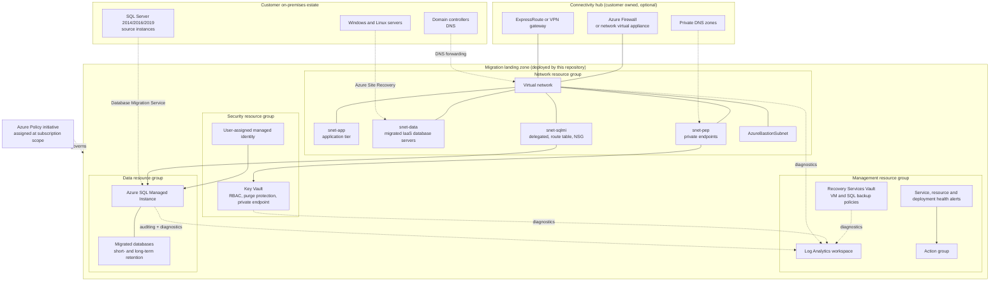
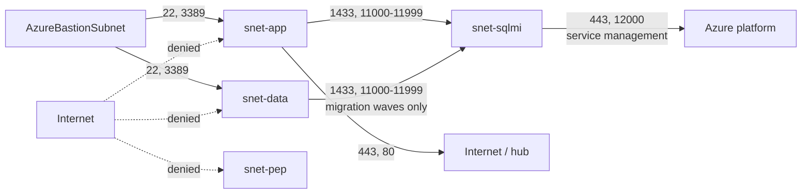
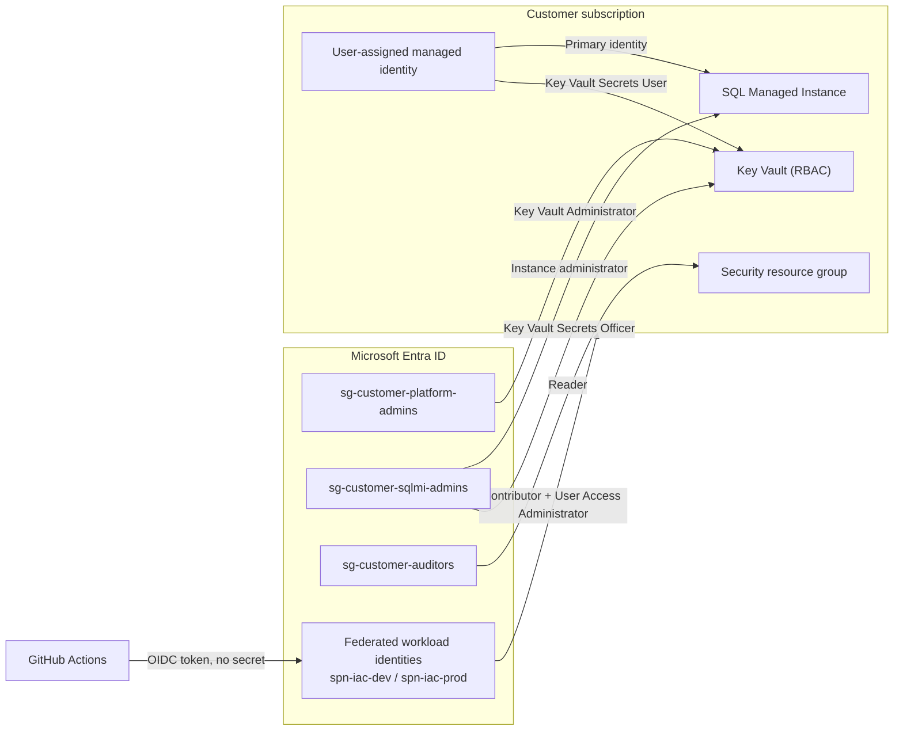
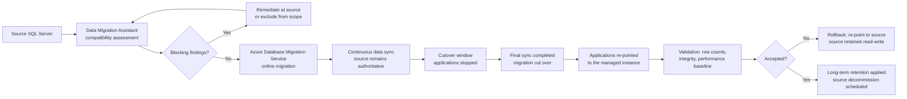
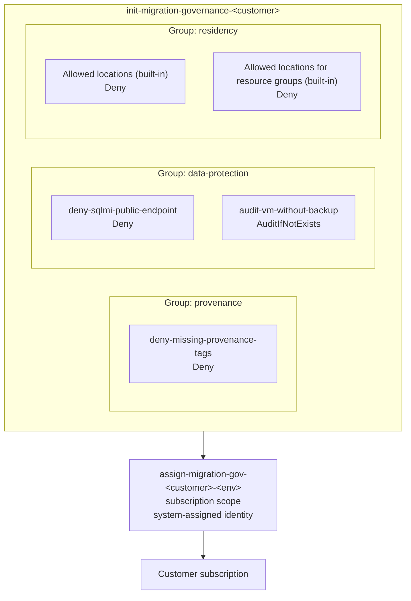

# Architecture

**Owner:** Principal Azure Architect
**Contributors:** Platform Engineering Lead, Database Migration Lead, Cloud Security Lead
**Applies to:** `alz-deployments` v1.0.0 and later
**Last reviewed:** 2026-03-28 · **Review cadence:** Quarterly

---

## 1. Scope

This document describes the **target-state architecture** deployed by `bicep/main.bicep` for every
Azure infrastructure and database migration engagement, and records the design decisions behind it
with their rationale.

It is deliberately a single architecture. Customer variation is expressed through parameter values —
address spaces, sizing, retention, regions, identity groups — not through architectural divergence.
Where a customer genuinely requires a different architecture, that is a template change request that
benefits every subsequent customer, not a one-off fork.

---

## 2. Logical architecture

---

## 3. Resource organisation

Four purpose-scoped resource groups per customer environment. The separation exists so that
role-based access control, resource locks, cost reporting and lifecycle can be applied at the
correct granularity.

| Resource group | Contains | Why separate |
|---|---|---|
| `rg-<suffix>-network` | Virtual network, subnets, network security groups, route tables, peering | Network changes have the widest blast radius and the narrowest set of authorised changers |
| `rg-<suffix>-security` | Key Vault, user-assigned managed identity, role assignments | Security resources are subject to a different access review cycle |
| `rg-<suffix>-management` | Log Analytics workspace, action group, alerts, Recovery Services Vault | Monitoring and backup outlive individual workloads and must not be deleted with them |
| `rg-<suffix>-data` | SQL Managed Instance and managed databases | The highest-value, longest-lead-time resource is isolated so that it is never caught in an unrelated deletion |

`<suffix>` is `<customerCode>-<workload>-<environment>-<regionAbbreviation>`. See
[Naming_Standards.md](Naming_Standards.md).

---

## 4. Network architecture

### 4.1 Address plan

| Subnet | Purpose | Recommended size | Notes |
|---|---|---|---|
| `snet-app` | Migrated application servers, jump hosts, integration runtimes | `/24` | Administrative access only via Azure Bastion |
| `snet-data` | Migrated SQL Server on Azure Virtual Machines, file servers | `/24` | Always On endpoint traffic permitted within the subnet only |
| `snet-sqlmi` | Azure SQL Managed Instance | `/24` (minimum `/27`) | **Dedicated.** No other resource may be placed here |
| `snet-pep` | Private endpoints for Key Vault, Storage and other platform services | `/24` | Private endpoint network policies disabled |
| `AzureBastionSubnet` | Azure Bastion | `/26` | Name is fixed by the service |

The virtual network address space must not overlap the customer on-premises estate, the
connectivity hub, or any other landing zone that may later be peered to it. This is checked by
`scripts/validate.ps1` and confirmed with the customer network team in Phase 1.

### 4.2 Traffic flow

### 4.3 Network security groups

| Network security group | Key inbound rules | Key outbound rules |
|---|---|---|
| `nsg-snet-app-*` | Allow 443 and 80 from `VirtualNetwork`; allow 22 and 3389 from the Bastion subnet only; allow `AzureLoadBalancer`; **deny `Internet`** | Platform default |
| `nsg-snet-data-*` | Allow 1433 and 1434 from `snet-app` only; allow 5022 within `snet-data`; allow `AzureLoadBalancer`; **deny `Internet`** | Platform default |
| `nsg-snet-sqlmi-*` | The five rules required by the SQL Managed Instance service-aided subnet configuration, plus client access from `snet-app` and `snet-data` | `allow_management_outbound` (443, 12000) and `allow_misubnet_outbound` |
| `nsg-snet-pep-*` | Allow `VirtualNetwork`; **deny `Internet`** | Platform default |
| `nsg-bastion-*` | The rule set mandated by Azure Bastion | The rule set mandated by Azure Bastion |

> **Design decision.** No explicit deny rule is placed on the SQL Managed Instance subnet. Service-aided
> subnet configuration manages the platform rules; an additional deny breaks the management plane
> and causes the instance to enter a failed state that can take hours to recover.

### 4.4 Routing

| Subnet | Route table | Default route |
|---|---|---|
| `snet-sqlmi` | `rt-snet-sqlmi-*`, BGP propagation disabled | `0.0.0.0/0` → **Internet** (mandatory; forced tunnelling breaks the service) |
| `snet-app`, `snet-data` | `rt-workload-*`, only when `routeThroughHubAppliance` is true | `0.0.0.0/0` → hub network virtual appliance |
| `snet-pep`, `AzureBastionSubnet` | None | Platform default |

### 4.5 Hybrid connectivity

The landing zone peers to a customer-owned connectivity hub when
`hubVirtualNetworkResourceId` is supplied. The reciprocal peering is created from the hub
subscription by the customer platform team — this repository deliberately does not hold write
permission in the hub.

---

## 5. Identity and access architecture

| Decision | Rationale |
|---|---|
| Key Vault uses **Azure RBAC**, not vault access policies | Permissions appear in the same access review as all other Azure permissions, and are visible to Microsoft Defender for Cloud |
| Purge protection is **hard-coded on**, not parameterised | It cannot be disabled once set; parameterising it would allow a configuration change to remove an irreversible control |
| Public network access to Key Vault is **disabled** by `main.bicep` | Secrets are reachable only through the private endpoint |
| The SQL Managed Instance administrator is a **Microsoft Entra group**, never an individual | Removes standing personal administrative access and survives staff changes |
| Deployment uses **federated workload identity**, no client secret | There is no credential to leak, rotate, or find in a log |
| No deployment principal holds **Owner** | `User Access Administrator` plus `Contributor` is sufficient and narrower |

---

## 6. Data platform architecture

### 6.1 Target service selection

| Source | Target | When |
|---|---|---|
| SQL Server 2012–2022, standard feature usage | **Azure SQL Managed Instance** | Default. Near-complete surface area compatibility, no application rewrite |
| SQL Server with unsupported features (for example, Filestream, cross-instance distributed transactions on unsupported topologies) | SQL Server on Azure Virtual Machines in `snet-data` | Where compatibility findings cannot be remediated in the migration window |
| Single, self-contained databases with modern feature usage | Azure SQL Database | Where the customer accepts application-level changes for lower cost |

This repository deploys the first and provides the subnet for the second.

### 6.2 SQL Managed Instance configuration

| Setting | Development | Production | Rationale |
|---|---|---|---|
| Service tier | General Purpose | Business Critical where contracted | Business Critical provides local SSD, built-in read-scale replica and faster failover |
| Zone redundancy | Off | On where the region supports it | Protects against a datacentre-level failure without a second region |
| Backup storage redundancy | Local | Geo | A regional outage must not cause backup loss |
| Public data endpoint | **Disabled** | **Disabled** | Hard-coded in the template and denied by policy |
| Minimum TLS version | **1.2** | **1.2** | Legacy transport security is prohibited |
| Connection type | Proxy | Proxy | Avoids requiring ports 11000–11999 from every client; Redirect is opt-in per customer |
| Collation and time zone | From the **source instance** | From the **source instance** | Both are immutable after creation; a mismatch is a full rebuild |
| Auditing | Enabled to Log Analytics | Enabled to Log Analytics | Audit records land in the same workspace as all other control evidence |
| Microsoft Defender for SQL | Enabled | Enabled | Threat detection on a high-value data asset |
| Short-term retention | 7–14 days | 35 days | Point-in-time restore window |
| Long-term retention | Minimal | From the records retention obligation | Set from the obligation, never from a default |

> **Design decision — collation and time zone are immutable.** They are captured in Phase 1 from the
> source instance and set explicitly in the parameter file. Accepting the template default is a
> defect, because correcting it after migration requires recreating the instance.

### 6.3 Database migration path

---

## 7. Monitoring and data protection architecture

| Component | Configuration | Purpose |
|---|---|---|
| Log Analytics workspace | `PerGB2018`, retention from the parameter file, optional daily ingestion cap | Single destination for platform, network, database audit and backup telemetry |
| Saved searches | Deployment provenance, failed backup jobs, SQL audit activity | The same three verification queries run on every engagement |
| Action group | Email to the customer operations distribution group | Alert delivery |
| Service health alert | Subscription scope, `ServiceHealth` category | Azure platform issues affecting the migration |
| Resource health alert | Subscription scope, `Degraded` or `Unavailable` | A resource has become unhealthy |
| Deployment failure alert | Subscription scope, failed `Microsoft.Resources/deployments/write` | A pipeline or out-of-band deployment failed |
| Recovery Services Vault | Soft delete enabled, enhanced security enabled, redundancy from the parameter file | Backup of migrated virtual machines and SQL Server on Azure Virtual Machines |
| Virtual machine backup policy | Enhanced (V2) daily policy with daily, weekly, monthly and yearly retention | Standard protection for every migrated server |
| SQL backup policy | Daily full plus hourly log backup | Protection for lift-and-shift database servers |

> **Design decision — the Recovery Services Vault lives in the management resource group, not the
> data resource group.** Backup must survive the deletion of the workload it protects.

---

## 8. Governance architecture

| Control | Effect | What it prevents |
|---|---|---|
| `deny-missing-provenance-tags` | Deny | Resources created outside the pipeline. A portal-created resource cannot carry `SourceCommit` and `DeploymentId`, so it is blocked at creation |
| `deny-sqlmi-public-endpoint` | Deny | The managed instance public data endpoint being enabled by any route, including a future template edit |
| `audit-vm-without-backup` | AuditIfNotExists | A migrated virtual machine reaching sign-off without backup protection |
| Allowed locations | Deny | Data leaving the contractually agreed regions |

> **Design decision — policy effects are literal, not parameterised.** Parameterising the effect
> would allow a parameter file change to weaken an enforced control without architecture review.
> The only permitted relaxation is `enforcementMode: DoNotEnforce`, which is visible, explicit,
> audited, and rejected on production configurations by `scripts/validate.ps1`.

---

## 9. Security architecture summary

| Layer | Control |
|---|---|
| Network | No subnet permits inbound traffic from `Internet`; administrative access only through Azure Bastion; managed instance reachable only through its delegated subnet |
| Transport | TLS 1.2 minimum on the managed instance |
| Data at rest | Transparent Data Encryption; Key Vault soft delete and purge protection |
| Identity | Entra group administrators; no standing personal administrative access; RBAC-only Key Vault |
| Secrets | None in source control; Key Vault references in parameter files; federated workload identity for deployment |
| Detection | Microsoft Defender for SQL; managed instance auditing to Log Analytics; diagnostic settings on the virtual network, network security groups, Key Vault and Recovery Services Vault |
| Recovery | Vault soft delete; geo-redundant backup; point-in-time and long-term retention |
| Assurance | Azure Policy deny controls; automated post-deployment verification |

---

## 10. Scalability and limits

| Consideration | Limit or guidance |
|---|---|
| SQL Managed Instance subnet | Minimum `/27`; `/24` recommended. The subnet cannot be resized after the instance is created |
| Managed instances per subnet | One instance per subnet in this architecture, for blast-radius isolation |
| Managed instance provisioning time | First instance in a subnet takes several hours. Deploy the landing zone well ahead of the cutover window |
| Log Analytics daily cap | Set in non-production to control discovery and replication ingestion cost; never set in production |
| Virtual network peering | Peering is not transitive. Spoke-to-spoke traffic transits the hub appliance |
| Policy assignment scope | Subscription scope, so that resource groups created later inherit the controls automatically |

---

## 11. Known constraints and accepted risks

| Constraint | Impact | Mitigation |
|---|---|---|
| The SQL Managed Instance subnet requires an internet default route | Egress from that subnet is not inspected by the hub appliance | Compensated by network security group rules, private-only client connectivity and managed instance auditing |
| The reciprocal hub peering is created outside this repository | The landing zone peering can exist in a one-sided state | `post-deployment-checks.ps1` reports peering state; hub creation is a documented Phase 6 prerequisite |
| Long-term retention policies cannot be applied to databases created by the migration service until after cutover | A short window exists where a migrated database has only short-term retention | Databases are added to `sqlDatabases` immediately after cutover, in the same wave's change request |
| Key Vault purge protection cannot be reversed | A mis-named vault cannot be recreated for 90 days | Vault names are reviewed at pull request; the naming convention makes collisions improbable |

---

## Change history

| Date | Version | Author | Summary |
|---|---|---|---|
| 2026-03-28 | 1.0.0 | Principal Azure Architect | Initial architecture of record for the audit baseline |
