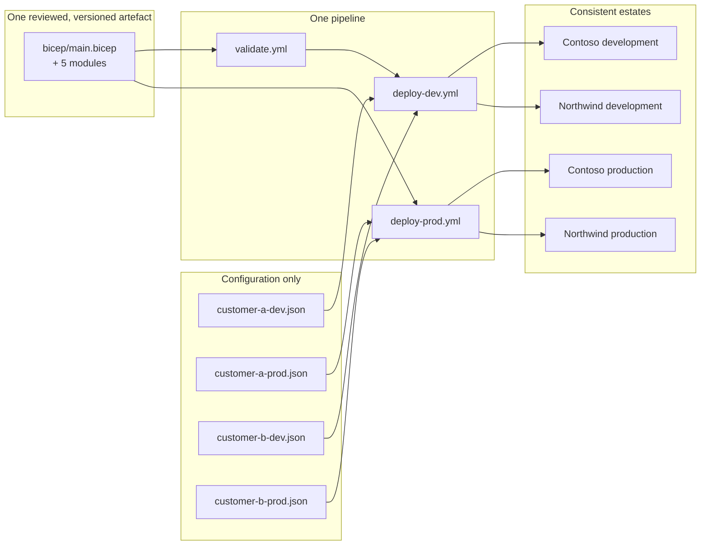
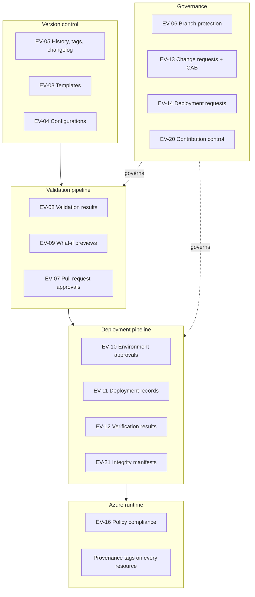

# Audit Evidence Guide

**Audience:** Microsoft-appointed auditor, and the partner audit evidence owner
**Owner:** Governance and Compliance Manager
**Co-owner:** Audit Evidence Owner
**Specialization:** Infrastructure and Database Migration to Microsoft Azure
**Control:** **3.1 Repeatable Deployment**
**Last reviewed:** 2026-09-28 · **Review cadence:** Quarterly, and before every audit

---

> **Auditor: start here.** Section 3 maps each requirement of Control 3.1 to the artefact that
> evidences it. Section 6 is a timed live walkthrough that demonstrates the complete traceability
> chain in under ten minutes. Nothing in this repository was assembled for the audit; every evidence
> artefact is generated continuously as a by-product of normal delivery.

---

## 1. Partner interpretation of Control 3.1

> *Control intent: the partner must demonstrate that customer deployments are executed through a
> documented, standardised, automated and version-controlled process that produces consistent
> results across engagements, rather than through ad-hoc manual effort.*

This practice satisfies that intent through a single structural decision:

**Deployment logic lives in `bicep/`. Customer configuration lives in `parameters/`. A new customer
is onboarded by adding a parameter file. No template is ever copied, forked or edited per
engagement.**

Everything else — the pipeline, the approval gates, the policy controls, the verification suite —
exists to make that decision enforceable rather than merely intended.

---

## 2. Evidence generation model

| Evidence class | Produced by | Hand-editable | Where it lives | Retention |
|---|---|---|---|---|
| Process definition | Documents authored by named owners, changed through pull request | Yes, via pull request | `docs/` in Git | Life of the repository |
| Code artefact | Templates and parameter files | Yes, via pull request | `bicep/`, `parameters/` in Git | Life of the repository |
| Review and approval record | GitHub pull request and environment approval APIs | **No** | GitHub; exported at audit time | Life of the repository |
| Validation record | `validate.yml` job results and artefacts | **No** | Workflow artefacts | 90–400 days |
| What-if preview | `validate.yml` and `deploy-prod.yml` | **No** | Workflow artefacts and pull request comments | 400 days |
| Deployment record | `deploy-dev.yml` and `deploy-prod.yml` | **No** | Workflow artefacts, with SHA-256 manifest | 400 days |
| Verification record | `post-deployment-checks.ps1` | **No** | Workflow artefacts | 400 days |
| Change record | Change Request and Deployment Request issues | Yes, until closed | GitHub Issues | Life of the repository |
| Customer acceptance | Signed acceptance record | Yes | Engagement record and issue comment | 7 years |

Every production deployment publishes a `manifest.json` containing the SHA-256 hash of every file in
its evidence bundle. An auditor can therefore prove that an evidence artefact presented today is the
artefact that was produced on the day of the deployment.

---

## 3. Control 3.1 requirement mapping

> The sub-requirement identifiers below are this practice's decomposition of the control intent.
> Before submission, the Governance and Compliance Manager reconciles them against the current
> official audit checklist issued by the Microsoft-appointed auditor and records the reconciliation
> in section 8.

| # | Requirement | Primary evidence | Where | Demonstrated by |
|---|---|---|---|---|
| **3.1.1** | A documented, repeatable deployment methodology exists and is followed | Seven-phase methodology with entry and exit criteria per phase | [Deployment_Methodology.md](Deployment_Methodology.md) | Walkthrough step 1 |
| **3.1.2** | Deployments are automated using Infrastructure as Code | Six Bicep templates deploying resource groups, networking, identity, monitoring, data protection, governance and the database platform | [`bicep/`](../bicep) | Walkthrough step 2 |
| **3.1.3** | Deployment assets are standardised and reusable across customers | Identical templates consumed by four customer configurations; templates contain no customer value, enforced by an automated scan | [`parameters/`](../parameters), `scripts/validate.ps1` convention scan | Walkthrough step 10 |
| **3.1.4** | All assets are under version control with a complete history | Protected `main`, signed commits, linear history, squash merges, release tags, `CHANGELOG.md` | Git history, [CHANGELOG.md](../CHANGELOG.md) | Walkthrough step 5 |
| **3.1.5** | Changes are peer-reviewed and approved before deployment | Branch protection with two required approvals, CODEOWNER review and no administrator bypass | [`.github/CODEOWNERS`](../.github/CODEOWNERS), [Change_Management.md §2.3](Change_Management.md#23-main-branch-protection) | Walkthrough step 6 |
| **3.1.6** | Deployments are validated and tested before production | Six-job validation gate: traceability, build and lint, secret and convention scan, PSRule for Azure, Azure Resource Manager validation, what-if preview | [`validate.yml`](../.github/workflows/validate.yml) | Walkthrough step 4 |
| **3.1.7** | A formal change management process governs production changes | Four change classes, Change Advisory Board, approval authority matrix, freeze windows, emergency path, post-implementation review | [Change_Management.md](Change_Management.md), [change-request.yml](../.github/ISSUE_TEMPLATE/change-request.yml) | Walkthrough step 7 |
| **3.1.8** | Releases are controlled, versioned and documented | Semantic versioning, release candidate soak, Go/No-Go checklist, release notes, customer version pinning | [Change_Management.md §5](Change_Management.md#5-release-procedure), [CHANGELOG.md](../CHANGELOG.md) | Walkthrough step 8 |
| **3.1.9** | Rollback and recovery procedures are defined and proven | Per-layer rollback methods with durations and data loss risk, trigger criteria, decision authority, and an executed rollback record | [Change_Management.md §6](Change_Management.md#6-rollback-procedure), [migration-project-02.md](../examples/migration-project-02.md) | Walkthrough step 9 |
| **3.1.10** | Deployments are traceable end-to-end and auditable | Provenance tags enforced by deny policy; evidence bundle with SHA-256 manifest; the complete chain from a live resource to the change request | [Naming_Standards.md §3](Naming_Standards.md#32-provenance-tags--mandatory-and-enforced), [Change_Management.md §11](Change_Management.md#11-traceability-chain) | Walkthrough steps 1–10 |
| **3.1.11** | Deployments are verified rather than assumed | Eight-group, forty-plus assertion verification suite executed after every deployment, whose failure blocks sign-off | [`post-deployment-checks.ps1`](../scripts/post-deployment-checks.ps1) | Walkthrough step 3 |
| **3.1.12** | The approach has been applied to real customer engagements | Two sanitised end-to-end engagement records covering infrastructure and database migration | [`examples/`](../examples) | Supporting reading |

---

## 4. Evidence catalogue

| ID | Evidence | Location | Owner |
|---|---|---|---|
| EV-01 | Deployment methodology | `docs/Deployment_Methodology.md` | Principal Azure Architect |
| EV-02 | Target architecture and design decisions | `docs/Architecture.md` | Principal Azure Architect |
| EV-03 | Infrastructure as Code template library | `bicep/` | Platform Engineering Lead |
| EV-04 | Customer configurations, one per environment | `parameters/` | Delivery Manager |
| EV-05 | Version control history, tags and changelog | Git, `CHANGELOG.md` | Delivery Manager |
| EV-06 | Branch protection configuration, including no administrator bypass | Repository settings screenshot | Governance and Compliance Manager |
| EV-07 | Pull request records with reviews and approvals | GitHub, exported at audit time | Audit Evidence Owner |
| EV-08 | Automated validation results | Workflow artefacts, `psrule-results` | DevOps Engineer |
| EV-09 | What-if previews attached to pull requests and production runs | Pull request comments, workflow artefacts | DevOps Engineer |
| EV-10 | Environment approval records with named approvers and timestamps | GitHub Deployments API | Audit Evidence Owner |
| EV-11 | Deployment records with Azure correlation identifiers | Workflow artefacts, `deployment-record-*.json` | Audit Evidence Owner |
| EV-12 | Post-deployment verification results | Workflow artefacts, `postdeploy-*.json` | Platform Engineering Lead |
| EV-13 | Change requests and Change Advisory Board decisions | GitHub Issues | Delivery Manager |
| EV-14 | Deployment requests and authorisation records | GitHub Issues | Delivery Manager |
| EV-15 | Rollback procedures and an executed rollback | `docs/Change_Management.md §6`, `examples/migration-project-02.md` | Infrastructure Migration Lead |
| EV-16 | Policy as code and enforced governance | `bicep/governance.bicep`, Azure Policy compliance export | Cloud Security Lead |
| EV-17 | Naming and tagging standard with enforcement chain | `docs/Naming_Standards.md` | Platform Engineering Lead |
| EV-18 | Customer engagement records | `examples/` | Delivery Manager |
| EV-19 | Secret handling and identity model | `SECURITY.md` | Cloud Security Lead |
| EV-20 | Contribution control and Definition of Done | `CONTRIBUTING.md` | Governance and Compliance Manager |
| EV-21 | Evidence integrity manifests | `manifest.json` in every production evidence bundle | Audit Evidence Owner |
| EV-22 | Continuous improvement record | Post-implementation review comments, corrective action issues | Governance and Compliance Manager |

---

## 5. Where each evidence type is produced

---

## 6. Live walkthrough script

**Duration:** 10 minutes. **Participants:** Principal Azure Architect, Delivery Manager, Audit
Evidence Owner. **Rehearsed:** before every audit, per section 7.

The demonstration starts in the Azure portal on a live production resource and ends at the change
request that authorised it. It can be run in either direction.

| Step | Action | What it evidences |
|---|---|---|
| **1** | In the Azure portal, open a production resource in the customer subscription. Open **Tags**. Read `ManagedBy=IaC`, `ChangeRequest=CR-0161`, `SourceCommit=9f3c1a7`, `DeploymentId=1284`. | 3.1.10 — every live resource is traceable |
| **2** | Open the subscription **Deployments** blade. Locate deployment `mig-customer-a-prod-284`. Note the correlation identifier and timestamp. Open the template to show it is the repository template. | 3.1.2 — the estate was deployed from Infrastructure as Code |
| **3** | Open **Policy → Compliance**. Show the `assign-migration-gov-ctso-prd` assignment and its compliance state. Attempt to enable the SQL Managed Instance public data endpoint and show that Azure denies it. | 3.1.11, 3.1.16 — governance is enforced, not advisory |
| **4** | Switch to GitHub. Open workflow run **1284**. Show the authorisation preflight, the what-if preview in the run summary, the deployment step with the correlation identifier, and the post-deployment verification step. | 3.1.6, 3.1.11 — validated before, verified after |
| **5** | On the same run, open the **production** environment approval. Show the two named approvers and the approval timestamps. Confirm that neither approver is the engineer who started the run. | 3.1.5 — segregation of duties at deployment time |
| **6** | Open commit **9f3c1a7**. Show that it is signed, has a Conventional Commit subject, and carries the `CR: CR-0161` trailer. Show `git log` on `bicep/` to demonstrate the complete history. | 3.1.4 — full version control history |
| **7** | Open pull request **#92**. Show the completed template, the two approvals including the CODEOWNER, the five green checks, the what-if comment, and the rollback plan. Then open repository settings and show branch protection, including **"Do not allow bypassing the above settings"**. | 3.1.5 — peer review is enforced and cannot be bypassed |
| **8** | Open Change Request issue **CR-0161**. Show the risk assessment, the backout plan, the Change Advisory Board decision comment with named approvers, and the agreed window. Open Deployment Request issue **#214** and show the readiness checklist and rollback trigger criteria. | 3.1.7 — formal change control |
| **9** | Open release **v1.2.0**. Show the release notes, the `CHANGELOG.md` entry tracing to CR-0161, and the attached evidence bundle. | 3.1.8 — controlled, versioned releases |
| **10** | Open `parameters/customer-a-prod.json` and `parameters/customer-b-prod.json` side by side. Show that both are consumed by the **same** `bicep/main.bicep` at the **same** release tag, and that only configuration differs. Then show the `validate.ps1` convention scan that makes a customer value in a template impossible to merge. | **3.1.3 — the core repeatability and reusability claim** |

### 6.1 Reserve demonstration — rollback

If the auditor asks to see rollback rather than take it on trust, open
[`examples/migration-project-02.md`](../examples/migration-project-02.md) section 7, which records an
executed rollback of a wave-2 cutover: the trigger criteria that were met, the decision authority,
the method used, the duration, and the corrective actions that followed.

---

## 7. Pre-audit readiness

| When | Action | Owner |
|---|---|---|
| T-30 days | Freeze non-essential feature work; reconcile section 3 against the current official checklist | Governance and Compliance Manager |
| T-30 days | Confirm at least three customer engagements have complete artefact sets, and at least one is a database migration | Delivery Manager |
| T-21 days | Re-run every example end-to-end in a partner sandbox subscription and record the result | Principal Azure Architect |
| T-14 days | Export pull request, review, approval and workflow run records; verify every SHA-256 manifest | Audit Evidence Owner |
| T-14 days | Refresh the branch protection screenshot, including the administrator bypass setting | Governance and Compliance Manager |
| T-7 days | Confirm customer consent for every reference and sanitisation of every named value | Delivery Manager |
| T-7 days | Rehearse the section 6 walkthrough end to end with all named participants | Audit Evidence Owner |
| T-1 day | Confirm access for every participant to Azure, GitHub and the evidence store | Audit Evidence Owner |

### 7.1 Readiness checklist

- [ ] Methodology documents reviewed and dated within the last six months
- [ ] At least three sanitised customer engagements with complete artefact sets
- [ ] At least one engagement is a database migration
- [ ] 100% of production deployments in the review window executed through the pipeline
- [ ] Zero unexplained drift incidents in the review window
- [ ] Branch protection screenshot current, including no administrator bypass
- [ ] Every evidence manifest hash verified
- [ ] Every example re-executed successfully
- [ ] Customer consent recorded for every reference
- [ ] At least one rollback executed or rehearsed, with an evidence record
- [ ] Section 3 reconciled against the current official checklist
- [ ] Walkthrough rehearsed with all named participants

---

## 8. Checklist reconciliation record

Completed by the Governance and Compliance Manager before submission and retained as evidence that
the mapping in section 3 is current.

| Field | Value |
|---|---|
| Official checklist version | *To be completed at reconciliation* |
| Date issued by the auditor | *To be completed at reconciliation* |
| Reconciled by | *To be completed at reconciliation* |
| Date reconciled | *To be completed at reconciliation* |
| Sub-requirements added | *To be completed at reconciliation* |
| Sub-requirements removed | *To be completed at reconciliation* |
| Gaps identified | *To be completed at reconciliation* |
| Remediation plan | *To be completed at reconciliation* |

---

## 9. Confidentiality and sanitisation

| Rule | Implementation |
|---|---|
| Customer identity | Parameter files use anonymised labels (`customer-a`); the trading name appears inside the file only |
| Consent | No customer is named to an auditor without written consent recorded in the engagement record |
| Identifiers | Subscription, tenant and object identifiers in this repository belong to non-production demonstration tenants |
| Secrets | No secret, credential, connection string or key exists anywhere in the repository or its history |
| Personal data | No personal data appears in any tag, name, document or evidence artefact |
| Evidence sharing | Evidence bundles are shared under the engagement confidentiality terms; the hash manifest allows integrity verification without disclosing content |

---

## 10. Known audit risks and mitigations

| Risk | Impact if realised | Mitigation already in place |
|---|---|---|
| Evidence appears to have been created for the audit | Control failed | Evidence is generated by the pipeline on every run from the first release; Git history shows organic growth; post-implementation reviews record real failures and their corrective actions |
| Manual portal changes found in a customer production subscription | Control failed | `deny-missing-provenance-tags` blocks creation outside the pipeline; verification group B detects any resource lacking provenance tags |
| Only one customer engagement available | Control failed | Minimum of three engagements is a pre-audit gate; two are documented in `examples/` |
| Administrator bypass of branch protection discovered | Control failed | "Do not allow bypassing" is enabled; any use is an auditable incident requiring a post-implementation review |
| A secret is found in repository history | Security review failure | Pattern scan in `validate.ps1` and `validate.yml`; GitHub push protection; secretless federated deployment identity |
| Documentation stale relative to code | Partial finding | Quarterly review cadence recorded in every document header; documentation updates are part of the Definition of Done |
| Sub-control wording has changed since this mapping | Partial finding | Section 8 reconciliation is a mandatory pre-submission gate |

---

## 11. Contacts

| Role | Responsibility | Contact |
|---|---|---|
| Audit Evidence Owner | Auditor liaison, evidence export and integrity | `compliance@partner.example` |
| Governance and Compliance Manager | Control environment, checklist reconciliation | `governance@partner.example` |
| Principal Azure Architect | Methodology and architecture demonstrations | `azure-architecture@partner.example` |
| Delivery Manager | Customer engagement records and consent | `delivery@partner.example` |

---

## Change history

| Date | Version | Author | Summary |
|---|---|---|---|
| 2026-09-28 | 1.0.0 | Governance and Compliance Manager | Initial audit evidence guide for Control 3.1 |
