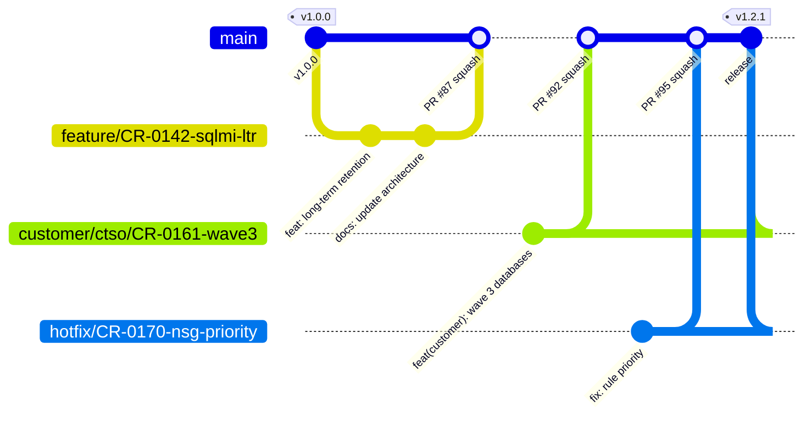
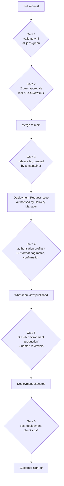
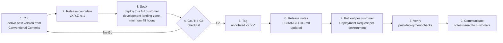
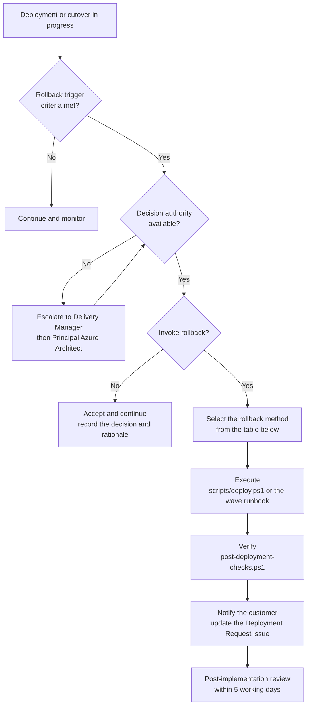
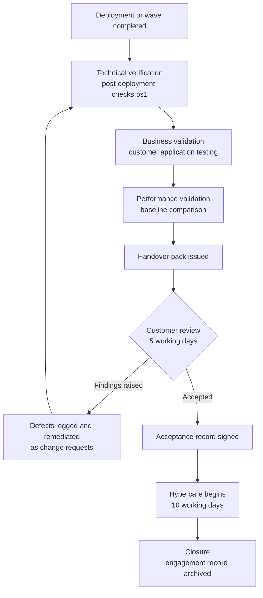

# Change Management

**Owner:** Governance and Compliance Manager
**Co-owner:** Delivery Manager
**Applies to:** `alz-deployments` v1.0.0 and later — every change to every customer environment
**Last reviewed:** 2026-09-28 · **Review cadence:** Semi-annually, and after every post-implementation review

---

## Contents

1. [Scope](#1-scope)
2. [Branching strategy](#2-branching-strategy)
3. [Change classes](#3-change-classes)
4. [Approval process](#4-approval-process)
5. [Release procedure](#5-release-procedure)
6. [Rollback procedure](#6-rollback-procedure)
7. [Customer sign-off process](#7-customer-sign-off-process)
8. [Emergency changes](#8-emergency-changes)
9. [Freeze windows](#9-freeze-windows)
10. [Post-implementation review](#10-post-implementation-review)
11. [Traceability chain](#11-traceability-chain)

---

## 1. Scope

Every change to a customer Azure environment delivered by this practice is in scope, including:

- Bicep template changes
- Customer parameter changes
- Pipeline and script changes
- Azure Policy definition and assignment changes
- Migration wave cutovers

Out of scope: changes the customer makes inside their own applications and databases at the data
layer, and changes in customer-owned subscriptions that this repository does not manage. Where the
boundary is unclear, the Delivery Manager rules and records the decision.

---

## 2. Branching strategy

### 2.1 Model — trunk-based with protected `main` and release tags



**Why trunk-based and not GitFlow.** Long-lived environment branches produce divergent histories.
An auditor reading a repository with `develop`, `release/uat` and per-customer branches reasonably
concludes that different code is deployed to different customers — the opposite of the claim this
repository exists to support. Environment promotion here is achieved by **release tags and
parameter files**, never by branches.

### 2.2 Branch types

| Type | Pattern | Source | Max lifetime | Approvals |
|---|---|---|---|---|
| Trunk | `main` | — | Permanent | Protected |
| Feature | `feature/CR-<id>-<slug>` | `main` | 5 working days | 2, including CODEOWNER |
| Fix | `fix/CR-<id>-<slug>` | `main` | 3 working days | 2 |
| Hotfix | `hotfix/CR-<id>-<slug>` | `main` or a release tag | 24 hours | 1 plus retrospective second |
| Customer configuration | `customer/<code>/CR-<id>-<slug>` | `main` | 5 working days | 2, including Delivery |
| Documentation | `docs/CR-<id>-<slug>` | `main` | 5 working days | 1 |
| Release stabilisation | `release/v<major>.<minor>` | `main` | 3 working days | 2, including Delivery |
| Integration (**archived**) | `develop` | — | — | Merge to `main` permanently blocked |

**Release stabilisation branches** are optional and are cut only when a release candidate needs a
documentation freeze or a soak period during which `main` must remain open for unrelated work. They
carry no code that did not originate on `main`.

**`develop` is archived, not deleted.** It was the integration branch during the pre-`v1.0.0`
build-out, when no customer estate existed to protect. It was retired at the `v1.0.0` baseline under
CR-0022, because a long-lived divergent branch is indistinguishable, to an auditor, from "different
code deployed to different customers". It is retained read-only so that the build-out history remains
inspectable, and it can never be merged to `main` again.

Every branch name contains a change request identifier. This is validated by the
`Change request traceability` job in `validate.yml`, and it is the first link of the audit chain.

### 2.3 `main` branch protection

These settings are configured in the repository and screenshotted as audit evidence EV-06.

| Setting | Value | Why an auditor asks |
|---|---|---|
| Require a pull request before merging | Enabled | No unreviewed change reaches a customer |
| Required approvals | **2** | Segregation of duties |
| Dismiss stale approvals on new commits | Enabled | Approval applies to the artefact actually deployed |
| Require review from Code Owners | Enabled | Reviewer competence, per `.github/CODEOWNERS` |
| Require approval of the most recent push | Enabled | Prevents post-approval tampering |
| Require conversation resolution | Enabled | Review findings are demonstrably closed |
| Required status checks | `validate / Validation gate` | Automated quality gate cannot be skipped |
| Require branches to be up to date | Enabled | The change is tested against the final state |
| Require signed commits | Enabled | Non-repudiation of authorship |
| Require linear history | Enabled | Readable, unambiguous history |
| Block force pushes | Enabled | History immutability |
| Restrict deletions | Enabled | History immutability |
| **Do not allow bypassing the above, including administrators** | Enabled | Auditors probe this specifically |
| Merge method | Squash only | Clean, semantic-version-derivable history |
| Tag protection | `v*`, maintainers only | Release integrity |

### 2.4 Commit convention

```text
<type>(<scope>): <subject>

<body: why, not what>

CR: CR-0142
Refs: #87
```

`type` ∈ `feat`, `fix`, `docs`, `refactor`, `test`, `chore`, `ci`, `perf`, `revert`, `security`.
Breaking changes use `!` after the scope and a `BREAKING CHANGE:` footer, and drive a major release.

---

## 3. Change classes

| Class | Definition | Approval | Lead time | Example |
|---|---|---|---|---|
| **Standard** | Pre-approved, low risk, fully automated, previously validated | CODEOWNER on the pull request | None | Adding a tag value; documentation; a development parameter adjustment |
| **Normal** | Planned change with customer impact | Change Advisory Board, asynchronous, two approvers | 3 working days | Adding a managed database to a wave; increasing backup retention |
| **Major** | Breaking, wide blast radius, or production data affecting | Change Advisory Board, synchronous, plus customer change board | 10 working days | Changing the naming standard; reworking network security group rules; a database cutover |
| **Emergency** | Restores service or mitigates an active security risk | One named emergency approver; retrospective board within 24 hours | Immediate | A network security group rule blocking production traffic |

### 3.1 Change lifecycle

```mermaid
flowchart LR
    A["1. Raise<br/>Change Request issue"] --> B["2. Assess<br/>risk, impact, blast radius"]
    B --> C["3. Approve<br/>CAB / approval matrix"]
    C --> D["4. Build<br/>branch, commit, pull request"]
    D --> E["5. Validate<br/>validate.yml gate + what-if"]
    E --> F["6. Review<br/>2 approvals, conversations resolved"]
    F --> G["7. Merge and release<br/>squash to main, tag vX.Y.Z"]
    G --> H["8. Authorise execution<br/>Deployment Request issue"]
    H --> I["9. Deploy<br/>deploy-prod.yml, 2 environment approvers"]
    I --> J["10. Verify<br/>post-deployment-checks.ps1"]
    J --> K["11. Sign off<br/>customer acceptance"]
    K --> L["12. Review<br/>PIR for Major, Emergency, failed or rolled back"]
    L -. "corrective actions" .-> A
```



---

## 4. Approval process

### 4.1 Change Advisory Board

| Attribute | Definition |
|---|---|
| Chair | Principal Azure Architect |
| Members | Platform Engineering Lead, Cloud Security Lead, Delivery Manager, Infrastructure Migration Lead, Database Migration Lead |
| Customer representation | Required for any change affecting a customer production environment |
| Quorum | Chair plus two, and must include the Cloud Security Lead for any security-affecting change |
| Cadence | Weekly scheduled; asynchronous approval permitted for Normal changes |
| Record | A comment on the change request issue plus the `cab-approved`, `cab-rejected` or `cab-deferred` label |

The decision comment uses this exact format so that it can be machine-extracted for evidence:

```text
CAB decision: Approved
Date: 2026-11-05
Approvers: A. Architect (Principal Azure Architect), D. Manager (Delivery Manager)
Conditions: Deploy to test and soak for 48 hours before production.
```

### 4.2 Approval authority matrix

| Change | Platform Eng. Lead | Architect | Security Lead | Delivery Manager | Customer |
|---|---|---|---|---|---|
| Documentation, examples | A | I | I | I | — |
| Script change | A | C | C | I | — |
| Template change, non-breaking | R | **A** | C | I | I |
| Template change, breaking | R | **A** | **A** | C | I |
| Policy definition or assignment | C | R | **A** | I | I |
| Network or identity change | R | **A** | **A** | C | C |
| Non-production customer parameters | **A** | I | I | C | I |
| **Production customer parameters** | R | **A** | C | **A** | **A** |
| **Migration wave cutover** | C | C | C | **A** | **A** |
| Emergency change | A\* | I | C | I | I |

*A = Accountable, R = Responsible, C = Consulted, I = Informed. \*From the named emergency approver list.*

### 4.3 Approval gates in the pipeline



Six independent gates. No single individual can traverse all of them alone: the deploying engineer
cannot be an environment approver, and the pull request author cannot be one of their own two
reviewers.

---

## 5. Release procedure

### 5.1 Versioning

| Artefact | Scheme | Example |
|---|---|---|
| Repository release | Semantic versioning | `v1.4.0` |
| Customer environment | Pinned to a release tag | Contoso production on `v1.3.2` |

| Increment | When |
|---|---|
| **Major** | A breaking parameter or behaviour change, a resource replacement risk, or a removal |
| **Minor** | A new optional parameter, a new capability, or a new supported resource |
| **Patch** | A defect fix, documentation correction, or non-behavioural refactor |

### 5.2 Release types and cadence

| Type | Cadence | Approval |
|---|---|---|
| Scheduled minor | Every two weeks, Wednesday | Delivery Manager and Principal Azure Architect |
| Patch | As needed | Delivery Manager |
| Major | Quarterly at most | CAB, plus 30 days advance notice to every customer |
| Hotfix | Immediate | Emergency change authority |

### 5.3 Procedure



### 5.4 Go / No-Go checklist

A release is cut only when every item is true:

- [ ] Every `validate.yml` job green on the release commit
- [ ] Release candidate soaked for at least 48 hours in a development landing zone
- [ ] `post-deployment-checks.ps1` passed against the release candidate
- [ ] No open Severity 1 or Severity 2 defect against the release scope
- [ ] `CHANGELOG.md` complete and every entry traced to a change request
- [ ] Documentation updated for every behavioural change
- [ ] Rollback to the previous tag verified, not merely asserted
- [ ] CAB approval recorded for any Major content
- [ ] No customer freeze window conflicts with the planned rollout

### 5.5 Deprecation

| Rule | Value |
|---|---|
| Notice before a parameter is removed | Minimum two minor releases or 90 days, whichever is longer |
| Notice before a breaking change | 30 days |
| Supported release lines | Current major and previous major |
| Removal | Only in a major release |

---

## 6. Rollback procedure

### 6.1 Principles

1. **Rollback is designed before deployment.** A pull request without a credible rollback plan is
   not approved.
2. **Rollback is verified, not asserted.** "Redeploy the previous tag" is acceptable only when that
   redeployment has actually been executed against a development landing zone.
3. **Deleting a resource group is never a rollback method.**
4. **The source environment is retained.** Source servers and databases stay available for the
   agreed retention period after cutover, and are the primary rollback path for a migration wave.

### 6.2 Decision flow



### 6.3 Rollback methods

| Layer | Method | Duration | Data loss risk |
|---|---|---|---|
| Template or pipeline change | Re-run `deploy-prod.yml` from the previous release tag with unchanged parameters | 15–45 min | None |
| Customer parameter change | Revert the pull request, cut a patch release, redeploy | 30–60 min | None |
| Network security group or routing change | Redeploy the previous tag; the change is declarative and fully reverted | 10–20 min | None |
| Policy assignment change | Redeploy the previous tag; or set `enforcementMode` to `DoNotEnforce` as an emergency measure, with a mandatory follow-up change | 10 min | None |
| Virtual machine migration cutover | Re-point DNS to the retained source server; stop the Azure replica | Minutes | Changes made on the Azure replica after cutover are lost |
| Database migration cutover | Re-point application connection strings to the retained source instance, which stays read-write until sign-off | Minutes | Transactions written to the managed instance after cutover are lost |
| Database corruption after cutover | Point-in-time restore inside the short-term retention window, or restore from long-term retention | 1–6 hours depending on size | Bounded by the restore point |

### 6.4 Rollback trigger criteria

Defined per change on the Deployment Request issue. Standard criteria, unless superseded:

- The deployment has not reached the verification stage within twice the planned duration
- `post-deployment-checks.ps1` reports any `Fail` result that cannot be remediated within 30 minutes
- Application connectivity is not restored within 30 minutes of the planned cutover completion
- Database integrity validation fails
- Any Severity 1 customer impact is observed

### 6.5 What is not a rollback

| Not a rollback | Why |
|---|---|
| Deleting the resource group | Destroys backups, audit history and the Key Vault; cannot be undone within 90 days |
| Manually editing a resource in the portal | Creates drift and breaks the repeatability claim; also blocked by policy |
| Disabling the policy assignment permanently | Removes the control rather than reversing the change |
| Leaving the environment in a partially deployed state | Unverified and unsupportable |

---

## 7. Customer sign-off process



### 7.1 Acceptance criteria

A wave is accepted only when all of the following are demonstrated to the customer:

| Criterion | Evidence provided to the customer |
|---|---|
| Infrastructure deployed as designed | `post-deployment-checks.ps1` verification record |
| Governance in force | Azure Policy compliance state export |
| Every migrated workload protected | Recovery Services Vault protected items list |
| Data integrity | Row counts and checksum comparison, source versus target |
| Performance acceptable | Pre- and post-migration query duration comparison against the agreed threshold |
| Connectivity confirmed | Customer-executed application test results |
| Monitoring active | Log Analytics ingestion confirmed; alert rules enabled |
| Documentation delivered | Architecture summary, runbook, escalation path |

### 7.2 Acceptance record

Recorded as a comment on the Deployment Request issue and countersigned in the customer's own
change system:

```text
Acceptance record
Engagement:      ENG-2026-0114
Wave:            Wave 3 - Warehouse management
Change request:  CR-0161
Release:         v1.2.0
Deployed:        2026-11-14T22:04:00Z
Verified:        post-deployment-checks.ps1 - 41 checks, 0 failures
Accepted by:     <name>, <role>, Contoso Manufacturing Ltd
Date:            2026-11-18
Conditions:      None
Hypercare ends:  2026-12-02
```

### 7.3 Conditional acceptance

Where the customer accepts with conditions, each condition is raised as its own change request,
assigned an owner and a date, and tracked to closure before the engagement record is archived.
Hypercare is extended until the last condition closes.

---

## 8. Emergency changes

An emergency change restores service or mitigates an active security risk. It is the **only**
permitted deviation from the standard process, and it is never a substitute for planning.

| Step | Requirement | Timing |
|---|---|---|
| 1 | Raise a Change Request issue with class `Emergency`, even if it is raised retrospectively | Within 1 hour |
| 2 | Obtain approval from a named emergency approver | Before execution where possible |
| 3 | Branch `hotfix/CR-####-slug`; the pull request may be merged with one approval | — |
| 4 | Deploy through `deploy-prod.yml` as normal. The environment gate is not bypassed | — |
| 5 | Obtain a retrospective second approval on the pull request | Within 24 hours |
| 6 | Present the change to the Change Advisory Board | Within 24 hours |
| 7 | Complete a post-implementation review | Within 5 working days |

Named emergency approvers are maintained by the Governance and Compliance Manager and reviewed
quarterly. Emergency change ratio is a reported metric; a ratio above 5% triggers a process review.

---

## 9. Freeze windows

| Source | Example |
|---|---|
| Customer declared | Contoso: financial year end, 20 March to 5 April. Northwind: month end and regulatory reporting windows |
| Engagement | The 48 hours before and after any migration wave cutover for the affected customer |
| Practice | The last two weeks of December |

Freeze windows are recorded in `metadata.freezeWindows` in the customer parameter file and are
checked at Deployment Request. Only Emergency changes may be executed during a freeze, and each
requires named executive approval recorded on the change request.

---

## 10. Post-implementation review

Mandatory for Major changes, Emergency changes, failed deployments and rollbacks. Recorded as a
comment on the change request issue.

| Section | Content |
|---|---|
| Outcome | Successful, partially successful, or rolled back |
| Timeline | Planned versus actual, with the material deviations |
| What worked | Practices to retain |
| What failed | Root cause, not symptom |
| Corrective actions | Each raised as its own issue with an owner and a date |
| Process changes | Updates required to this document, the methodology, the templates or the check suite |

Corrective actions are tracked to closure and are reported as evidence of continuous improvement in
[Audit_Evidence_Guide.md](Audit_Evidence_Guide.md).

---

## 11. Traceability chain

This chain is the single most important audit artefact this process produces. An auditor may enter
it at any point and reach every other point.

```text
CR-0142  (Change Request issue: risk, backout plan, CAB approval, window)
  └─► feature/CR-0142-sqlmi-ltr-policy  (branch name validated by validate.yml)
        └─► Pull request #87  (2 approvals, CODEOWNER, 5 checks green, what-if attached,
              conversations resolved, rollback plan)
              └─► Commit 9f3c1a7  (signed, squashed, Conventional Commit, "CR: CR-0142" trailer)
                    └─► Tag v1.4.0  (protected, annotated, CHANGELOG entry)
                          └─► Deployment Request #214  (window, readiness checklist, rollback triggers,
                                named deploying engineer and approver)
                                └─► Workflow run 1284  (production environment, 2 named approvers,
                                      approval timestamps, what-if preview)
                                      └─► Azure deployment correlation ID 3f2b-...
                                            └─► Resource tags: ChangeRequest=CR-0142,
                                                  SourceCommit=9f3c1a7, DeploymentId=1284
                                                  └─► Evidence bundle + SHA-256 manifest
                                                        └─► Customer acceptance record
```

---

## Change history

| Date | Version | Author | Summary |
|---|---|---|---|
| 2026-09-28 | 1.0.0 | Governance and Compliance Manager | Initial change management framework for the audit baseline |
