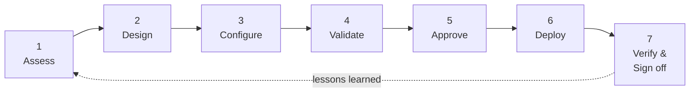
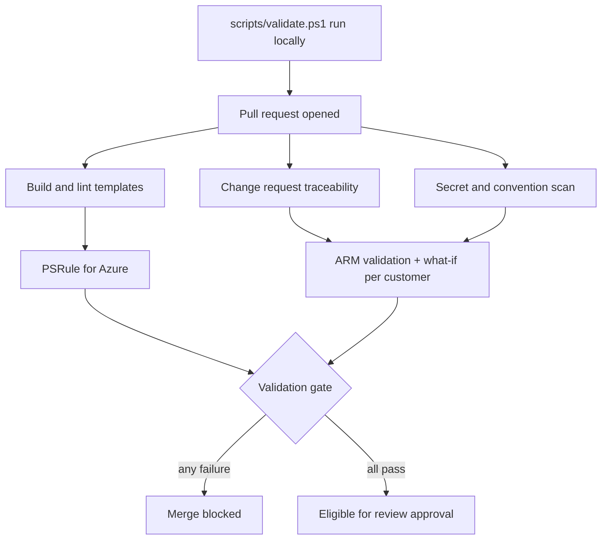
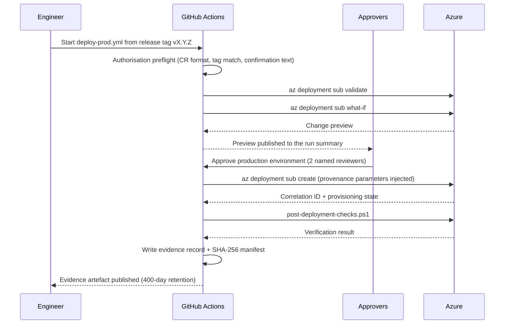
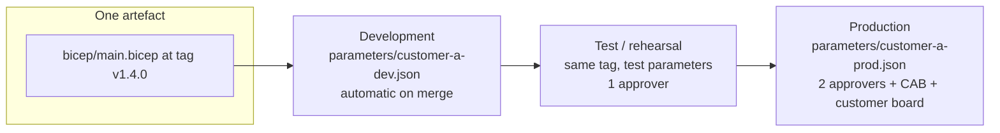
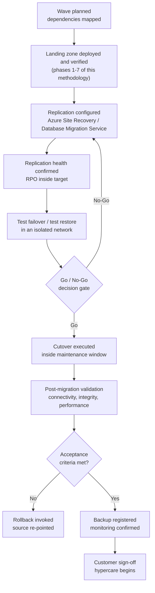

# Deployment Methodology

**Owner:** Principal Azure Architect
**Contributors:** Platform Engineering Lead, Database Migration Lead, Delivery Manager
**Applies to:** `alz-deployments` v1.0.0 and later
**Related controls:** Microsoft Advanced Specialization — Infrastructure and Database Migration to Microsoft Azure, **Control 3.1 Repeatable Deployment**
**Last reviewed:** 2026-03-29 · **Review cadence:** Quarterly, and after every post-implementation review

---

## 1. Purpose

This document defines the **single deployment methodology** used for every Azure infrastructure and
database migration delivered by this practice. It is not a description of one project. It is the
process that produces the same outcome, to the same standard, for every customer.

The methodology exists to satisfy three simultaneous requirements:

| Requirement | How the methodology satisfies it |
|---|---|
| **Repeatability** | Logic lives in `bicep/`; configuration lives in `parameters/`. A new customer consumes the identical template through the identical pipeline. |
| **Governance** | No change reaches a customer environment without an approved change request, two peer approvals, an automated quality gate, and a deployment approval. |
| **Auditability** | Every deployed resource carries provenance tags that trace back through the pipeline run, the commit, the pull request and the change request. |

---

## 2. Principles

1. **Infrastructure as Code is the only source of truth.** If it is not in this repository, it does
   not exist. Portal changes are drift and are treated as incidents.
2. **One template, many customers.** A template that contains a customer name, subscription
   identifier or tenant identifier is rejected by `scripts/validate.ps1`.
3. **Preview before change.** No deployment runs without a `what-if` preview being produced and
   reviewed by a human other than the author.
4. **Promote artefacts, not effort.** The same release tag is deployed to development, then test,
   then production. Only the parameter file differs.
5. **Verify, do not assume.** Every deployment is followed by an automated verification suite whose
   failure blocks sign-off.
6. **Secretless by construction.** No credential exists in the repository, in a pipeline variable,
   or in an engineer's shell history.
7. **Evidence is a by-product, not an exercise.** Every run emits its own evidence record. Nothing
   is assembled retrospectively for an audit.

---

## 3. The seven phases

Each phase has defined entry criteria, activities, artefacts and exit criteria. A phase may not
start until the previous phase's exit criteria are met. This is what makes the process auditable
rather than merely documented.

---

### Phase 1 — Assess

**Owner:** Infrastructure Migration Lead and Database Migration Lead
**Entry criteria:** Signed statement of work; customer technical contacts identified.

| Activity | Tooling | Output |
|---|---|---|
| Discover servers, dependencies and utilisation | Azure Migrate discovery and dependency analysis | Server inventory with CPU, memory, disk and network profiles |
| Assess SQL Server estate for managed instance compatibility | Data Migration Assistant; Azure Migrate SQL assessment | Blocking and advisory compatibility findings per database |
| Determine collation, time zone, edition and feature usage of every source instance | `SERVERPROPERTY` queries; Data Migration Assistant | Source instance profile that drives `sqlCollation` and `sqlTimezoneId` |
| Establish records retention and data residency obligations | Customer compliance function | Retention values that drive backup and long-term retention parameters |
| Capture the on-premises IP address plan | Customer network team | Non-overlapping address space for the landing zone |
| Right-size the target platform | Azure Migrate assessment; SQL assessment | Target service tier, vCore count and storage |

**Exit criteria**

- [ ] Every in-scope server and database is inventoried
- [ ] Every blocking database compatibility finding has a documented remediation or a scope exclusion
- [ ] Target sizing is agreed and recorded
- [ ] Data residency and retention obligations are confirmed in writing
- [ ] An address space is reserved that does not overlap the customer estate or the connectivity hub

---

### Phase 2 — Design

**Owner:** Principal Azure Architect
**Entry criteria:** Phase 1 exit criteria met.

| Activity | Output |
|---|---|
| Select the landing zone pattern and confirm it is satisfied by the existing templates | Design decision record |
| Identify any capability the current templates do not provide | Module request change request, or a documented exception |
| Confirm the network topology: isolated, hub-peered, or hub-peered with forced tunnelling | Values for `hubVirtualNetworkResourceId`, `routeThroughHubAppliance`, `nextHopApplianceIpAddress` |
| Agree the wave plan: which servers and databases migrate together and in what order | Wave schedule with dependency mapping |
| Agree the maintenance window, the freeze windows and the cutover approach | Recorded in the parameter file metadata |
| Agree the rollback approach for each wave | Rollback plan recorded on the change request |

> **If the design requires a capability the templates do not have**, the template change is raised as
> its own change request and follows the full contribution process *before* the customer
> configuration is written. Customers are never onboarded onto a modified private copy of a template.

**Exit criteria**

- [ ] The design is achievable with the current templates, or the required template change is merged and released
- [ ] Architecture decisions are recorded with rationale in `docs/Architecture.md` where they are generally applicable
- [ ] The customer has approved the target architecture

---

### Phase 3 — Configure

**Owner:** Delivery Manager with Platform Engineering
**Entry criteria:** Phase 2 exit criteria met; an approved change request exists.

1. Raise the change request issue using the **Change Request** form.
2. Create the branch: `customer/<code>/CR-####-onboarding`.
3. Copy `parameters/sample-customer.json` to `parameters/<customer>-<env>.json`.
4. Complete every value. Specifically:
   - `customerCode`, `customerName`, `environment`, `location`, `costCentre`, `ownerEmail`
   - the full IP address plan
   - `allowedLocations` from the data residency obligation
   - retention values from the records retention obligation
   - `sqlCollation` and `sqlTimezoneId` from the **source instance profile**, not from the default
   - Microsoft Entra group object identifiers supplied by the customer identity team
5. Create the customer bootstrap Key Vault and the `sqlmi-admin-password` secret **out of band**, then
   reference it from the parameter file. The password is never typed into a file.
6. Complete the metadata block, including `customerApproval` and `maintenanceWindow` for production.

**Exit criteria**

- [ ] No `REPLACE` marker remains in the file
- [ ] The administrator password resolves from Key Vault, not a literal value
- [ ] Subnet prefixes fall inside the virtual network address space
- [ ] The SQL Managed Instance subnet is at least a `/27`, and a `/24` unless justified

---

### Phase 4 — Validate

**Owner:** Author, then the automated pipeline
**Entry criteria:** Configuration complete.

| Gate | Enforced by | What it proves |
|---|---|---|
| Change request traceability | `validate.yml` | The change is authorised and traceable |
| Compile and lint | Bicep linter, ruleset in `bicepconfig.json` | The template is syntactically and structurally sound |
| Secret scan | `scripts/validate.ps1` | No credential is entering source control |
| Convention scan | `scripts/validate.ps1` | No customer-specific or hard-coded value is entering a template |
| Policy as code | PSRule for Azure, baseline in `ps-rule.yaml` | The template meets the Well-Architected and security baseline |
| Parameter validation | `scripts/validate.ps1` | The configuration is complete, internally consistent and secretless |
| Azure validation | `az deployment sub validate` | Azure Resource Manager accepts the deployment |
| Change preview | `az deployment sub what-if` | The exact impact is known before any change is made |

**Exit criteria**

- [ ] Every validation job is green
- [ ] The what-if preview has been read and matches the intent
- [ ] Every `Delete` operation in the preview is justified in the pull request

---

### Phase 5 — Approve

**Owner:** Reviewers and the Change Advisory Board
**Entry criteria:** Phase 4 exit criteria met.

| Approval | Who | Recorded where |
|---|---|---|
| Peer review | Two reviewers, including the path CODEOWNER | Pull request review record |
| Security review | Cloud Security Lead, for any network, identity, policy or data change | Pull request review record |
| Change advisory board | Per the approval matrix in `docs/Change_Management.md` | Comment and label on the change request issue |
| Customer change board | Customer, for production | `metadata.customerApproval` in the parameter file and the change request |
| Deployment authorisation | Delivery Manager | Deployment Request issue |
| Environment approval | Two named reviewers, at execution time | GitHub Environment approval record |

**Exit criteria**

- [ ] All required approvals are recorded with names and timestamps
- [ ] The deployment window is confirmed and is outside every freeze period

---

### Phase 6 — Deploy

**Owner:** DevOps Engineer
**Entry criteria:** Phase 5 exit criteria met; change merged to `main`; release tagged.

Rules that are not negotiable:

- Production deployments start from a **release tag**, never a branch.
- The pipeline injects `changeRequestId`, `sourceCommit` and `deploymentId` as deployment
  parameters; they become resource tags. A deployment without them is impossible.
- The deploying engineer and the approving reviewer must be different people.
- Concurrency control prevents two deployments to the same customer environment overlapping.

**Exit criteria**

- [ ] Provisioning state is `Succeeded`
- [ ] The Azure correlation identifier is captured in the evidence record

---

### Phase 7 — Verify and sign off

**Owner:** Platform Engineering Lead, Database Migration Lead, Delivery Manager
**Entry criteria:** Deployment succeeded.

| Verification | Performed by | Evidence |
|---|---|---|
| Technical verification, 8 check groups | `scripts/post-deployment-checks.ps1` (automatic) | `postdeploy-*.json` in the evidence bundle |
| Azure Policy compliance | Azure Policy compliance scan | Compliance state export |
| Backup registration | Manual, per migrated workload | Recovery Services Vault protected items list |
| Database integrity and row counts | Database Migration Lead | Cutover runbook completion record |
| Application connectivity | Customer application owner | Signed test evidence |
| Performance baseline comparison | Database Migration Lead | Pre- and post-migration query duration comparison |
| Customer acceptance | Customer, formally | Signed acceptance record |

**Exit criteria**

- [ ] `post-deployment-checks.ps1` reports zero failures
- [ ] Every migrated workload is registered against a backup policy
- [ ] The customer has formally accepted the wave
- [ ] A post-implementation review is scheduled if the change was Major, Emergency, failed or rolled back

---

## 4. Environment promotion

The same release tag flows through every environment. Only the parameter file changes.

| Environment | Trigger | Approval | Purpose |
|---|---|---|---|
| Development | Automatic on merge to `main` | None | Prove the change deploys and verifies |
| Test / rehearsal | Manual, same release tag | One reviewer | Rehearse the wave against production-equivalent configuration |
| Production | Manual, from a release tag | Two named reviewers, CAB, customer change board | Execute the wave |

A change may not skip an environment. Skipping is possible only as an emergency change and requires
a post-implementation review.

---

## 5. Migration wave execution

Infrastructure deployment is a prerequisite for, not a substitute for, the migration itself.

### Go / No-Go criteria

A cutover proceeds only when **all** of the following are true:

- [ ] The landing zone deployment succeeded and `post-deployment-checks.ps1` reported zero failures
- [ ] Replication health is green and the recovery point objective is inside target
- [ ] A test failover or test restore has completed successfully and been validated
- [ ] The source environment is confirmed as retainable for the agreed rollback retention period
- [ ] Application owners have confirmed readiness and are available for the window
- [ ] The rollback plan has been re-read by the named decision authority within the last 24 hours
- [ ] The window is inside the maintenance window and outside every freeze period

Any single unmet criterion is a No-Go. There is no partial go.

---

## 6. Rollback

Rollback is designed before deployment, not improvised during an incident. The full procedure is in
[Change_Management.md](Change_Management.md#6-rollback-procedure). In summary:

| Layer | Rollback method | Typical duration |
|---|---|---|
| Template or orchestration change | Redeploy the previous release tag with unchanged parameters | 15–45 minutes |
| Customer configuration change | Revert the pull request, redeploy | 15–45 minutes |
| Virtual machine migration | Re-point DNS to the source; source retained for the agreed period | Minutes |
| Database migration | Re-point application connection strings to the source instance, which is retained read-write until sign-off | Minutes |
| Database corruption after cutover | Restore from the pre-cutover backup or the point-in-time restore window | Hours |

Deleting a resource group is **never** a rollback method.

---

## 7. Tooling

| Tool | Minimum version | Used for |
|---|---|---|
| Azure CLI | 2.61.0 | Deployment, validation, what-if, verification |
| Bicep | 0.28.0 | Template compilation and linting |
| PowerShell | 7.4 | All scripts in `scripts/` |
| PSRule for Azure | 1.38.0 | Policy-as-code quality gate |
| Azure Migrate | Current | Discovery, dependency mapping, assessment |
| Data Migration Assistant | Current | SQL Server compatibility assessment |
| Azure Database Migration Service | Current | Database data movement |
| Azure Site Recovery | Current | Virtual machine replication and cutover |

Tool versions are pinned in the pipeline and reviewed quarterly.

---

## 8. Responsibilities

| Activity | Architect | Platform Eng. | Database Lead | DevOps | Delivery | Security | Customer |
|---|---|---|---|---|---|---|---|
| Assess | C | C | **A** | I | R | I | R |
| Design | **A** | R | R | C | C | R | **A** |
| Configure | C | R | C | I | **A** | I | C |
| Validate | C | **A** | C | R | I | C | I |
| Approve | **A** | R | C | I | **A** | **A** | **A** |
| Deploy | I | C | C | **A** | R | I | I |
| Verify | C | **A** | **A** | R | R | C | R |
| Sign off | C | I | R | I | **A** | I | **A** |

*A = Accountable, R = Responsible, C = Consulted, I = Informed.*

---

## 9. Metrics

Reported monthly by the Delivery Manager and retained as evidence of process maturity.

| Metric | Target | Why it matters |
|---|---|---|
| Deployments executed through the pipeline | 100% | Any exception is a repeatability failure |
| Change success rate | ≥ 98% | Process effectiveness |
| Emergency change ratio | ≤ 5% | High ratios indicate inadequate planning |
| Mean lead time, approval to deployment | ≤ 5 working days | Process efficiency |
| Rollback rate | ≤ 2% | Quality of validation |
| Post-deployment check pass rate on first attempt | ≥ 95% | Quality of configuration |
| Drift incidents detected | 0 | Infrastructure as Code remains the source of truth |
| Template reuse across customers | 100% | Core repeatability measure |

---

## Change history

| Date | Version | Author | Summary |
|---|---|---|---|
| 2026-03-29 | 1.0.0 | Principal Azure Architect | Initial methodology of record for the audit baseline |
