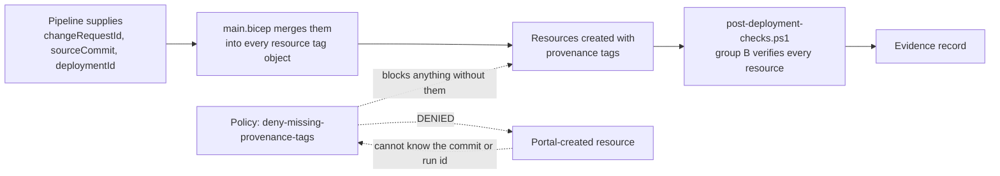

# Naming and Tagging Standards

**Owner:** Platform Engineering Lead
**Applies to:** `alz-deployments` v1.0.0 and later
**Enforced by:** `bicep/main.bicep` (name construction), `bicep/governance.bicep` (tag deny policy), `scripts/validate.ps1` (convention scan), `scripts/post-deployment-checks.ps1` (verification)
**Last reviewed:** 2026-03-29 · **Review cadence:** Quarterly

---

## 1. Why this matters

Naming and tagging are not cosmetic. In this repository they are load-bearing controls:

- Names are **constructed by the template**, never supplied by hand. Two customers deployed from the
  same template therefore produce structurally identical estates, which is the visible proof of
  repeatability.
- Provenance tags are the **first link of the audit traceability chain**. An auditor standing on a
  live Azure resource reads its tags and reaches the approved change request that created it.
- The provenance tag set is enforced by an Azure Policy **deny** effect, so a resource created
  outside the pipeline — which cannot know the commit or run identifier — is blocked at creation.

---

## 2. Naming convention

### 2.1 Pattern

```text
<resource-type-abbreviation>-<customer-code>-<workload>-<environment>-<region>-<instance>
```

Constructed in `bicep/main.bicep` as:

```bicep
var resourceSuffix = '${customerCode}-${workloadName}-${environment}-${regionAbbreviation}'
```

| Segment | Source | Constraints |
|---|---|---|
| Resource type abbreviation | Fixed table below | Lowercase, 2–6 characters |
| Customer code | `customerCode` parameter | Lowercase, 2–6 characters, alphanumeric |
| Workload | `workloadName` parameter | Lowercase, 2–8 characters. `mig` for a migration landing zone |
| Environment | `environment` parameter | One of `dev`, `tst`, `uat`, `prd` |
| Region | Derived from `location` | 3–4 character abbreviation from the table in `main.bicep` |
| Instance | Literal | `001`, `002`, … where a resource may be duplicated |

### 2.2 Worked examples

| Resource | Contoso production, West Europe | Northwind development, UK South |
|---|---|---|
| Network resource group | `rg-ctso-mig-prd-weu-network` | `rg-nwfn-core-dev-uks-network` |
| Security resource group | `rg-ctso-mig-prd-weu-security` | `rg-nwfn-core-dev-uks-security` |
| Management resource group | `rg-ctso-mig-prd-weu-management` | `rg-nwfn-core-dev-uks-management` |
| Data resource group | `rg-ctso-mig-prd-weu-data` | `rg-nwfn-core-dev-uks-data` |
| Virtual network | `vnet-ctso-mig-prd-weu-001` | `vnet-nwfn-core-dev-uks-001` |
| Log Analytics workspace | `log-ctso-mig-prd-weu-001` | `log-nwfn-core-dev-uks-001` |
| Recovery Services Vault | `rsv-ctso-mig-prd-weu-001` | `rsv-nwfn-core-dev-uks-001` |
| Managed identity | `id-ctso-mig-prd-weu-001` | `id-nwfn-core-dev-uks-001` |
| Key Vault | `kv-ctso-prd-<hash>` | `kv-nwfn-dev-<hash>` |
| SQL Managed Instance | `sqlmi-ctso-mig-prd-weu` | `sqlmi-nwfn-core-dev-uks` |

### 2.3 Resource type abbreviations

| Resource type | Abbreviation | Example |
|---|---|---|
| Resource group | `rg` | `rg-ctso-mig-prd-weu-data` |
| Virtual network | `vnet` | `vnet-ctso-mig-prd-weu-001` |
| Subnet | `snet` | `snet-app`, `snet-data`, `snet-sqlmi`, `snet-pep` |
| Network security group | `nsg` | `nsg-snet-sqlmi-vnet-ctso-mig-prd-weu-001` |
| Route table | `rt` | `rt-snet-sqlmi-vnet-ctso-mig-prd-weu-001` |
| Private endpoint | `pep` | `pep-kv-ctso-prd-a1b2c3` |
| Key Vault | `kv` | `kv-ctso-prd-a1b2c3` |
| User-assigned managed identity | `id` | `id-ctso-mig-prd-weu-001` |
| Log Analytics workspace | `log` | `log-ctso-mig-prd-weu-001` |
| Action group | `ag` | `ag-log-ctso-mig-prd-weu-001` |
| Recovery Services Vault | `rsv` | `rsv-ctso-mig-prd-weu-001` |
| SQL Managed Instance | `sqlmi` | `sqlmi-ctso-mig-prd-weu` |
| Diagnostic setting | `diag` | `diag-vnet-ctso-mig-prd-weu-001` |
| Policy initiative | `init` | `init-migration-governance-ctso` |
| Policy assignment | `assign` | `assign-migration-gov-ctso-prd` |
| Azure Firewall | `afw` | `afw-ctso-hub-prd-weu-001` |
| Virtual network gateway | `vgw` | `vgw-ctso-hub-prd-weu-001` |
| Virtual machine | `vm` | `vm-ctso-erp01-prd` |
| Storage account | `st` | `stctsomigprdweu001` (no hyphens permitted) |

### 2.4 Region abbreviations

| Region | Abbreviation | Region | Abbreviation |
|---|---|---|---|
| `westeurope` | `weu` | `eastus` | `eus` |
| `northeurope` | `neu` | `eastus2` | `eus2` |
| `uksouth` | `uks` | `centralus` | `cus` |
| `ukwest` | `ukw` | `westus2` | `wus2` |
| `swedencentral` | `sec` | `westus3` | `wus3` |
| `germanywestcentral` | `gwc` | `canadacentral` | `cac` |
| `francecentral` | `frc` | `uaenorth` | `uan` |
| `switzerlandnorth` | `chn` | `southeastasia` | `sea` |
| `norwayeast` | `nwe` | `australiaeast` | `aue` |
| `polandcentral` | `plc` | `italynorth` | `itn` |

A region not in the table falls back to the first four characters of the region name. Adding a
region to the table is a normal change request.

### 2.5 Globally unique names

Key Vault and SQL Managed Instance names must be globally unique.

| Resource | Default behaviour | Override |
|---|---|---|
| Key Vault | `kv-<customerCode>-<environment>-<6-character deterministic hash>` derived from the subscription, customer, workload and environment | Set `keyVaultName` in the parameter file where the customer has a naming mandate |
| SQL Managed Instance | `sqlmi-<suffix>-<6-character deterministic hash>` | Set `sqlManagedInstanceName` explicitly. **Recommended**, so that the name appears in the reviewed configuration and is stable across subscriptions |

Both customer parameter sets in this repository set `sqlManagedInstanceName` explicitly for exactly
this reason.

### 2.6 Prohibited in names

- Personal names, project code names or ticket numbers
- Environment words spelled in full (`production`, `development`)
- Anything that implies a security posture (`secure`, `dmz`, `public`)
- Any value that must change when the customer renames a business unit
- Uppercase characters, except where the Azure service itself requires them

---

## 3. Tagging standard

Every taggable resource receives a single merged tag object constructed in `bicep/main.bicep`:

```bicep
var tags = union(businessTags, provenanceTags, additionalTags)
```

### 3.1 Business tags

| Tag | Source parameter | Example | Purpose |
|---|---|---|---|
| `Customer` | `customerName` | `Contoso Manufacturing Ltd` | Cost attribution and audit identification |
| `CustomerCode` | `customerCode` | `ctso` | Machine-friendly grouping |
| `Environment` | `environment` | `prd` | Lifecycle and policy targeting |
| `Workload` | `workloadName` | `mig` | Workload grouping |
| `CostCentre` | `costCentre` | `CC-41180` | Chargeback |
| `Owner` | `ownerEmail` | `azure.platform@contoso-manufacturing.example` | Accountable technical contact |
| `DataClassification` | `dataClassification` | `Confidential` | Drives handling requirements and access review frequency |
| `Purpose` | Set per resource group | `Database platform` | Explains why the resource group exists |

### 3.2 Provenance tags — mandatory and enforced

| Tag | Value in a pipeline deployment | Purpose |
|---|---|---|
| `ManagedBy` | `IaC` | Declares the resource is pipeline-managed. Any other value is denied |
| `SourceRepo` | `example-partner/alz-deployments` | Which repository produced the resource |
| `SourceCommit` | `9f3c1a7` | Which reviewed commit produced it |
| `DeploymentId` | `1284` | Which GitHub Actions run produced it |
| `ChangeRequest` | `CR-0142` | Which approved change authorised it |
| `DeployedUtc` | `2026-03-11T21:04:00Z` | When it was produced |

These are supplied by the pipeline as deployment parameters, not stored in the repository:

```bash
az deployment sub create ... \
  --parameters changeRequestId="CR-0142" \
               sourceCommit="9f3c1a7" \
               deploymentId="1284"
```

### 3.3 The enforcement chain



This is why manual portal creation fails in a governed subscription: the operator has no commit
identifier or run identifier to supply. The control is structural, not procedural.

### 3.4 Optional customer tags

Supplied through `additionalTags`. Common values used across engagements:

| Tag | Example | Purpose |
|---|---|---|
| `Engagement` | `ENG-2026-0114` | Internal engagement reference |
| `MigrationWave` | `wave-1-4` | Which wave the resource belongs to |
| `BusinessUnit` | `Group IT` | Customer internal reporting |
| `ServiceLevel` | `Gold` | Support tier |
| `DisasterRecoveryTier` | `Tier-1` | Recovery objectives |
| `RegulatoryScope` | `FCA-SYSC-8` | Applicable regulatory regime |
| `DataSubjectRights` | `In-scope` | Data protection handling |

### 3.5 Tag value rules

- Tag **keys** are `PascalCase`. Tag **values** preserve the customer's own formatting.
- No secret, credential, connection string or personal data in any tag value.
- No tag value longer than 256 characters.
- A tag whose value must be recalculated on every deployment (`SourceCommit`, `DeploymentId`,
  `DeployedUtc`) will appear as a modification in every `what-if` preview. This is expected; see
  section 4 of the pull request template.

---

## 4. Parameter file naming

```text
parameters/<customer-code>-<environment-word>.json
```

| File | Customer | Environment |
|---|---|---|
| `customer-a-dev.json` | Contoso Manufacturing | Development |
| `customer-a-prod.json` | Contoso Manufacturing | Production |
| `customer-b-dev.json` | Northwind Financial | Development |
| `customer-b-prod.json` | Northwind Financial | Production |
| `sample-customer.json` | — | Annotated onboarding template |

> Customer folders use an anonymised label (`customer-a`) rather than the customer name, so that the
> repository can be shown to an auditor without a confidentiality waiver. The real customer name is
> recorded inside the file, and disclosure is governed by the consent register described in
> [Audit_Evidence_Guide.md](Audit_Evidence_Guide.md).

---

## 5. Branch, commit and deployment naming

| Artefact | Pattern | Example |
|---|---|---|
| Feature branch | `feature/CR-<id>-<slug>` | `feature/CR-0142-sqlmi-ltr-policy` |
| Fix branch | `fix/CR-<id>-<slug>` | `fix/CR-0150-nsg-priority` |
| Hotfix branch | `hotfix/CR-<id>-<slug>` | `hotfix/CR-0151-backup-retention` |
| Customer branch | `customer/<code>/CR-<id>-<slug>` | `customer/ctso/CR-0161-wave3-params` |
| Release tag | `v<major>.<minor>.<patch>` | `v1.4.0` |
| Azure deployment name | `mig-<configuration>-<run number>` | `mig-customer-a-prod-284` |
| Evidence artefact | `<type>-evidence-<environment>-<configuration>-<run number>` | `production-deployment-evidence-customer-a-prod-284` |

---

## 6. Enforcement summary

| Rule | Enforced by | Failure mode |
|---|---|---|
| Names are constructed, never hand-written | `bicep/main.bicep` | Not possible to violate through a parameter file |
| No customer name in a template | `scripts/validate.ps1` convention scan | Pull request blocked |
| No hard-coded identifier in a template | `scripts/validate.ps1` convention scan, with an explicit allow-list of Azure built-in role and policy identifiers | Pull request blocked |
| Every parameter carries a description | `scripts/validate.ps1` convention scan | Pull request blocked |
| Every template declares `metadata name`, `metadata owner` and `targetScope` | `scripts/validate.ps1` convention scan | Pull request blocked |
| Provenance tags present on every resource | `bicep/governance.bicep` deny policy | Resource creation blocked in Azure |
| Provenance tags verified after deployment | `scripts/post-deployment-checks.ps1` group B | Deployment marked unverified; sign-off blocked |

---

## 7. Changing this standard

The naming and tagging standard is a breaking change surface: altering a name pattern causes Azure
to replace resources. Any change therefore:

1. Is raised as a **Major** change request
2. Requires Principal Azure Architect and Cloud Security Lead approval
3. Requires a `what-if` preview showing the replacement impact for every existing customer
4. Is released as a **major** semantic version
5. Is applied per customer through a planned change with its own maintenance window

Adding a new resource type abbreviation, a new region abbreviation or a new optional tag is a
**Normal** change.

---

## Change history

| Date | Version | Author | Summary |
|---|---|---|---|
| 2026-03-29 | 1.0.0 | Platform Engineering Lead | Initial naming and tagging standard for the audit baseline |
