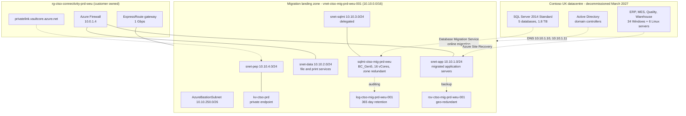

# Migration Project 01 — Contoso Manufacturing Ltd

**Engagement:** ENG-2026-0114 — UK datacentre exit, waves 1–4
**Customer code:** `ctso` · **Anonymised label:** `customer-a`
**Migration type:** Infrastructure lift-and-shift plus homogeneous database migration
**Source platform:** SQL Server 2014 Standard on Windows Server 2012 R2, on-premises Hyper-V
**Target platform:** Azure SQL Managed Instance, Business Critical, West Europe
**Delivered with:** `alz-deployments` `v1.0.0` → `v1.3.1`
**Status:** Waves 1–3 complete and accepted. Wave 4 scheduled 2026-11-14.
**Customer consent for reference:** Recorded in the engagement record, 2026-08-21.

> Sanitised engagement record. Subscription and object identifiers are those of a demonstration
> tenant. Retained as evidence EV-18 for Control 3.1.

---

## 1. Business context

Contoso Manufacturing operated a single UK datacentre whose lease expired in March 2027. The
datacentre hosted the ERP, manufacturing execution, quality and warehouse management systems, all
backed by one SQL Server 2014 Standard instance that was out of mainstream support.

| Driver | Detail |
|---|---|
| Datacentre lease expiry | Hard deadline of 31 March 2027 |
| SQL Server 2014 end of support | Extended support ended; no security updates without a paid agreement |
| Quality records retention | ISO 9001 obligation to retain manufacturing quality data for seven years |
| Availability | Manufacturing execution system outage costs approximately £18,000 per hour |
| Constraint | No application source code changes were permitted; the ERP vendor would not support a refactor |

The no-code-change constraint made Azure SQL Managed Instance the only viable database target.

---

## 2. Assessment findings (Phase 1)

| Area | Finding |
|---|---|
| Servers in scope | 34 Windows servers, 6 Linux servers |
| Databases in scope | 5 user databases, 1.8 TB total |
| Source instance collation | `SQL_Latin1_General_CP1_CI_AS` |
| Source instance time zone | `W. Europe Standard Time` |
| Data Migration Assistant — blocking findings | 2 (see below) |
| Data Migration Assistant — advisory findings | 17, all deprecated syntax with no runtime impact |
| Peak database throughput | 2,400 transactions per second during the nightly MRP run |
| Recovery point objective | 15 minutes |
| Recovery time objective | 2 hours |

### 2.1 Blocking compatibility findings and their remediation

| Finding | Impact | Remediation | Change request |
|---|---|---|---|
| Cross-database queries using three-part names to a database outside the migration scope | Would fail after migration | The referenced database was brought into scope for wave 3 rather than excluded | CR-0148 |
| `xp_cmdshell` used by a nightly file export job | Not available on Azure SQL Managed Instance | Replaced with an Azure Data Factory copy activity, delivered by the customer application team before wave 2 | CR-0149 |

Both were identified in Phase 1 and closed before Phase 2 exited. Neither was discovered during
cutover, which is the outcome the assessment phase exists to produce.

### 2.2 Right-sizing decision

| Metric | Source | Target | Rationale |
|---|---|---|---|
| CPU | 16 physical cores, 62% peak | 16 vCores Business Critical | Business Critical provides local SSD; General Purpose remote storage latency failed the MRP run test |
| Memory | 128 GB | Included in the 16 vCore Business Critical allocation | — |
| Storage | 1.8 TB used | 1024 GB reserved, expanded to 2048 GB in wave 3 | Started smaller to control cost during rehearsal; expanded as a planned change |
| Licensing | Software Assurance held | `BasePrice` (Azure Hybrid Benefit) | Saved approximately 38% of the compute cost |

---

## 3. Target architecture

**Configuration file:** [`parameters/customer-a-prod.json`](../parameters/customer-a-prod.json)

Design decisions specific to this engagement:

| Decision | Rationale |
|---|---|
| Business Critical rather than General Purpose | General Purpose remote storage latency extended the nightly MRP run from 41 to 96 minutes in rehearsal, breaching the production window |
| Zone redundancy enabled | The manufacturing execution system outage cost justified the premium |
| Forced tunnelling through the hub firewall for `snet-app` and `snet-data` | Customer security policy required egress inspection. The SQL Managed Instance subnet is exempt, as the service requires an internet default route |
| Custom DNS pointing at the migrated domain controllers | Kerberos authentication had to continue working for the ERP application without change |
| Seven-year yearly long-term retention | ISO 9001 quality records obligation |

---

## 4. Wave plan

| Wave | Scope | Window | Change request | Release | Outcome |
|---|---|---|---|---|---|
| Rehearsal | Full landing zone deployed to the development subscription; all four waves rehearsed end to end | 2026-04-11 | CR-0030 | v1.0.0 | Success. Two runbook defects found and corrected |
| 1 | Landing zone deployed to production; domain controllers migrated; connectivity proven | 2026-05-09 22:00–02:00 | CR-0142 | v1.1.1 | Success |
| 2 | Quality and Warehouse databases; 8 application servers | 2026-06-13 22:00–04:00 | CR-0155 | v1.2.0 | Success |
| 3 | ERP and MES databases; 19 application servers; instance storage expanded to 2048 GB | 2026-08-08 22:00–04:00 | CR-0161 | v1.3.1 | Success |
| 4 | Residual file and print services; source decommission | 2026-11-14 | CR-0174 | v1.3.1 | Scheduled |

Wave 3 was the highest-risk wave and is documented in detail below.

---

## 5. Wave 3 cutover record

**Change request:** CR-0161 · **Pull request:** #92 · **Release:** `v1.3.1`
**Deployment Request:** #214 · **Workflow run:** 1284 · **Azure correlation ID:** `3f2b8c41-...`

### 5.1 Timeline

| Time (UTC) | Event | Owner |
|---|---|---|
| 21:45 | Go / No-Go call. All eleven criteria confirmed. Decision: **Go** | Delivery Manager |
| 22:00 | Customer stopped ERP and MES application services | Customer |
| 22:04 | `deploy-prod.yml` started from tag `v1.3.1`. Authorisation preflight passed | DevOps Engineer |
| 22:07 | What-if preview published: 3 modify, 2 create, 0 delete | Pipeline |
| 22:14 | Production environment approved by two named reviewers | Architect, Delivery Manager |
| 22:19 | Deployment completed. Instance storage expanded to 2048 GB, two databases added | Pipeline |
| 22:31 | `post-deployment-checks.ps1`: 41 checks, 0 failures | Pipeline |
| 22:35 | Database Migration Service final synchronisation started | Database Migration Lead |
| 23:48 | Final synchronisation complete. Migration cut over | Database Migration Lead |
| 23:55 | Row count and checksum comparison completed against the source | Database Migration Lead |
| 00:10 | Applications re-pointed to `sqlmi-ctso-mig-prd-weu.<dns-zone>.database.windows.net` | Customer |
| 00:24 | Customer application smoke tests passed | Customer |
| 01:05 | Nightly MRP run started on the migrated platform | Customer |
| 01:44 | MRP run completed in 39 minutes, against a 41-minute source baseline | Database Migration Lead |
| 02:00 | Long-term retention policy confirmed on all five databases | Database Migration Lead |
| 02:15 | Wave declared successful. Hypercare started | Delivery Manager |

Elapsed time inside the four-hour window: 4 hours 15 minutes, 15 minutes over plan. The overrun was
in customer-side application smoke testing and did not affect service.

### 5.2 Validation results

| Check | Target | Result |
|---|---|---|
| Post-deployment verification | 0 failures | 41 checks, 0 failures |
| Row count comparison, 5 databases | Exact match | Exact match |
| `DBCC CHECKDB` on the migrated instance | No errors | No errors |
| MRP run duration | ≤ 45 minutes | 39 minutes |
| Top 20 query duration comparison | Within 110% of baseline | Worst case 104% of baseline |
| Application smoke tests | All pass | All pass |
| Backup protection registered | All migrated servers | 19 of 19 |
| Azure Policy compliance | 100% | 100% |

---

## 6. Repeatability evidence

The point of this record is not that the migration succeeded. It is that it succeeded using the
**same artefacts** as every other engagement.

| Aspect | Contoso | Any other customer |
|---|---|---|
| Template | `bicep/main.bicep` at `v1.3.1` | Identical |
| Modules | The same five modules | Identical |
| Pipeline | `validate.yml`, `deploy-prod.yml` | Identical |
| Verification suite | `post-deployment-checks.ps1` | Identical |
| Governance initiative | `init-migration-governance-ctso` | Same definitions, customer-scoped name |
| What differed | `parameters/customer-a-prod.json` only | Their own parameter file only |

Configuration effort for the production landing zone: approximately two hours, entirely in the
parameter file. No template was edited for this engagement.

---

## 7. Lessons learned

| Observation | Action taken | Change request |
|---|---|---|
| The General Purpose tier failed the MRP performance requirement, discovered only in rehearsal | Added an explicit nightly batch workload performance test to the rehearsal exit criteria in the methodology | CR-0152 |
| Instance storage expansion triggered a brief failover that had not been anticipated in the runbook | Runbook now stops applications before any online scaling operation | CR-0160 |
| Long-term retention could not be applied to databases created by the migration service until after cutover | Databases are now added to `sqlDatabases` in the same wave change request, applied immediately post-cutover | CR-0163 |
| Customer application smoke testing consistently overran its estimate | Smoke test allowance increased from 15 to 30 minutes in the wave planning template | CR-0165 |

All four corrective actions were delivered as normal changes and now benefit every subsequent
engagement. This is the continuous improvement evidence referenced as EV-22.

---

## 8. Outcome

| Measure | Result |
|---|---|
| Waves completed on schedule | 3 of 3 executed to date; wave 4 scheduled |
| Unplanned downtime | None |
| Rollbacks invoked | None |
| Post-deployment check failures in production | 0 |
| Azure Policy compliance at sign-off | 100% |
| Datacentre lease exit | On track, 18 weeks ahead of the 31 March 2027 deadline |
| Database platform | Fully supported, automatically patched, seven-year retention satisfied |
| Customer acceptance | Wave 1 signed 2026-05-13; wave 2 signed 2026-06-17; wave 3 signed 2026-08-12 |

---

## 9. Evidence index for this engagement

| Artefact | Location |
|---|---|
| Customer configuration | `parameters/customer-a-prod.json`, `parameters/customer-a-dev.json` |
| Change requests | CR-0030, CR-0142, CR-0148, CR-0149, CR-0155, CR-0161, CR-0174 |
| Pull requests | #46, #87, #92 |
| Releases | `v1.0.0`, `v1.1.1`, `v1.2.0`, `v1.3.1` |
| Deployment requests | #198, #206, #214 |
| Workflow runs | 1102, 1144, 1284 |
| Deployment evidence bundles | `production-deployment-evidence-customer-a-prod-<run>` |
| Verification records | `postdeploy-customer-a-prod.json` in each bundle |
| Acceptance records | Engagement record, countersigned in the Contoso change system |

---

## Change history

| Date | Version | Author | Summary |
|---|---|---|---|
| 2026-09-28 | 1.0.0 | Delivery Manager | Initial sanitised engagement record |
