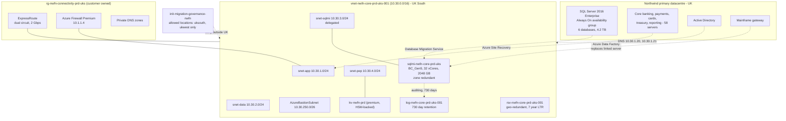
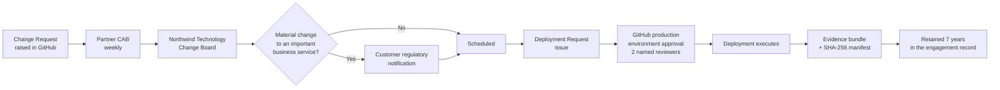

# Migration Project 02 — Northwind Financial Services plc

**Engagement:** ENG-2026-0207 — Regulated core banking platform migration, waves 1–6
**Customer code:** `nwfn` · **Anonymised label:** `customer-b`
**Migration type:** Regulated database and infrastructure migration under UK financial services supervision
**Source platform:** SQL Server 2016 Enterprise with Always On availability groups, on-premises VMware
**Target platform:** Azure SQL Managed Instance, Business Critical, zone redundant, UK South
**Delivered with:** `alz-deployments` `v1.0.0` → `v1.3.1`
**Status:** Waves 1–4 complete and accepted. Wave 2 was rolled back and re-executed; see section 7. Waves 5–6 scheduled.
**Customer consent for reference:** Recorded in the engagement record, 2026-09-18.

> Sanitised engagement record. Subscription and object identifiers are those of a demonstration
> tenant. Retained as evidence EV-15 and EV-18 for Control 3.1. **This record is the primary
> evidence of a proven, executed rollback.**

---

## 1. Business and regulatory context

Northwind Financial Services operates a regulated core banking platform. The migration was subject
to operational resilience requirements, which changed the character of the engagement in three ways:

| Requirement | Consequence for the migration |
|---|---|
| Data residency restricted to the United Kingdom by contract and by regulatory obligation | `allowedLocations` limited to `uksouth` and `ukwest`, enforced by a deny policy in **every** environment including development |
| Important business services must have a documented, tested impact tolerance | Rollback had to be demonstrably executable, not merely documented |
| Seven-year record-keeping obligation | Long-term retention of `P7Y`, and 730-day telemetry retention |
| Change must be evidenced to the regulator on request | Every deployment had to produce an immutable, timestamped record linking it to an approved change |
| Month-end and regulatory reporting freeze windows | Only eight viable cutover windows existed in the calendar year |

The last point is why rollback capability mattered so much: a failed cutover that could not be
reversed inside the window would have consumed one of only eight opportunities.

---

## 2. Assessment findings (Phase 1)

| Area | Finding |
|---|---|
| Servers in scope | 58 Windows servers |
| Databases in scope | 6 user databases, 4.2 TB total |
| Source instance collation | `Latin1_General_CI_AS` — **not** the SQL Server default |
| Source instance time zone | `GMT Standard Time` |
| High availability at source | Always On availability group, 2 synchronous replicas plus 1 asynchronous |
| Data Migration Assistant — blocking findings | 1 |
| Data Migration Assistant — advisory findings | 31 |
| Peak transaction rate | 6,800 transactions per second during end-of-day settlement |
| Recovery point objective | 5 minutes |
| Recovery time objective | 1 hour |

> **The collation finding was the single highest-risk item in the engagement.** The source instance
> used `Latin1_General_CI_AS`, not the SQL Server default. Instance collation is immutable on Azure
> SQL Managed Instance. Deploying with the template default would have required destroying and
> recreating a 4.2 TB Business Critical instance — a multi-day recovery inside a window that does
> not repeat for weeks. It was caught in Phase 1 and set explicitly in
> [`parameters/customer-b-prod.json`](../parameters/customer-b-prod.json).

### 2.1 Blocking finding

| Finding | Impact | Remediation | Change request |
|---|---|---|---|
| A linked server to a mainframe gateway used a driver unavailable on Azure SQL Managed Instance | The settlement reconciliation job would fail | Reconciliation moved to an Azure Data Factory pipeline calling the gateway directly; delivered by the customer before wave 2 | CR-0181 |

---

## 3. Target architecture



**Configuration file:** [`parameters/customer-b-prod.json`](../parameters/customer-b-prod.json)

| Decision | Rationale |
|---|---|
| `Latin1_General_CI_AS` collation set explicitly | Matches the source. Immutable after creation |
| Business Critical, 32 vCores, zone redundant | Contracted 99.99% availability; the built-in read-scale replica serves regulatory reporting without affecting the transactional workload |
| Premium Key Vault | Hardware security module backed keys were a customer control requirement |
| 730-day telemetry retention | Regulatory record-keeping |
| `P7Y` long-term retention with 36 monthly points | Seven-year obligation |
| `allowedLocations` enforced in development as well as production | Prevents a rehearsal from placing regulated data outside the United Kingdom |
| `auditorGroupObjectId` populated | The customer internal audit function holds standing read-only access to the security resource group |

---

## 4. Wave plan

| Wave | Scope | Window | Change request | Release | Outcome |
|---|---|---|---|---|---|
| Rehearsal | Full landing zone and all waves rehearsed in development | 2026-04-18 | CR-0031 | v1.0.0 | Success |
| 1 | Landing zone deployed to production; connectivity and identity proven | 2026-05-16 01:00–05:00 | CR-0180 | v1.1.1 | Success |
| 2 | Payments and Customer Master databases | 2026-06-20 01:00–05:00 | CR-0186 | v1.2.0 | **Rolled back.** See section 7 |
| 2R | Re-execution of wave 2 after remediation | 2026-07-18 01:00–05:00 | CR-0191 | v1.3.0 | Success |
| 3 | Regulatory Reporting and Audit databases | 2026-08-15 01:00–05:00 | CR-0195 | v1.3.1 | Success |
| 4 | Card Services and Treasury databases | 2026-09-12 01:00–05:00 | CR-0203 | v1.3.1 | Success |
| 5 | Residual application servers | 2026-10-10 | CR-0210 | v1.3.1 | Scheduled |
| 6 | Source decommission | 2026-11-07 | CR-0218 | v1.3.1 | Scheduled |

---

## 5. Governance in this engagement



The customer's regulatory obligation to evidence change to a supervisor on request was satisfied
without any additional process. The evidence bundle produced by `deploy-prod.yml` — deployment
record, what-if preview, verification results and hash manifest — was accepted by the customer
compliance function as-is.

---

## 6. Wave 2 cutover — the attempt that was rolled back

**Change request:** CR-0186 · **Release:** `v1.2.0` · **Deployment Request:** #241 · **Workflow run:** 1198

### 6.1 Timeline

| Time (UTC) | Event |
|---|---|
| 00:45 | Go / No-Go call. All criteria confirmed. Decision: **Go** |
| 01:00 | Customer stopped the payments and customer master applications |
| 01:04 | `deploy-prod.yml` started from tag `v1.2.0`. Preflight passed |
| 01:09 | What-if preview: 2 modify, 2 create, 0 delete |
| 01:16 | Production environment approved by two named reviewers |
| 01:22 | Deployment completed. Provisioning state `Succeeded` |
| 01:34 | `post-deployment-checks.ps1`: 43 checks, 0 failures |
| 01:38 | Database Migration Service final synchronisation started |
| 02:51 | Final synchronisation complete. Migration cut over |
| 03:04 | Row count comparison passed. Integrity check passed |
| 03:10 | Applications re-pointed to the managed instance |
| 03:26 | **Payments application failed its smoke test.** Settlement batch aborted with a timeout |
| 03:41 | Root cause identified: the settlement batch opened 340 concurrent connections; the application's connection string used the default connection type, and the customer network team had not opened ports 11000–11999 from `snet-app`, so every connection was proxied, exhausting the proxy gateway throughput |
| 03:55 | Remediation attempted by re-pointing the application to the proxy-only endpoint with a reduced connection pool. Settlement batch still exceeded its window |
| **04:05** | **Rollback trigger criterion met:** application connectivity not restored within 30 minutes of planned cutover completion. Decision authority: Delivery Manager, in consultation with the Database Migration Lead |
| 04:07 | **Rollback invoked** |
| 04:12 | Applications re-pointed to the retained on-premises availability group listener |
| 04:19 | Settlement batch restarted on the source platform |
| 04:38 | Settlement batch completed successfully on source. Service fully restored |
| 04:45 | Customer notified. Deployment Request #241 updated with the rollback record |
| 05:00 | Window closed. No customer-visible service impact outside the planned window |
### 6.2 Why rollback worked

| Design decision | Effect during the incident |
|---|---|
| The source availability group was retained **read-write** until formal sign-off, not decommissioned at cutover | The rollback was a connection string change, not a data recovery exercise |
| Rollback trigger criteria were objective and pre-agreed on the Deployment Request | No debate at 04:05; the criterion was met and the decision was made in two minutes |
| Decision authority was named in advance | The Delivery Manager was present for the whole window |
| Rollback was rehearsed in the development landing zone during the rehearsal wave | The runbook steps were known and had been executed before |
| The Azure landing zone itself was left in place | Nothing had to be destroyed; the infrastructure was correct, only the client connectivity path was wrong |

Total time from trigger to full service restoration: **31 minutes**, entirely inside the maintenance
window.

---

## 7. Rollback record and corrective actions

This section is the evidence referenced as **EV-15** in
[Audit_Evidence_Guide.md](../docs/Audit_Evidence_Guide.md).

### 7.1 Rollback record

```text
Rollback record
Engagement:            ENG-2026-0207
Wave:                  Wave 2 - Payments and Customer Master
Change request:        CR-0186
Deployment request:    #241
Release deployed:      v1.2.0
Workflow run:          1198
Azure correlation ID:  8d14a9f2-...
Trigger criterion met: Application connectivity not restored within 30 minutes of planned cutover
                       completion (criterion 3 of 5 on Deployment Request #241)
Trigger time:          2026-06-20T04:05:00Z
Decision authority:    Delivery Manager, in consultation with the Database Migration Lead
Decision time:         2026-06-20T04:07:00Z
Method:                Application connection strings re-pointed to the retained on-premises
                       availability group listener. Azure landing zone left in place.
Service restored:      2026-06-20T04:38:00Z
Elapsed:               31 minutes
Data loss:             None. Transactions written to the managed instance between 03:10 and 04:07
                       were identified from the audit log; 0 settlement transactions had committed
                       because the batch never completed. 14 read-only enquiry sessions were
                       discarded.
Customer impact:       None outside the planned maintenance window.
Customer notified:     2026-06-20T04:45:00Z
Post-implementation
review completed:      2026-06-25
```

### 7.2 Post-implementation review findings

| Finding | Root cause | Corrective action | Change request |
|---|---|---|---|
| Connection type and client port requirements were not validated before cutover | The Go / No-Go checklist verified infrastructure and replication, but not the client connectivity path under load | Added an explicit pre-cutover client connectivity test at production concurrency to the wave exit criteria in `docs/Deployment_Methodology.md` | CR-0188 |
| Ports 11000–11999 were not open from `snet-app` | `proxyOverride` defaulted to `Proxy`, which was correct, but the settlement batch's concurrency exceeded proxy gateway throughput — a limit not identified in assessment | `Redirect` connection type adopted for this customer, with the required network security group rule added to the template as an optional, parameterised rule set | CR-0189 |
| Peak concurrency was not captured during assessment | The assessment captured transaction rate but not concurrent connection count | Concurrent connection profiling added to the Phase 1 assessment activity table | CR-0190 |
| The rollback itself executed cleanly | — | No action. The rehearsal of the rollback path was validated as effective and is now mandatory for every regulated engagement | CR-0192 |

All four corrective actions were delivered before wave 2R. Wave 2R, and every subsequent wave,
completed successfully at the first attempt.

### 7.3 What this demonstrates for Control 3.1

| Control aspect | Demonstrated |
|---|---|
| Rollback procedures are **defined** | Trigger criteria, decision authority and method were agreed on Deployment Request #241 before the window opened |
| Rollback procedures are **proven** | Executed under real conditions in 31 minutes with zero data loss and zero unplanned customer impact |
| Failure is **detected**, not discovered later | The automated verification suite passed, and the failure was caught by the agreed application smoke test, within the window |
| The process **improves** | Four corrective actions were raised, delivered, and now apply to every engagement |
| The process is **honest** | A failed cutover is recorded in the repository rather than omitted. An audit trail that contains only successes is not an audit trail |

---

## 8. Wave 2R — re-execution

**Change request:** CR-0191 · **Release:** `v1.3.0` · **Workflow run:** 1402

| Difference from wave 2 | Detail |
|---|---|
| Connection type | `Redirect` rather than `Proxy` |
| Network security group | Ports 11000–11999 permitted from `snet-app` to `snet-sqlmi`, delivered as a parameterised optional rule set in `v1.3.0` |
| Pre-cutover validation | Client connectivity tested at 400 concurrent connections against the development landing zone, and against production one week before the window |
| Go / No-Go | Twelve criteria rather than eleven; the additional criterion was the client connectivity test result |

**Outcome:** completed in 2 hours 48 minutes against a 4-hour window. Settlement batch completed in
22 minutes against a 26-minute source baseline. Accepted by the customer on 2026-07-22.

---

## 9. Outcome

| Measure | Result |
|---|---|
| Waves completed | 4 of 6; waves 5 and 6 scheduled |
| Cutovers rolled back | 1 of 5 attempts to date |
| Data loss across the engagement | None |
| Unplanned customer-visible downtime | None |
| Regulatory notification required | Yes, for waves 2, 2R and 4. All satisfied with the standard evidence bundle |
| Post-deployment check failures in production | 0 |
| Azure Policy compliance at sign-off | 100% |
| Data residency breaches | 0 — the allowed-locations deny policy prevented two attempted development deployments to West Europe |
| Customer acceptance | Waves 1, 2R, 3 and 4 accepted. Wave 4 signed 2026-09-16 |

---

## 10. Evidence index for this engagement

| Artefact | Location |
|---|---|
| Customer configuration | `parameters/customer-b-prod.json`, `parameters/customer-b-dev.json` |
| Change requests | CR-0031, CR-0180, CR-0181, CR-0186, CR-0188 to CR-0192, CR-0195, CR-0203, CR-0210, CR-0218 |
| Releases | `v1.0.0`, `v1.1.1`, `v1.2.0`, `v1.3.0`, `v1.3.1` |
| Deployment requests | #232, #241, #256, #268, #279, #288 |
| Workflow runs | 1118, 1198, 1402, 1361, 1489, 1522 |
| Rollback record | Section 7.1 of this document; Deployment Request #241 |
| Post-implementation review | CR-0186 issue comment, 2026-06-25 |
| Deployment evidence bundles | `production-deployment-evidence-customer-b-prod-<run>` |
| Acceptance records | Engagement record, countersigned in the Northwind change system |

---

## Change history

| Date | Version | Author | Summary |
|---|---|---|---|
| 2026-09-28 | 1.0.0 | Delivery Manager | Initial sanitised engagement record including the executed rollback |
